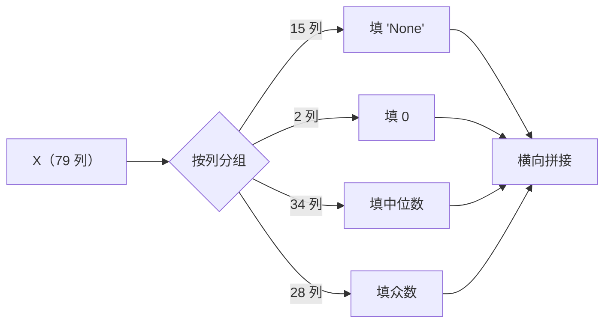

# 代码逐行讲解 · house_prices

> **用途**：把项目代码**逐句**讲清楚 —— 每一句在干什么、用到了什么语法。
> **配套**：`docs/python_syntax_notes.zh.md`（语法/库速查）；本文件侧重"**这份代码为什么这么写**"。
>
> ⚠️ 为什么不直接把注释写进源码？因为**每行都注释会让代码变噪音**。
> 源码只注释关键行；细讲放这里。

## 目录

| 顺序 | 文件 | 讲解位置 | 状态 |
|---|---|---|---|
| 0 | `src/house_prices/__init__.py` | §1.0 | ✅ |
| 1 | `src/house_prices/data.py` | §1.1 ~ §1.5 | ✅ |
| 2 | `src/house_prices/evaluate.py` | §2.1 ~ §2.4 | ✅ |
| 3 | `src/house_prices/preprocess.py` | §4.0 ~ §4.7 | ✅ |
| 4 | `tests/*.py`（15 个脚本） | §5.0 ~ §5.4 | ✅ |

> 📖 **读法**：先扫一眼 **§〇 语法总索引**，然后 **§一 → §五 从上到下读一遍** —— 即可覆盖项目**全部 Python 代码**。
> 每个小节的组织固定为：**它干什么 → 逐句讲 → 语法点表**。

### 覆盖检查表（确认没有遗漏任何代码文件）

| 代码文件 | 规模 | 讲解位置 |
|---|---|---|
| `src/house_prices/__init__.py` | ~10 行 | §1.0 |
| `src/house_prices/data.py` | ~35 行 | §1.1 ~ §1.5 |
| `src/house_prices/evaluate.py` | ~90 行 | §2.1 ~ §2.4 |
| `src/house_prices/preprocess.py` | ~200 行 | §4.0 ~ §4.7 |
| `tests/smoke_evaluate.py` | ~50 行 | §5.1 + §5.2 |
| `tests/smoke_preprocess.py` | ~45 行 | §5.1 + §5.2 |
| `tests/smoke_encoder.py` | ~55 行 | §5.1 + §5.2 |
| `tests/smoke_pipeline.py` | ~50 行 | §5.1 + §5.2 |
| `tests/smoke_sklearn_concepts.py` | ~95 行 | §5.1 + §5.2 |
| `tests/smoke_catboost_native.py` | ~100 行 | §5.1 + §5.2 |
| `tests/run_baseline.py` | ~45 行 | §5.1 + §5.2 |
| `tests/run_experiment.py` | ~55 行 | §5.1 + §5.2 |
| `tests/run_model_experiment.py` | ~50 行 | §5.1 + §5.2 |
| `tests/run_boosting_experiment.py` | ~100 行 | §5.1 + §5.2 |
| `tests/run_tuning_depth.py` | ~70 行 | §5.1 + §5.2 |
| `tests/run_tuning_lr_iters.py` | ~110 行 | §5.1 + §5.2 |
| `tests/run_tuning_seed_check.py` | ~90 行 | §5.1 + §5.2 |
| `tests/run_catboost_native.py` | ~80 行 | §5.1 + §5.2 |
| `tests/make_submission.py` | ~65 行 | §5.1 + §5.2 |

> ⚠️ `notebooks/*.ipynb` 是**探索性分析**，不是可复用代码；它内部自带中文说明，不在本文档范围内。

---

# 〇、语法总索引（**先看这张表**）

> **规则**：每条语法**只在首次出现时详细讲解一次**，之后一律引用、不再重复。
> 遇到不认识的写法 → 先来这里查"去哪看"。

| # | 语法 | 首次讲解 | 一句话 |
|---|---|---|---|
| 1 | `"""..."""` 文档字符串 | §1.1 | 写在文件/函数第一句 = `__doc__` |
| 2 | `from __future__ import annotations` | §1.2 | 类型注解延迟求值 |
| 3 | `import X as Y` / `from X import Y` | §1.2 | 导入并起别名 |
| 4 | `Path(__file__).resolve().parents[n]` | §1.3 | 稳健定位仓库目录 |
| 5 | `Path / "子路径"` | §1.3 | 路径拼接（**运算符重载**） |
| 6 | `return a, b` / `a, b = f()` | §1.4 | 返回元组 + 序列解包 |
| 7 | `df.drop(columns=[...])` | §1.5 | 删列（返回新对象） |
| 8 | `df["列名"]` | §1.5 | 取一列 = Series |
| 9 | `def f(...) -> 类型:` | §1.4 §2.3 | 返回/参数注解（运行时不检查） |
| 10 | `np.asarray(x, dtype=float)` | §2.2 | 统一转成浮点数组 |
| 11 | 向量化运算 `+ - **` / `np.sqrt` / `np.mean` | §2.2 | 免写 for 循环 |
| 12 | 多行函数签名 + 默认参数 | §2.3 | 参数多时一行一个 |
| 13 | **嵌套解包** `for i, (a, b) in ...` | §2.3 | 一次拆两层 |
| 14 | `enumerate(x, start=1)` | §2.3 | 遍历时带序号 |
| 15 | **花式索引** `y[idx]`（下标数组） | §2.3 | 一次取一整批样本 |
| 16 | `clone(model)` | §2.3 | 复制"未训练"的模型 |
| 17 | f-string 格式化 `{x:.5f}` / `{x:36s}` / `{x:>5}`（右对齐）/ `{x:^19}`（居中）/ `{y:,.0f}` | §2.3 §5.2 | 控精度 / 对齐 / 千分位 |
| 18 | **三元表达式** `A if 条件 else B` | §2.4 | 一行的 if/else |
| 19 | `hasattr(obj, "name")` | §2.4 | 检查属性是否存在 |
| 20 | `_名字` 下划线开头 | §2.4 | "模块内部私有"约定 |
| 21 | 列表字面量跨多行 + **尾随逗号** | §4.2 | `[]` 内换行不用续行符 |
| 22 | **列表推导式** `[f(x) for x in L if 条件]` | §4.3 | 一行"筛选 + 变换" |
| 23 | `x in L` / `x not in L` | §4.3 | 成员判断 |
| 24 | 方法链 `a.b().c()` | §4.3 | 连续调用 |
| 25 | **`ColumnTransformer` 三元组** `(名字, 变换器, 列)` | §4.3 | 按列分组派处理器 ⭐⭐ |
| 26 | `"passthrough"` / `"drop"` | §4.3 | 用字符串当"变换器" |
| 27 | `[...] * n` | §4.4 | 列表重复 n 次 |
| 28 | `class C(A, B):` | §4.5 | 类定义 + 多重继承 |
| 29 | **`lambda`** / 字典里存函数 | §4.5 | 匿名函数；函数是"一等公民" |
| 30 | `def __init__(self, ...)` | §4.5 | 构造方法；参数必须原样保存 |
| 31 | `self.xxx = ...` 实例属性 | §4.5 | 对象自己记东西 |
| 32 | **属性名末尾 `_`** | §4.5 | sklearn 约定："这是 fit 学的" |
| 33 | `X.copy()` | §4.5 | 不原地修改输入 |
| 34 | `df["新列"] = ...` | §4.5 | 列赋值（不存在 = 新增） |
| 35 | `list(a) + list(b)` | §4.5 | 列表拼接 |
| 36 | **"假值"**：`()` `[]` `""` `0` `None` | §4.6 | 空容器在 `if` 里为假 |
| 37 | 可选步骤 `if 开关: steps.append(...)` | §4.6 | 让流水线里的某一步**可开关**（如 `encode=True/False`） |
| 38 | `df.reindex(columns=...)` | §4.6 | 重排 / 新增列 |
| 39 | **嵌套 Pipeline** | §4.6 | Pipeline 里装 Pipeline |
| 40 | 关键字传参 `f(a=a)` | §4.6 | 显式透传参数 |
| 41 | `sys.path.insert(0, str(path))` | §5.1 | 告诉 Python 去哪找包 |
| 42 | `# noqa: E402` | §5.1 | 告诉检查工具"我故意的" |
| 43 | `def main() -> None:` | §5.1 | 主逻辑装进函数 |
| 44 | `if __name__ == "__main__":` | §5.1 | 模块入口约定 |
| 45 | `X.isna().sum().sum()` | §5.2 | 数总缺失数 |
| 46 | `list(a) == list(b)` | §5.2 | 比较列表内容 |
| 47 | `all(d.values())` | §5.2 | 全部为真 |
| 48 | `raise SystemExit("msg")` | §5.2 | 主动终止程序 |
| 49 | `__init__.py`（包入口） | §1.0 | 有它，目录才是能被 `import` 的**包** |
| 50 | `X["列"] > 0` + `.astype(int)` | §4.5 | 阈值化 → 0/1 标志 |
| 51 | 元组拼接 `BASE + ("新的",)` | §5.2 | 在基础配置上加一个特征 |
| 52 | **元组当字典键** `d[(lr, iters)]` | §5.2 | 元组不可变 → 可以当键；用来表示“多个参数的组合” |
| 53 | `min(...)` / `sorted(..., key=lambda k: ...)` | §5.2 | 按“某个函数的结果”取最小 / 排序 |
| 54 | `1e-6` 科学计数法；浮点数别用 `==` 比 | §5.2 | `0.025*1200` 不精确等于 `30` → 用容差判断 |
| 55 | `try: ... except Exception as exc:` + `type(exc).__name__` | §5.2 | 捕获异常并看它的**类型**（诊断/健壮性） |
| 56 | `dict(**BASE, k=v)` —— `**` 字典解包 | §5.2 | 在基础配置上“加/覆盖”几个参数 |
| 57 | `x is None`（而不是 `== None`） | §5.2 | 判“没给/空”的标准写法（None 是单例） |
| 58 | `np.all(np.isfinite(a))` | §5.2 | 数组里是否**全是有限数**（无 NaN/inf） |
| 59 | **`sys.argv`** + `len(sys.argv) > 1` | §5.2 | 读**命令行参数**（`argv[0]` 是脚本名） |
| 60 | `time.perf_counter()` | §5.2 | 高精度**计时器**；两次相减 = 耗时 |
| 61 | `X.assign(列=新值)` + `.astype(str)` | §5.2 | 返回“改了一列的新表”（不就地改）；转字符串 |

---

# 一、`src/house_prices/` —— 包与数据读取

## 1.0 `__init__.py` —— 包入口（最"空"、但最必要的一个文件）

```python
"""house_prices：Kaggle House Prices 项目的可复用代码包。

模块划分（用到一个建一个，不过早抽象）：
- data.py     : 读取原始数据
- evaluate.py : 统一的评估尺子（5 折 CV + log 空间 RMSE）
"""
```

| 语法点 | 说明 |
|---|---|
| `__init__.py` 的**存在** | 一个目录里有它，Python 才把这个目录当成**包（package）** |
| 文件里**只放文档字符串** | 相当于"包说明书"；`import house_prices; help(house_prices)` 能看到 |

> 🧒 **为什么需要它？**
> 没有 `__init__.py`，`src/house_prices/` 只是个**普通文件夹**，
> `from house_prices.data import load_raw` 会直接报 `ModuleNotFoundError`。
> 这里**故意留空**（只写说明）—— 包的初始化逻辑越少越好，避免"一 import 就产生副作用"。

---

**`data.py` 只干一件事：把 csv 读进来，并拆成 (X, y)。**

## 1.1 文件开头的文档字符串

```python
"""读取原始数据。

约定：data/raw/ 只读，本模块只负责"读进来"，不做任何修改。
"""
```

- **干什么**：这是**模块的说明**，写在文件最上方。
- **语法**：三引号 `"""..."""` 是**多行字符串**；放在文件/函数**第一句**时，Python 会自动把它当作 `__doc__`（文档字符串）。
- 用 `help(模块名)` 或编辑器悬浮提示能看到它。

## 1.2 导入区

```python
from __future__ import annotations
```

- **干什么**：让类型注解**延迟求值**（不当场执行）。
- **语法**：`from __future__ import X` = "启用未来版本才默认开启的特性"。
- **为什么需要**：这样下面写 `tuple[pd.DataFrame, pd.DataFrame]` 时，旧版 Python 也不会报错。

```python
from pathlib import Path
```

- **干什么**：导入 `pathlib` 里的 `Path` 类 —— **面向对象的路径处理**（比字符串拼路径安全、跨平台）。
- **语法**：`from 模块 import 名字`。

```python
import pandas as pd
```

- **干什么**：导入 pandas，取别名 `pd`。
- **语法**：`import 模块 as 别名`。`pd` / `np` 是**行业惯例**，别自己改。

## 1.3 定位仓库根目录（本文件最"绕"的一行）

```python
# 本文件位于 <repo>/src/house_prices/data.py
# parents[0]=house_prices, parents[1]=src, parents[2]=仓库根目录
RAW_DIR = Path(__file__).resolve().parents[2] / "data" / "raw"
```

拆开看（**从里往外读**）：

| 片段 | 干什么 | 语法点 |
|---|---|---|
| `__file__` | Python 内置变量 = **当前文件的路径**（字符串） | 双下划线包围 = "内置/特殊" |
| `Path(__file__)` | 把字符串变成 `Path` 对象 | 类的实例化 `Path(...)` |
| `.resolve()` | 变成**绝对路径**（解析 `.` / `..` / 符号链接） | 方法链式调用 |
| `.parents[2]` | **上跳 3 层目录**：`parents[0]`=父目录，`[1]`=祖父，`[2]`=曾祖父 | 索引取值 |
| `/ "data"` | 拼路径 | ⭐ **运算符重载**：`Path` 把 `/` 定义成了"拼路径" |

> 🧒 **为什么要这么绕？**
> 因为**不能写死路径**（如 `"C:/Users/23353/..."`）。这样写，**不管你在哪台电脑、从哪个目录运行**，都能找到 `data/raw`。
> 📌 这是个很实用的工程技巧，值得记住。

## 1.4 读数据的函数

```python
def load_raw() -> tuple[pd.DataFrame, pd.DataFrame]:
```

- **干什么**：定义函数 `load_raw`，无参数。
- **语法**：`-> 类型` 是**返回值类型注解**。⚠️ **它只是个"说明"，Python 运行时不会检查**。
- `tuple[pd.DataFrame, pd.DataFrame]` 意思是"返回两个 DataFrame 组成的元组"。

```python
    """读取原始训练集 / 测试集。

    Returns
    -------
    (train, test)
        train: 1460 x 81，含 SalePrice
        test : 1459 x 80，不含 SalePrice
    """
```

- **语法**：函数体内的**文档字符串**，用 `help(load_raw)` 能看。
- `Returns / -------` 是 **numpydoc 风格**（科学计算社区通用格式）。

```python
    train = pd.read_csv(RAW_DIR / "train.csv")
    test = pd.read_csv(RAW_DIR / "test.csv")
    return train, test
```

- **干什么**：读两个 csv。
- **语法**：
  - `RAW_DIR / "train.csv"` 又是 `/` 拼路径。
  - `pd.read_csv()` 返回 **DataFrame**。
  - `return train, test` 返回的是**一个元组**（`return (train, test)` 的简写）。
- 调用方可以**解包**：`train, test = load_raw()` —— 语法上叫"序列解包"。

## 1.5 拆分 X 和 y

```python
def get_xy(train: pd.DataFrame) -> tuple[pd.DataFrame, pd.Series]:
```

- **语法**：`train: pd.DataFrame` 是**参数类型注解**（同样是"说明"，运行时不检查）。

```python
    """把 train 拆成 (X, y)。

    注意：Id 是行号、不是特征，必须排除。
    y 返回的是**原始尺度**的 SalePrice（log 变换在评估/训练时再做）。
    """
```

```python
    X = train.drop(columns=["Id", "SalePrice"])
    y = train["SalePrice"]
    return X, y
```

| 语句 | 干什么 | 语法点 |
|---|---|---|
| `train.drop(columns=[...])` | 删掉两列，返回**新的** DataFrame（默认不修改原对象） | 关键字参数 + 列表 |
| `train["SalePrice"]` | 取出**一列**，得到 `Series` | `df[列名]` |
| `return X, y` | 返回元组 | 解包用 `X, y = get_xy(train)` |

> ⚠️ **为什么必须删 `Id`？** 它是行号，和房价毫无关系。留着会让模型"记住行号"，毫无泛化价值，甚至引入噪声。
> ⚠️ **为什么不在这里对 y 取 log？** 因为 `y` 只是"原始答案"，log 变换是**训练/评估时**才做的动作——保持这一层纯粹，职责清晰。

---

# 二、`src/house_prices/evaluate.py`

**全项目最重要的文件：统一的"尺子"。**

## 2.1 文件头与导入

```python
"""统一的评估尺子：K 折交叉验证 + log 空间 RMSE。
...
"""
```

```python
from __future__ import annotations

import numpy as np
from sklearn.base import clone
from sklearn.model_selection import KFold, RepeatedKFold
```

| 导入 | 干什么 |
|---|---|
| `numpy as np` | 数值计算（数组、开方、均值…） |
| `clone` | **复制一个"没训练过"的模型**（关键！下面讲） |
| `KFold, RepeatedKFold` | 两种"切数据"的工具 |

```python
SEED = 42
```

- **干什么**：**模块级常量**，全大写命名 = "这是个不该改的常数"。
- **语法**：模块级变量，其他函数里能直接读到（闭包/全局作用域）。

## 2.2 第一个函数：RMSE

```python
def rmse(y_true, y_pred) -> float:
    """普通 RMSE（均方根误差）。越小越好。"""
    y_true = np.asarray(y_true, dtype=float)
    y_pred = np.asarray(y_pred, dtype=float)
    return float(np.sqrt(np.mean((y_true - y_pred) ** 2)))
```

**干什么**：算 $\text{RMSE}=\sqrt{\frac1n\sum(y_i-\hat y_i)^2}$。

**语法拆解**（**从里往外读**）：

| 片段 | 含义 |
|---|---|
| `y_true - y_pred` | **逐元素相减**（numpy 的向量化，不用写 for 循环） |
| `(...) ** 2` | 逐元素平方（`**` 是幂运算符） |
| `np.mean(...)` | 求平均 |
| `np.sqrt(...)` | 开根号 |
| `float(...)` | 转成 Python 原生 `float`（更干净、更好打印） |
| `np.asarray(x, dtype=float)` | 把**任何输入**（list / Series / ndarray）统一转成浮点数组 |

> 🧒 **为什么要 `np.asarray`？** 因为你可能传 list，也可能传 pandas Series。统一转换后，后面就能放心用 numpy 运算。
> 🧒 **为什么不用 for 循环？** numpy 的"向量化"是 C 层实现，**快几十倍**，而且写起来更短。

## 2.3 核心函数：`cv_rmse_log`

### 函数签名（多行参数写法）

```python
def cv_rmse_log(
    model,
    X,
    y,
    n_splits: int = 5,
    n_repeats: int = 1,
    seed: int = SEED,
    verbose: bool = False,
) -> tuple[float, float]:
```

| 语法点 | 说明 |
|---|---|
| 参数一行一个 | 参数多时更易读（PEP 8 推荐） |
| `n_splits: int = 5` | **类型注解 + 默认值**。不传就是 5 |
| `seed: int = SEED` | 默认值可以是**上面定义的常量** |
| `-> tuple[float, float]` | 返回"两个 float 的元组" = (均值, 标准差) |

### 准备 y 和切分器

```python
    y = np.asarray(y, dtype=float)

    if n_repeats == 1:
        splitter = KFold(n_splits=n_splits, shuffle=True, random_state=seed)
    else:
        splitter = RepeatedKFold(
            n_splits=n_splits, n_repeats=n_repeats, random_state=seed
        )
```

| 语法点 | 说明 |
|---|---|
| `if / else` | 分支 |
| `shuffle=True` | 切之前先打乱（否则数据有顺序，比如按价格排序） |
| `random_state=seed` | **固定随机种子** → 每次结果一样 ⭐ 这是"同一把尺子"的关键 |
| `X = (\n ... \n)` | 括号内的换行不需要反斜杠，Python 允许 |

### 主循环（最核心的 6 行）

```python
    scores: list[float] = []
    for i, (tr_idx, va_idx) in enumerate(splitter.split(X), start=1):
        m = clone(model)                      # 每折用全新模型，避免状态泄漏
        m.fit(_take_rows(X, tr_idx), np.log1p(y[tr_idx]))   # 在 log 空间训练
        pred_log = m.predict(_take_rows(X, va_idx))         # 模型输出在 log 空间
        s = rmse(np.log1p(y[va_idx]), pred_log)             # 在 log 空间比较
        scores.append(s)
        if verbose:
            print(f"  split {i:3d}: RMSE(log) = {s:.5f}")
```

**逐句**：

| 语句 | 干什么 | 语法点 |
|---|---|---|
| `scores: list[float] = []` | 建空列表存分数 | **变量类型注解** + 空列表字面量 |
| `splitter.split(X)` | 生成器，每次产出`(训练集下标, 验证集下标)` | 可迭代对象 |
| `enumerate(..., start=1)` | 同时拿到**序号**和**元素**，序号从 1 开始 | 内置函数 |
| `for i, (tr_idx, va_idx) in ...` | 同时做**两层解包**：先解出 `i` 和元组，再把元组解成两个下标数组 | 嵌套解包 ⭐ |
| `clone(model)` | **深拷贝一个未训练的模型** | 见下方 ⭐⭐ |
| `m.fit(...)` | 在该折的**训练部分**上训练 | — |
| `np.log1p(y[tr_idx])` | 取训练部分的目标值并做 `log(1+x)` | ⭐ **fancy indexing**：用"下标数组"取子集 |
| `_take_rows(X, tr_idx)` | 按行取特征子集 | 见 2.4 |
| `m.predict(...)` | 预测（**输出在 log 空间**） | — |
| `rmse(np.log1p(y[va_idx]), pred_log)` | 在 **log 空间**比较 | 注意两边都在 log 空间 |
| `scores.append(s)` | 把本折分数加进列表 | 列表方法 |
| `f"  split {i:3d}: RMSE(log) = {s:.5f}"` | f-string 格式化 | `:3d`=整数占 3 位；`:5f`=保留 5 位小数 |

> ⭐⭐ **为什么必须 `clone(model)`？**
> `fit` 会**改变模型内部状态**（存下学到的系数）。如果 5 折共用同一个对象，第 2 折就会"带着第 1 折的记忆"开始训练 → **折与折之间互相污染**。
> `clone` 给你一个**全新白纸**，保证每折独立。

> ⭐ **为什么是 `y[tr_idx]` 而不是 `y.iloc[tr_idx]`？**
> 因为上面已经 `y = np.asarray(y)` 转成 numpy 数组了，numpy 数组用**中括号 + 下标数组**取值。这是"列表下标"和"numpy 花式索引"共用的语法。

### 返回结果

```python
    return float(np.mean(scores)), float(np.std(scores))
```

- **干什么**：返回 (均值, 标准差)。
- **语法**：`return a, b` 等价于 `return (a, b)`。
- ⚠️ `np.std` 默认是**总体标准差**（除以 n）；pandas 的 `.std()` 默认是**样本标准差**（除以 n−1）。差一点点，但要心里有数。

## 2.4 一个小工具函数

```python
def _take_rows(X, idx):
    """同时支持 pandas DataFrame 与 ndarray 的按行取子集。"""
    return X.iloc[idx] if hasattr(X, "iloc") else X[idx]
```

| 语法点 | 说明 |
|---|---|
| `_take_rows` | **下划线开头 = "模块内部私有"**。约定俗成：外部别直接调 |
| `X.iloc[idx] if hasattr(X, "iloc") else X[idx]` | **三元表达式**：`A if 条件 else B` |
| `hasattr(X, "iloc")` | 检查对象**有没有这个属性**——DataFrame 有 `iloc`，ndarray 没有 |

> 🧒 **为什么要兼容两种？** 因为 `X` 可能是 DataFrame（有列名），也可能是纯 numpy 数组。这个小函数让**两种都能用**。

---

# 三、本部分语法索引

本部分（`data.py` + `evaluate.py`）涉及的语法都已在正文**详细讲过** → 汇总见 **§〇 语法总索引**（第 1~20 条），此处**不再重复**。

---

# 四、`src/house_prices/preprocess.py`

**这是全项目最长、也最"工程"的一个文件：把 EDA 的结论翻译成 sklearn 能用的"变换器"。**

## 4.0 总览：文件里有 6 块

| 块 | 内容 | 对应阶段 |
|---|---|---|
| ① 常量 | `CAT_SEMANTIC_NONE` / `NUM_SEMANTIC_ZERO` / `ORDINAL_COLS` / `QUALITY_ORDER` | EDA 结论 |
| ② `build_imputer` | 缺失值填充器 | B1 |
| ③ `build_encoder` | 类别编码器 | B2 |
| ④ `FEATURE_BUILDERS` | 派生特征"**配方表**"（名字 → 算式） | 阶段 C |
| ⑤ `AddDerivedFeatures` | **自定义**变换器（按名字加特征） | 阶段 C |
| ⑥ `build_preprocessor` / `make_pipeline` | 把上面几块组装成流水线 | B3 |

## 4.1 文件头 + 导入

```python
"""预处理：把 EDA 的结论变成可复用的 sklearn 变换器。

⚠️ 铁律：这里的变换全都必须放进 Pipeline，
   只在【训练集】上 fit，再 transform 验证集 / 测试集 —— 否则数据泄漏。
"""
from __future__ import annotations

import numpy as np
from sklearn.base import BaseEstimator, TransformerMixin
from sklearn.compose import ColumnTransformer
from sklearn.impute import SimpleImputer
from sklearn.pipeline import Pipeline
from sklearn.preprocessing import OneHotEncoder, OrdinalEncoder
```

**这几个 sklearn 组件分别是什么**（🧒 用"工厂流水线"类比）：

| 类 | 角色 | 一句话 |
|---|---|---|
| `SimpleImputer` | 填充器 | "空的格子填什么" |
| `OrdinalEncoder` | 有序编码器 | "差/中/好 → 0/1/2" |
| `OneHotEncoder` | 独热编码器 | "每个取值单独开一列 0/1" |
| `ColumnTransformer` | **调度器** | "给每一**组**列派一个处理器" |
| `Pipeline` | **流水线** | "把多个步骤串起来，当做一个对象用" |
| `BaseEstimator` | 基类 | 白送 `get_params` / `set_params` / `clone` 支持 |
| `TransformerMixin` | 基类 | 白送 `fit_transform` 方法 |

## 4.2 常量：把 EDA 结论写成代码

```python
CAT_SEMANTIC_NONE = [
    "PoolQC", "MiscFeature", "Alley", "Fence", "FireplaceQu",
    "GarageType", "GarageFinish", "GarageQual", "GarageCond",
    "BsmtQual", "BsmtCond", "BsmtExposure", "BsmtFinType1", "BsmtFinType2",
    "MasVnrType",
]

NUM_SEMANTIC_ZERO = ["GarageYrBlt", "MasVnrArea"]
```

| 语法点 | 说明 |
|---|---|
| 列表字面量跨多行 | 只要在 `[]` **里面**换行，就不需要反斜杠续行 |
| 全大写 + 下划线 | **常量命名约定**（读代码的人一看就知道"不该改"） |
| 尾随逗号 | 最后一项后面加 `,` 是**合法且推荐**的（以后增删行不会报错） |

> 📌 这两个清单**直接来自 EDA**（`notebooks/01_data_overview.ipynb`）。这就是 EDA 的价值：结论变成可复用的常量。

## 4.3 `build_imputer` —— 填充器

### 拆列清单（4 行列表推导式）

```python
    cat_semantic = [c for c in CAT_SEMANTIC_NONE if c in X.columns]
    num_semantic = [c for c in NUM_SEMANTIC_ZERO if c in X.columns]

    num_all = X.select_dtypes(include="number").columns.tolist()
    cat_all = X.select_dtypes(exclude="number").columns.tolist()
    other_num = [c for c in num_all if c not in num_semantic]
    other_cat = [c for c in cat_all if c not in cat_semantic]
```

| 语句 | 干什么 | 语法点 |
|---|---|---|
| `[c for c in L if 条件]` | **列表推导式**：一行写出"筛选出的列表" | `[表达式 for 变量 in 可迭代 if 条件]` |
| `c in X.columns` | 判断列名是否存在 | `in` 运算符 |
| `c not in num_semantic` | 取差集 | `not in` |
| `X.select_dtypes(include="number")` | 只挑出数值列 | 按 dtype 筛选 |
| `.columns.tolist()` | Index → 普通列表 | **方法链**（`.` 连着写） |

> 🧒 **为什么要 `if c in X.columns`？**
> 防止列名写错时抛异常。万一以后数据变了、某列没了，程序**降级运行**而不是崩溃。
> 这叫**防御性编程**。

### 核心：`ColumnTransformer` 的三元组语法 ⭐⭐

```python
    ct = ColumnTransformer(
        [
            ("cat_none", SimpleImputer(strategy="constant", fill_value="None"), cat_semantic),
            ("num_zero", SimpleImputer(strategy="constant", fill_value=0), num_semantic),
            ("num_median", SimpleImputer(strategy="median"), other_num),
            ("cat_mode", SimpleImputer(strategy="most_frequent"), other_cat),
        ],
        remainder="drop",
        verbose_feature_names_out=False,
    )
```

**这是本文件最重要的语法**。每一行是一个 **三元组**：

```
( 名字 ,  变换器  ,  要处理的列 )
```

| 位置 | 含义 | 注意 |
|---|---|---|
| ① 名字 | 字符串，给这一步起名 | 以后能用 `"名字__参数"` 调参 |
| ② 变换器 | 一个**实例**（注意是 `SimpleImputer(...)` 不是类名） | 也可以是字符串 `"passthrough"`（原样通过）/ `"drop"`（丢弃） |
| ③ 列清单 | 这一组包含哪些列 | 列名列表，或列下标列表 |

**`ColumnTransformer` 干的事**：把 X 按列切成几组 → 每组送进各自的变换器 → 结果**横向拼起来**。



| 参数 | 含义 |
|---|---|
| `remainder="drop"` | 没被任何组覆盖的列 → **丢掉**（默认也是 drop） |
| `verbose_feature_names_out=False` | 输出列名**不加前缀**（加前缀会变成 `cat_none__PoolQC` 这种，太长） |

```python
    ct.set_output(transform="pandas")  # 输出保留 DataFrame，方便查看 / 调试
    return ct
```

- **干什么**：让 `transform()` 返回 **DataFrame**（默认返回 numpy 数组，没有列名）。
- **语法**：`set_output` 是 sklearn 1.2+ 的**全局输出格式开关**，可选 `"default"` / `"pandas"` / `"polars"`。
- 🧒 **为什么需要**？因为下一步 `build_encoder` 要**按列名**工作。如果中间变成没有列名的 numpy 数组，就接不上了。

## 4.4 `build_encoder` —— 编码器

```python
ORDINAL_COLS = [
    "ExterQual", "ExterCond", "BsmtQual", "BsmtCond", "HeatingQC",
    "KitchenQual", "FireplaceQu", "GarageQual", "GarageCond", "PoolQC",
]
QUALITY_ORDER = ["None", "Po", "Fa", "TA", "Gd", "Ex"]
```

```python
    ordinal = [c for c in ORDINAL_COLS if c in X.columns]
    cat_all = X.select_dtypes(exclude="number").columns.tolist()
    nominal = [c for c in cat_all if c not in ordinal]
    num_all = X.select_dtypes(include="number").columns.tolist()
```

同样套路：**先分组，再派处理器**。

```python
            ("ordinal", OrdinalEncoder(categories=[QUALITY_ORDER] * len(ordinal)), ordinal),
```

| 语法点 | 说明 |
|---|---|
| `categories=[...] * len(ordinal)` | **列表乘以整数 = 重复 n 次** → 10 个完全相同的等级顺序 |
| 为什么要给每一列都指定顺序 | `OrdinalEncoder` 默认按**字典序**排（`Ex < Fa < Gd < Po < TA`），那是**错的**！必须显式给出真实大小顺序 |

```python
            (
                "onehot",
                OneHotEncoder(handle_unknown="ignore", sparse_output=False),
                nominal,
            ),
```

| 参数 | 含义 |
|---|---|
| `handle_unknown="ignore"` | 遇到训练时没见过的类别 → **编码成全 0**，而不是报错 |
| `sparse_output=False` | 输出**稠密**矩阵（默认是稀疏矩阵，不方便转 DataFrame） |

```python
            ("num", "passthrough", num_all),
```

- **`"passthrough"`**：**字符串**也是合法的"变换器"位置 —— 意思是"这一组**原样通过**，不做任何处理"。
- 🧒 数值列已经填好了，只需要保留。

## 4.5 `FEATURE_BUILDERS` + `AddDerivedFeatures` —— 自定义变换器 ⭐⭐⭐

这是本文件最难、也最值钱的一段。

### 先看"配方表"：把算式存进字典

```python
FEATURE_BUILDERS = {
    # 线性组合（总和）：对线性模型零增益，但对树模型有用
    "TotalSF": lambda X: X["TotalBsmtSF"] + X["1stFlrSF"] + X["2ndFlrSF"],
    # 交互项（乘积）：线性模型**无法**自己表示 → 能提供新信息
    "QualArea": lambda X: X["OverallQual"] * X["GrLivArea"],
    # —— 以下为"阈值型"特征：把连续值压成 0/1 ——
    # 阈值化也是一种**非线性**变换（线性模型造不出 ">0 就跳变" 这种形状）
    "HasPool": lambda X: (X["PoolArea"] > 0).astype(int),
    "Has2ndFlr": lambda X: (X["2ndFlrSF"] > 0).astype(int),
    "HasBsmt": lambda X: (X["TotalBsmtSF"] > 0).astype(int),
    "HasGarage": lambda X: (X["GarageArea"] > 0).astype(int),
    "HasFireplace": lambda X: (X["Fireplaces"] > 0).astype(int),
}
```

| 语法点 | 说明 |
|---|---|
| `lambda 参数: 表达式` | **匿名函数**：不用 `def`、一行写完的"迷你函数" |
| 字典里存函数 | **函数是"一等公民"**：能像数字一样存进字典、当参数传来传去 |
| `X["列"] > 0` | **逐元素比较**，返回一整列 `True/False`（这就是"阈值化"） |
| `(...).astype(int)` | 把布尔列**转成 0/1 整数**（`True→1`、`False→0`） |
| 尾随逗号 | 最后一项后面的 `,` 合法且推荐（见 §4.2） |

> ⚠️ **实测教训（见 `experiments.md` 实验 #7）**：这 5 个阈值标志**全部无效**，原因有二：
> 1. **近似常数**：`HasPool` 只有 0.5% 为 1、`HasBsmt` 97.5%、`HasGarage` 94.5% 为 1 ——
>    一列几乎全是同一个值时，它**不能区分任何样本** → 零信息。
> 2. **信息已存在**：`Has2ndFlr`(43.2%)、`HasFireplace`(52.7%) 分布均衡却也没提升 ——
>    因为"有没有二楼/壁炉"这个信息，**原来的连续特征（`2ndFlrSF`、`Fireplaces` 的 0 vs >0）已经携带了**。
>
> 🧒 **所以"非线性就一定有用"是错的**，正确说法是：**"非线性 + 真的新信息"才有用**。
> 造特征前先问两句：**① 这列的值够不够分散？② 这个信息原特征里有没有？**

> 🧒 **为什么要把算式存进字典？**
> 这样"**特征名**"和"**怎么算**"就**解耦**了：
> - 想试新特征 → 在字典里**加一行**
> - 想开关某特征 → 在特征名列表里**增删一个字符串**
>
> 于是 A/B 实验变成一行：`make_pipeline(..., derived_features=("QualArea",))`。
> 📌 这个套路叫"**配置化**"，工程里非常常见。

### 再看自定义变换器

```python
class AddDerivedFeatures(BaseEstimator, TransformerMixin):
```

| 语法点 | 说明 |
|---|---|
| `class 名字(父类1, 父类2):` | **类定义 + 多重继承** |
| `BaseEstimator` | 提供 `get_params` / `set_params`（**这是 `clone` 能工作的前提**） |
| `TransformerMixin` | 提供 `fit_transform`（省得自己写） |

### ⓪ `__init__`：记住"要开哪些特征"

```python
    def __init__(self, features=()):
        self.features = features
```

| 语法点 | 说明 |
|---|---|
| `def __init__(self, ...)` | **构造方法**：创建对象时自动执行 |
| `features=()` | 默认值是**空元组** = 默认不加任何特征（就是 A/B 实验的基线） |
| `self.features = features` | ⚠️ sklearn 约定：**构造方法里必须原样保存参数**（不能做任何转换），否则 `clone` 会出错 |

### ① `fit`：不学习，但要"登记"

```python
    def fit(self, X, y=None):
        self.n_features_in_ = X.shape[1]
        if hasattr(X, "columns"):
            self.feature_names_in_ = np.asarray(X.columns)
        return self
```

| 语法点 | 说明 |
|---|---|
| `self` | **实例本身**，所有方法的第一个参数（固定写法） |
| `self.n_features_in_ = ...` | 创建一个**实例属性** |
| `X.shape[1]` | 元组的第 2 个元素 = **列数**（`shape[0]` 是行数） |
| `y=None` | 有监督的接口要接受 y，但这里用不到 → 默认 `None` |
| `return self` | sklearn 约定：**fit 必须返回自己**（这样才能写 `fit(...).transform(...)`） |

> ⚠️ **为什么属性名末尾要有下划线 `_`？**
> 这是 sklearn 的**强约定**：**只有在 `fit` 中学到的属性才带下划线**。
> 内部靠这个判断"模型是否已训练过"。写成 `n_features_in`（不带下划线）会被当成构造参数。

> ⚠️ **为什么不用 `validate_data`？**
> 我们试过，它默认要求数据是**纯数值**，而 `X` 里有字符串列 → 报错。
> 这个变换器只需要"列名 + 列数"，**手工登记两个属性**最干净。

### ② `transform`：真正干活

```python
    def transform(self, X):
        X = X.copy()                      # ⚠️ 绝不原地修改传进来的数据
        for name in self.features:
            X[name] = FEATURE_BUILDERS[name](X)
        return X
```

| 语法点 | 说明 |
|---|---|
| `X.copy()` | **复制一份**再改 —— ⚠️ 绝不能原地修改传进来的数据，那会"污染"调用方 |
| `for name in self.features:` | 遍历**实例属性里的列表**（见 §2.3 的 `for` 语法） |
| `FEATURE_BUILDERS[name]` | **用字符串查字典**，取出那个 `lambda` 函数 |
| `FEATURE_BUILDERS[name](X)` | **取出后立刻调用** —— 这是"函数是值"的直接体现 ⭐ |
| `X["新列名"] = ...` | DataFrame **列赋值**：列不存在 = 新增，存在 = 覆盖 |

> 🧒 **`FEATURE_BUILDERS[name](X)` 看着有点绕，拆开就是：**
> ```python
> f = FEATURE_BUILDERS[name]   # 先取出函数
> X[name] = f(X)               # 再调用它
> ```
> 这也解释了为什么字典里能存"算式"—— **函数和数字一样，都是值**。

### ③ `get_feature_names_out`：报出"我产出了哪些列"

```python
    def get_feature_names_out(self, input_features=None):
        if input_features is None:
            input_features = self.feature_names_in_
        return np.array(list(input_features) + list(self.features))
```

| 语法点 | 说明 |
|---|---|
| `if input_features is None` | `is None` 是**判断"是不是 None"**的标准写法（`==` 有时不可靠） |
| `list(数组) + 列表` | **列表拼接**（`+` 对列表是拼接，不是加法，见 §4.5） |
| `list(self.features)` | 把元组转成列表 —— 因为元组**不能**和列表直接 `+` |

> ⚠️ **`if input_features is None` 这行踩过坑**：
> `Pipeline.get_feature_names_out()` 调**第一步**时会传 `None`。
> 如果直接 `list(None)` 就崩了。正确做法：**回退到自己 `fit` 时登记的 `feature_names_in_`**。
> （这个坑记在 `docs/experiments.md` 的踩坑表里）

### 三个方法的分工

| 方法 | 谁调用 | 什么时候调 | 不写会怎样 |
|---|---|---|---|
| `fit` | `Pipeline.fit` | 训练时 | 报错 |
| `transform` | `Pipeline.predict` | 预测时 | 报错 |
| `get_feature_names_out` | 查看列名 / `set_output` | 调试时 | 调 `get_feature_names_out()` 报错 |

## 4.6 `build_preprocessor` / `make_pipeline` —— 组装

### 先看一个小工具：`cat_feature_names`

```python
def cat_feature_names(X) -> list[str]:
    """列出所有【类别型】列名（= 非数值列）。"""
    return X.select_dtypes(exclude="number").columns.tolist()
```

| 语法点 | 说明 |
|---|---|
| `select_dtypes(exclude="number")` | 按 **dtype** 选列：排除所有数值型 → 剩下就是类别列 |
| `.columns.tolist()` | 把列名（`Index` 对象）变成普通列表 |

> 🧒 **为什么要单独搞个函数？**
> 我们一直以来的做法是 **One-Hot**：43 个类别列 → 两百多列 0/1（又稀又大）。
> 但 CatBoost **不需要** One-Hot —— 它直接吃原始字符串列，只要告诉它“这 43 列是类别”就行。
> 这个函数负责算出“是哪 43 列”（**只读列名/类型，不读数值 → 不构成泄漏**）。

### 主流水线：`build_preprocessor` / `make_pipeline`

```python
def build_preprocessor(X, derived_features: tuple = (), encode: bool = True) -> Pipeline:
    steps = []
    if derived_features:
        derive = AddDerivedFeatures(features=list(derived_features))
        col_names = X.columns.tolist() + list(derived_features)
        X_for_layout = X.reindex(columns=col_names)
        steps.append(("derive", derive))
    else:
        X_for_layout = X

    steps.append(("impute", build_imputer(X_for_layout)))
    if encode:
        steps.append(("encode", build_encoder(X_for_layout)))
    return Pipeline(steps)
```

| 语法点 | 说明 |
|---|---|
| `def f(X, derived_features: tuple = ())` | 参数带**默认值**（空元组 = 基线版），调用方可以不传 |
| `if derived_features:` | ⚠️ **空元组 `()` 是"假值"** → 等价于"列表非空吗" |
| `steps = []` … `steps.append((...))` | 先建空列表再往里加 —— 这样"可选步骤"能灵活拼装 |
| `X.reindex(columns=col_names)` | 按给定列名**重排/新增**列；不存在的列自动填 `NaN` |
| ⭐ **`if encode:` 把一步变成"可选"** | `encode=False` 时**根本不加** `encode` 这一步 → 流水线变成"填充 → 模型" |

> 🧒 **这就是"预处理要和模型配套"** —— 同一个项目，不同的模型要配不同的流水线：
>
> | 模型 | 需要的预处理 | 为什么 |
> |---|---|---|
> | Ridge / 随机森林 / XGBoost | 填充 → **One-Hot + Ordinal** | 它们只认数字 |
> | **CatBoost** | 填充 →（**不编码**） | 它自己会处理原始类别列，而且做得更好 |
>
> 📌 **默认 `encode=True`**，所以老代码/老实验的行为**一字不变**（向后兼容）。
> ⚠️ 用 `encode=False` 时，必须同时把类别列名通过模型的 `cat_features=...` 告诉它，否则模型会报错。

> ⚠️ **为什么要有 `X_for_layout = X.reindex(...)` 这一步？**
> 因为 `build_imputer` / `build_encoder` 只根据 **列名与类型** 决定"哪列归哪组"（**不读数值**）。
> 如果不在"布局"里预先登记新列名，后面的 `ColumnTransformer` 就不认识它 → 直接 **drop 掉**（我们真的踩过：特征悄悄消失、分数纹丝不动）。
>
> 🧒 一句话：**先把"新列的名字"登记好，再让后面的组件去认领它。**

```python
def make_pipeline(model, X, derived_features: tuple = (),
                  encode: bool = True) -> Pipeline:
    return Pipeline(
        [
            ("prep", build_preprocessor(
                X, derived_features=derived_features, encode=encode
            )),
            ("model", model),
        ]
    )
```

| 语法点 | 说明 |
|---|---|
| **嵌套 Pipeline** | `Pipeline` 里装另一个 `Pipeline`（`prep` 那一步） |
| `derived_features=derived_features` | **关键字传参**：把本函数的参数透传给内层函数（名字一样，但必须显式写） |
| **参数逐层透传** | `encode` 从 `make_pipeline` 一路传到 `build_preprocessor`（参数名保持一致才好传） |

## 4.7 本部分语法索引

本部分（`preprocess.py`）涉及的语法都已在正文讲过 → 汇总见 **§〇 语法总索引**（第 21~40 条），此处**不再重复**。

**本部分新增、且已在 §4.5 详细讲过的两条重点**（也是本项目最"值钱"的语法）：

| 语法 | 一句话 |
|---|---|
| `lambda 参数: 表达式` | 匿名函数；配合"字典存函数"实现**配置化**（想想怎么一行切换一个特征） |
| `class C(A, B):` + `fit/transform/get_feature_names_out` | **自定义 sklearn 组件**的标准姿势（面试常问） |

---

# 五、`tests/*.py`

**这些脚本是"给人跑的"**（库文件 `src/**` 只定义函数，直接运行没输出）。

## 5.0 有哪几个、各干什么

| 文件 | 干什么 | 有分数吗 |
|---|---|---|
| `smoke_evaluate.py` | 冒烟：尺子能不能算分 | 参考分数（不算实验） |
| `smoke_preprocess.py` | 冒烟：填充后有没有 NaN | ❌ |
| `smoke_encoder.py` | 冒烟：编码后是不是全数字 | ❌ |
| `smoke_pipeline.py` | 冒烟：整条流水线能否端到端跑通 | ❌ |
| `smoke_sklearn_concepts.py` | 概念验证：`fit` 原地修改 / `clone` / `Pipeline` / 正则化 | 参考分数（不算实验） |
| `smoke_catboost_native.py` | 冒烟：原生 `cat_features` 能否跑通 + **clone 兼容性探测** | ❌ |
| `run_baseline.py` | 基线实验：地板 vs Ridge | ✅ |
| `run_experiment.py` | 特征工程 A/B 实验 | ✅ |
| `run_model_experiment.py` | **模型升级**实验（换模型） | ✅ |
| `run_boosting_experiment.py` | 三库对比（XGBoost / LightGBM / CatBoost）+ 树复杂度诊断 | ✅ |
| `run_tuning_depth.py` | **调参**：单变量扫描 CatBoost `depth`（含过拟合诊断） | ✅ |
| `run_tuning_lr_iters.py` | **调参**：联合扫描 `learning_rate × iterations` + 浅树诊断 | ✅ |
| `run_tuning_seed_check.py` | **复核**：换一套数据划分，验证“最优配置”是否稳健 | ✅ |
| `run_catboost_native.py` | **表示方式升级**：原生 `cat_features` vs One-Hot | ✅ |
| `make_submission.py` | 生成提交文件 + 格式自检 | ❌ |

## 5.1 公共骨架（15 个脚本几乎一样的部分）

### ① 开头的文档字符串 —— 写清"怎么运行"

```python
"""验证完整 Pipeline（填充 → 编码 → 模型）能端到端跑通。

运行方式（项目根目录）：
    .\\.venv\\Scripts\\python.exe tests\\smoke_pipeline.py

注意：这里只验证"能跑通"，**不算分数**（CV 分数属于 B4）。
"""
```

- **干什么**：让"半年后的你"不用读代码就知道：**这是干嘛的、怎么跑**。
- **语法点**：字符串里的 `\\` 是**转义**（在文档里显示成单个 `\`）。

### ② 让脚本能 `import` 到 `src/`（**最关键的两行**）⭐

```python
import sys
from pathlib import Path

ROOT = Path(__file__).resolve().parents[1]
sys.path.insert(0, str(ROOT / "src"))
```

| 语句 | 干什么 | 语法点 |
|---|---|---|
| `import sys` | 导入系统模块 | Python 提供"模块搜索路径"管理 |
| `Path(__file__).resolve().parents[1]` | 定位**仓库根目录**（比 `data.py` 少一层，因为脚本在 `tests/` 下） | 同 `data.py` 的套路 |
| `str(...)` | `Path` → **字符串**（`sys.path` 只接受字符串） | 类型转换 |
| `sys.path.insert(0, ...)` | 把这个路径**插到搜索列表最前面** | 列表的 `insert(位置, 值)` |

> 🧒 **为什么要这么做？**
> Python 找模块时，只会去"**当前目录 + 已安装的包**"里找。
> `house_prices` 这个包在 `src/` 里，Python 不认识 → 所以**手动告诉它"去 src/ 里找"**。
>
> ⚠️ 如果删掉这两行，运行脚本会立刻报：
> `ModuleNotFoundError: No module named 'house_prices'`
>
> 📌 插在**最前面**（`0`）是为了避免被同名的其他包抢先匹配。

### ③ `# noqa: E402` 是什么

```python
from house_prices.data import get_xy, load_raw     # noqa: E402
```

| 部分 | 含义 |
|---|---|
| `# noqa` | "**no quality assurance**" —— 告诉检查工具"这行别报警告" |
| `E402` | 具体是哪条规则：**"模块级 import 不在文件顶部"** |

> 🧒 **为什么会有这个警告？** 因为我们**故意**把 import 放在 `sys.path.insert` **之后**（不然找不到包）。
> 这属于"我知道规则、我故意破例"→ 用 `# noqa` 标记，避免编辑器一直飘黄线。

### ④ `main()` 函数：把逻辑装进一个函数

```python
def main() -> None:
    train, test = load_raw()
    ...
```

| 语法点 | 说明 |
|---|---|
| `-> None` | 返回值类型注解：**这个函数不返回东西** |
| 为什么要有 `main()` | 变量都在**函数局部作用域**里，不会污染全局；也方便以后被别的代码调用 |

### ⑤ 程序入口（**固定写法**）⭐

```python
if __name__ == "__main__":
    main()
```

| 情况 | `__name__` 的值 | 会执行 `main()` 吗 |
|---|---|---|
| **直接运行这个文件** | `"__main__"` | ✅ 会 |
| 被别的代码 `import` | `"smoke_pipeline"` | ❌ 不会 |

> 🧒 **好处**：这个文件**既能当脚本跑，也能被别人 import**（import 时不会"自动跑一遍"）。
> 📌 这是 Python 最经典的写法之一，**背下来**。

## 5.2 各脚本"特有"的部分

### `smoke_evaluate.py` —— 用"数据驱动"的写法批量测

```python
    cases = [
        ("① 只猜均值（地板基线）", DummyRegressor(strategy="mean"), ["OverallQual"]),
        ("② 线性回归（OverallQual）", LinearRegression(), ["OverallQual"]),
    ]

    for name, model, cols in cases:
        mean, std = cv_rmse_log(model, X[cols], y)
        print(f"{name:36s} RMSE(log) = {mean:.5f} ± {std:.5f}")
```

| 语法点 | 说明 |
|---|---|
| `cases = [("名字", 模型, 列), ...]` | **列表里放元组** —— 一种"表格化"的数据写法 |
| `for name, model, cols in cases:` | 遍历时**直接解包**出三个变量 ⭐ |
| `{name:36s}` | f-string 格式：`36s` = 字符串**左对齐**、宽度 36 |
| `{mean:.5f}` | 保留 **5 位小数** |

> 🧒 **为什么好？** 想加第 4 种模型，**只需在 `cases` 里加一行**，不用复制粘贴一整段代码。这叫"数据驱动"。

### `smoke_preprocess.py` —— 必须有"对照"

```python
    print(f"原始 NaN → train: {int(X.isna().sum().sum())}, test: {int(X_test.isna().sum().sum())}")

    imp = build_imputer(X)
    X_imp = imp.fit_transform(X)        # 只在 train 上 fit
    X_test_imp = imp.transform(X_test)  # test 只 transform

    print(f"填充后 NaN → train: {int(X_imp.isna().sum().sum())}, ...")
```

| 语法点 | 说明 |
|---|---|
| `X.isna()` | 返回**同形状的真假表**（哪里是 NaN） |
| `.sum()` **连着两个** | 第一个按列求和，第二个把列加起来 → **总缺失数** |
| `int(...)` | 转成普通整数（numpy 整数打印时会带 `np.int64(...)`，很难看） |

> 🧒 **为什么先打印"原始 NaN"？** 没有对照，就不知道"填充后为 0"是因为填好了，还是**本来就没有 NaN**（那样测试等于没测）。

### `smoke_encoder.py` —— 三个体检项

```python
    non_num = X_enc.select_dtypes(exclude="number").columns.tolist()
    print(f"非数值列: {non_num}  (应为空)")
    print(f"NaN 个数: train {int(X_enc.isna().sum().sum())}, ...")
    same = list(X_enc.columns) == list(X_test_enc.columns)
    print(f"train/test 列完全一致? {same}")
```

| 语法点 | 说明 |
|---|---|
| `list(a) == list(b)` | 比较两个列表内容是否完全相同（`pandas.Index` 直接 `==` 会做逐元素比较，结果不是布尔） |

> 🧒 **三项体检**：① 全是数字？② 没有 NaN？③ train/test 列一致？（列不一致 → 预测会错位）

### `smoke_pipeline.py` —— `fit_transform` vs `transform`

```python
    Xt = prep.fit_transform(X)          # 只在 train 上 fit
    Xt_test = prep.transform(X_test)    # test 只 transform
```

> 🧒 **这一行就是"防泄漏"的活教材**：
> 训练集 **学 + 填**；测试集 **只填**（用训练集学到的规则）。

### `run_baseline.py` / `run_experiment.py` —— 用字典装"候选方案"

```python
    # 参考 = 目前最好的配置；每次**只在它基础上加一个**特征 → 逐行可归因
    BASE = ("QualArea",)
    cases = {
        "参考：QualArea": BASE,
        "+ HasPool": BASE + ("HasPool",),
        "+ Has2ndFlr": BASE + ("Has2ndFlr",),
    }

    for name, feats in cases.items():
        model = make_pipeline(Ridge(alpha=1.0), X, derived_features=feats)
        mean, std = cv_rmse_log(model, X, y, n_repeats=10)
        print(f"{name:26s} {mean:.5f} ± {std:.5f}")
```

| 语法点 | 说明 |
|---|---|
| `BASE = ("QualArea",)` | ⚠️ **单元素元组必须带逗号**！`("QualArea")` 只是加了括号的字符串 |
| `BASE + ("HasPool",)` | **元组拼接** —— 得到 `("QualArea", "HasPool")`，即"在原基础上多开一个特征" ⭐ |

| 语法点 | 说明 |
|---|---|
| `{键: 值, ...}` | **字典字面量**（无序集合，但 Python 3.7+ 保留插入顺序） |
| `cases.items()` | 返回 `(键, 值)` 对 |
| `for name, feats in cases.items():` | 遍历字典时解包（解包语法见 §〇 第 13 条） |

> 🧒 **为什么用字典而不是列表？** 因为这里只需要"**名字 → 该开哪些特征**"这一种映射，不需要第三种信息。
>
> 💡 `run_baseline.py` 用的是**同一个套路**，只是把候选换成三行：**地板 / Ridge(5 折) / Ridge(5×10)**，
> 这样一屏就能看出"地板有多低、5 折与 5×10 差多少"。

### `run_model_experiment.py` —— 换模型（只变"模型"这一个变量）

```python
    # 特征固定为"目前最好的一组"，只变模型 → 逐行可归因
    BASE = ("QualArea", "TotalSF")

    cases = {
        "① Ridge(alpha=1)【线性参考】": (Ridge(alpha=1.0), BASE),
        "② 随机森林(200 棵)【上轮赢家】": (
            RandomForestRegressor(n_estimators=200, random_state=42, n_jobs=-1),
            BASE,
        ),
        "③ GBDT（默认 100 棵, lr=0.1）": (
            GradientBoostingRegressor(random_state=42),
            BASE,
        ),
        "④ GBDT（300 棵, lr=0.05）": (
            GradientBoostingRegressor(
                n_estimators=300, learning_rate=0.05, random_state=42
            ),
            BASE,
        ),
    }

    for name, (model, feats) in cases.items():
        pipe = make_pipeline(model, X, derived_features=feats)
        mean, std = cv_rmse_log(pipe, X, y, n_repeats=10)
        print(f"{name:32s} {mean:.5f} ± {std:.5f}")
```

| 语法点 | 说明 |
|---|---|
| `for name, (model, feats) in cases.items():` | ⭐ **两级解包**：先解出 `name` 和元组，再把元组解成 `model` / `feats`（见 §〇 第 13 条） |
| `RandomForestRegressor(..., n_jobs=-1)` | `n_jobs=-1` = **用上所有 CPU 核心**并行训练（`-1` 是"全部"的约定） |
| `random_state=42` | 固定随机性 → 结果**可复现** |

> 🧒 **树模型为什么不用标准化？** 它只做"大于/小于"比较，**不受量纲影响**（见 §〇 第 11 条的"向量化"同理，都属"算法特性决定预处理")。
> ⚠️ 我们的流水线对树仍然做了 One-Hot 和填充 —— **One-Hot 对树不是必需的**（但无害）。
> 这属于后续可优化项（记在 `experiments.md` 的待验证清单里）。

### `run_boosting_experiment.py` —— 三库对比：**同样的算法，不同的库**

```python
from catboost import CatBoostRegressor
from lightgbm import LGBMRegressor
from xgboost import XGBRegressor
```

```python
    cases = {
        "① sklearn GBDT(300, lr=0.05)【上轮赢家·锚点】": (
            GradientBoostingRegressor(
                n_estimators=300, learning_rate=0.05, random_state=42
            ),
            BASE,
        ),
        ...
    }
```

| 语法点 | 说明 |
|---|---|
| `from catboost import CatBoostRegressor` | 第三方库的导入方式**和 sklearn 完全一样**（都是 `from 包 import 类`） |
| 字典的**值又是一个元组** `(模型, 特征)` | 与 `run_model_experiment.py` 同一套路：两级解包 |

#### ⭐ 本文件最重要的知识：**三个库的参数名不统一**

| 含义 | sklearn | XGBoost | LightGBM | CatBoost |
|---|---|---|---|---|
| 树的数量 | `n_estimators` | `n_estimators` | `n_estimators` | **`iterations`** ⚠️ |
| 随机种子 | `random_state` | `random_state` | `random_state` | **`random_seed`** ⚠️ |
| 学习率 | `learning_rate` | `learning_rate` | `learning_rate` | `learning_rate` |
| 单棵树最大深度 | `max_depth` | `max_depth` | `max_depth` | `depth` |
| 静默训练日志 | — | `verbosity=0` | `verbose=-1` | `verbose=0` |
| 不写日志文件 | — | — | — | **`allow_writing_files=False`** |

> ⚠️ **传错参数名不会报错！** sklearn 风格的估计器普遍接受 `**kwargs`，写错的参数会被**静默吞掉**，
> 于是你以为改了参数、其实**根本没生效**。→ 换库时第一件事是**查它自己的参数名**。

#### ⭐ 第二个知识点：为什么脚本要分"两轮"

```python
    # ---- 第二轮：诊断"为什么 XGBoost / LightGBM 反而更差" ----
    # 假设：sklearn GBDT 默认 max_depth=3（浅树）；XGBoost 默认 max_depth=6 → 过拟合。
    # 验证方法：只把"树复杂度"压到 3 层，其它一律不动，看分数是否追回来。
    depth_cases = { ... }
```

> 🧒 **这叫"控制变量 + 提出假设 + 验证假设"**，是实验的核心方法论：
> 第一轮发现"XGBoost 更差"只是**现象**；第二轮**只改树复杂度**去验证"是不是默认树太深"，
> 才能得到**可复用的结论**（阶段 E 就照这个方向调参），而不是误以为"这个库没用"。
>
> 📌 结果记在 `experiments.md` 的 #16 / #17：压到 3 层后 XGBoost 从 0.13019 → 0.12568（追平锚点）
> → **结论：差在树复杂度，不在库**。

### `smoke_sklearn_concepts.py` —— 用实验验证四个"框架级"概念

```python
X = np.array([[1.0], [2.0], [3.0]])
y = np.array([2.0, 4.0, 6.0])  # 真实关系 y = 2x

def main() -> None:
    for name, mdl in [
        ("Ridge(alpha=1.0)", Ridge(alpha=1.0)),
        ("Ridge(alpha=0.0)", Ridge(alpha=0.0)),  # alpha=0 等价普通最小二乘
        ("LinearRegression", LinearRegression()),
    ]:
        mdl.fit(X, y)
        print(f"  {name:18s} coef_={mdl.coef_} intercept_={mdl.intercept_:.4f}")
```

| 语法点 | 说明 |
|---|---|
| `for name, mdl in [(名字, 模型), ...]:` | 列表里放元组 + 双层解包（同 §5.2 其它脚本） |
| `id(m)` | 取对象的**内存地址**（身份标识）；`id` 变=换了对象，不变=同一个对象 |
| `hasattr(m, 'coef_')` | 判断对象**有没有这个属性**（未训练时没有 `coef_`） |
| `alpha=0.0` | Ridge 的正则化强度；`0` = 不平正则 → 退化成 OLS |

#### ⭐ 它验证的四个概念（都是"框架怎么用"而非"算法怎么算"）

| # | 概念 | 本脚本给出的证据 |
|---|---|---|
| 0 | **正则化的作用** | 同样 `y=2x`：`Ridge(alpha=1)` 学到 `coef_=1.333`、`alpha=0` / `LinearRegression` 学到 `2.0` → **alpha 越大，系数被压得越小**（这就是"防止系数过大"的直观效果） |
| 1 | **`fit` 是原地修改对象** | `Ridge(alpha=1)` fit 前没有 `coef_`，fit 后有了；**`id` 不变** → 不是"返回一个新模型"，而是**把原对象改了** |
| 2 | **`clone` 只复制配置** | `clone(m)` 后副本 `alpha` 保留（超参数），但 `coef_` **不存在**（训练状态被清空） → 所以 `cv_rmse_log` 每折都 `clone(model)`，保证**每折从零开始、互不污染** |
| 3 | **`Pipeline` 是一个"复合对象"** | `named_steps` 按名字取步骤；`set_params(model__alpha=10.0)` 用 **双下划线**层层定位参数；`clone(pipe)` 保留步骤结构 |

> 🧒 **为什么值得单独写个脚本？** 因为 `cv_rmse_log` 里那句 `clone(model)`、以及 §4.6 里用 `set_params` 调参，
> 都属于"**不验证就等于没懂**"的框架行为。这个脚本让它们**看得见、可复现**（而不是"面试时背概念"）。
>
> ⚠️ 注意 `set_params(model__alpha=...)` 里的 `model__` 就是**步骤名 + 双下划线 + 参数名**，
> 这个命名规则来自 `Pipeline`，和 §4.5 自定义变换器的 `features` 参数一样，都是 sklearn 的"约定式接口"。

### `run_tuning_depth.py` —— 调参：**把"过拟合"画成表格**

```python
BASE = ("QualArea", "TotalSF")
DEPTHS = [2, 3, 4, 5, 6, 7, 8]


def make_model(depth: int) -> CatBoostRegressor:
    """把"只变 depth"这件事写成函数，避免各处参数抄漏。"""
    return CatBoostRegressor(
        iterations=300,
        learning_rate=0.05,
        depth=depth,
        random_seed=42,
        verbose=0,
        allow_writing_files=False,
    )
```

| 语法点 | 说明 |
|---|---|
| `make_model(depth)` | **"参数 → 模型"的工厂函数**（对照实验的核心工具） |
| `DEPTHS = [2, 3, ..., 8]` | 把"要扫哪些值"写成**列表**，循环时改一行就能扫别的范围 |
| `f"{'depth':>5}"` | f-string 里塞**字符串字面量** + `>5` = **右对齐**、宽 5（数字贴右才上下整齐） |

#### ⭐ 本文件最重要的两件事

**① 工厂函数：让"只改一个变量"变成一行代码**

```python
    for d in DEPTHS:
        mean, std = cv_rmse_log(
            make_pipeline(make_model(d), X, derived_features=BASE), X, y, n_repeats=10
        )
```

> 🧒 如果不用工厂函数，就要在循环里手写一长串 `CatBoostRegressor(iterations=300, ...)`，
> 而且还容易**把某个参数抄漏或抄错**——那对照实验就废了（一次动了两个变量）。
> 📌 调参脚本的固定写法：**`make_model(变化的参数)` + 循环扫值**。

**② 同时打印"训练集 RMSE" → 让过拟合看得见**

```python
    y_log = np.log1p(y)          # 不变的计算提到循环外（别每轮重算）

    for d in DEPTHS:
        ...  # ① CV 分数

        # ② 训练集拟合误差：看"模型有多会背"（诊断用）
        pipe = make_pipeline(make_model(d), X, derived_features=BASE)
        pipe.fit(X, y_log)
        tr = rmse(y_log, pipe.predict(X))
```

| 语法点 | 说明 |
|---|---|
| `np.log1p(y)` 写在循环外 | **不随循环变化的计算提到循环外**（循环里重算是白花时间） |
| `pipe.fit(X, y_log)` 后 `pipe.predict(X)` | **先 fit 再对同一批数据预测** = 训练集误差（"开卷考"成绩） |

> ⚠️ **训练集 RMSE 不是评估指标**！它只回答"模型有多会背",**永远**不能拿来选模型
> （否则一定选出长满的决策树，实验 #8 就是这么差的）。
> 🧒 但它**必须**和 CV 分数并排看：
>
> | 现象 | 含义 |
> |---|---|
> | 训练误差 ↓、CV 误差 ↓ | 还在"学"（复杂度不够） |
> | 训练误差 ↓、CV 误差 ↑ | **开始"背"** → 过拟合（方差主导） |
>
> 实验 #18 里：训练 RMSE 从 0.10879 一路降到 0.06136（单调下降），而 CV 是 **U 形**，
> 最低点落在 `depth=6` → 这就是**偏差-方差权衡**的实测曲线，不是背来的结论。

### `run_tuning_lr_iters.py` —— 调参：**为什么"一次只动一个参数"会骗你**

```python
BASE = ("QualArea", "TotalSF")
LRS = [0.025, 0.05, 0.1]
ITERS = [300, 600, 1200]
BUDGET = 30.0          # lr × iterations 的"相等学习预算"参考值
```

```python
    grid: dict[tuple[float, int], tuple[float, float]] = {}   # 元组当键
    for lr in LRS:
        cells = []
        for it in ITERS:
            mean, std = score(X, y, lr, it)
            grid[(lr, it)] = (mean, std)
            # 浮点数别用 == 比，用"差得够小"来判断（1e-6 容差）
            mark = "*" if abs(lr * it - BUDGET) < 1e-6 else " "
            cells.append(f"{mark}{mean:.5f} ± {std:.5f}".center(19))
        print(f"{lr:>11.3f} |" + "|".join(cells) + "|")
```

| 语法点 | 说明 |
|---|---|
| **`grid[(lr, it)]`** | **元组当字典键**：用它表示"多个参数的**组合**"。列表不能当键（可变），元组可以（不可变） |
| `abs(lr * it - BUDGET) < 1e-6` | **浮点数不能用 `==` 比**！`0.025 * 1200` 在二进制下不精确等于 `30` → 用"差得够小"（容差）判断 |
| `1e-6` | 科学计数法 = $10^{-6}$（也可写 `10 ** -6` 或 `0.000001`） |
| `"...".center(19)` | 字符串居中，两边补空格（`ljust` / `rjust` 也是一类） |
| `f"{lr:>11.3f}"` | `>` 右对齐、宽 11、保留 3 位小数 |

#### ⭐ 本文件的核心知识点：**参数耦合**

> 🧒 **什么叫耦合？** 两个参数**不能分开看** —— 一个变了，另一个的最优值也会变。
>
> 最典型的就是 `learning_rate`（每棵树学多少）和 `iterations`（一共学多少轮）：
>
> | | 直觉 |
> |---|---|
> | 学习率**小** | 每一步只迈一小步 → 走得慢，但走得稳 → 需要**更多步**才到位 |
> | 学习率**大** | 一步迈得远 → 快，但容易**迈过头**（在最优点两侧来回跳） |
>
> 所以 E-1 那句"`depth=6` 最好"，**前提是** `iterations=300`。
> 一旦把 `iterations` 放开到 1200，同样的 `depth` 也能涨不少分 → **E-1 的结论是有条件的**。

| 学习预算 `lr × iterations ≈ 30` | 含义 |
|---|---|
| `(0.1, 300)` / `(0.05, 600)` / `(0.025, 1200)` | "理论上走过总距离差不多"的三组配置 → 分数**应该**接近 |

> 📌 实测这三格是 0.12278 / 0.12058 / 0.11993 → **并不相等，而是**"学习率越小反而越好"。
> 这就是经典的**"小学习率 + 多树更稳更准"**（和实验 #12 的结论一致），
> 只不过收益是**递减**的（0.028 的差距只换来 0.0006）。

```python
    best = min(grid, key=lambda k: grid[k][0])
```

| 语法点 | 说明 |
|---|---|
| `min(可迭代对象, key=函数)` | 按"`key(元素)` 的结果"取最小值 → 这里 `key` 是"取该格子的 CV 均值" |
| `sorted(grid, key=lambda k: grid[k][0])` | 同理，按分数**排序**（`run_tuning_seed_check.py` 用它排名） |
| `min(grid, ...)` 直接遍历**字典的键** | 对字典用 `min`/`sorted`/`for` 时，默认拿到的都是**键**（不是值！） |

#### 表 B：用"放大预算"来区分**欠拟合**与**过拟合**

```python
    probe = [
        (2, 300),      # E-1 里的原配置（应复现 0.13242）
        (2, 1200),     # 学习预算 ×4 → 若大幅改善 = 原来只是"没训够"
        (6, 300),      # 对照组（应复现 0.12263）
        (6, 1200),     # 深树也放大预算 → 看会不会过拟合
    ]
```

> 🧒 **这是"用实验区分两种失败模式"的范例**：
>
> | 疑问 | 做法 | 判据 |
> |---|---|---|
> | 浅树（depth=2）差，是**容量不够**（欠拟合）还是**没训够**？ | 只把该配置的 `iterations` 从 300 提到 1200 | 追平了 = 只是没训够；**追不平** = 容量真不够 |
>
> 实测：depth=2 从 0.13242 → 0.12558（**追回大半，但仍差 0.0055**）
> → 结论：**两个原因都有**，但"容量不够"是主因。
>
> ⚠️ 反过来看 depth=6：300 → 1200 时**训练 RMSE 从 0.07616 掉到 0.02694（几乎背下来了）**，
> 而 CV 还在改善 → 说明原来的 300 轮**明显欠训练**，还没到过拟合的边界。
> 📌 这正是表格的用法：**训练 RMSE 和 CV RMSE 并排看**，才能判断"现在卡在哪一边"。

### `run_tuning_seed_check.py` —— 复核：**"挑出来的最优"会不会只是运气？**

```python
CANDIDATES = [
    (0.025, 1200),   # 表 A 第 1 名（0.11993）
    (0.05, 1200),    # 表 A 第 2 名（0.12006）
    (0.05, 600),     # 表 A 第 3 名（0.12058）
    (0.05, 300),     # E-1 默认配置（0.12263）—— 旧最好，看新配置是否真的赢它
]
SEEDS = [42, 2024]
```

| 语法点 | 说明 |
|---|---|
| `CANDIDATES` 用**元组列表**而不是字典 | 这里要**保留顺序**，且每项只有"两个数字"→ 列表更直观 |
| `CANDIDATES[:-1]` | **切片**：从头取到倒数第 1 个（排除最后一个元素） |

#### ⭐ 本文件的核心知识点：**选择偏差（selection bias）**

> ⚠️ 表 A 扫了 9 个配置，然后**取了分数最低的那个**。
> "从 N 个候选里挑最小值"这个动作**本身就会让分数偏乐观** ——
> 相当于同一份卷子考 13 次、取最高分当成绩。
>
> 🧒 **更麻烦的是**：我们从头到尾用的是**同一套折**（seed=42），
> 所以"最优"可能是**这套折的巧合**，换一批数据就不成立了。
>
> **复核办法**：换一套数据划分（`seed` 变了 → 折的切法完全不同）再跑一遍，**比排名**：
>
> | 结果 | 结论 |
> |---|---|
> | 排名基本不变 | 结论**稳健**，可以放心采用 |
> | 排名大幅翻盘 | 原来的"最优"只是**碰运气**，别写进实验结论 |

```python
    table: dict[tuple[float, int], dict[int, float]] = {}
    for lr, it in CANDIDATES:
        table[(lr, it)] = {}
        for s in SEEDS:
            table[(lr, it)][s] = score(X, y, lr, it, seed=s)
```

| 语法点 | 说明 |
|---|---|
| **"字典套字典"** `d[配置][seed]` | 比"用更长的元组当键"更易读：第一层按配置、第二层按 seed |
| `table[(lr, it)] = {}` 先建空字典 | 用嵌套结构前，先把内层容器**建好**再填 |

#### ⚠️ 分清两种"换种子"（很容易混淆）

| 换什么 | 代码 | 回答的问题 |
|---|---|---|
| 换**数据划分**的种子 | `cv_rmse_log(..., seed=2024)` | "换一批题目，结论还成立吗？" ← **本脚本要的** |
| 换**模型训练**的随机种子 | `CatBoostRegressor(random_seed=...)` | "同一个模型重训一遍，稳不稳？" |

> 📌 本脚本**固定** `random_seed=42`、**只换** `cv_rmse_log` 的 `seed` →
> 这样就把"模型的不确定性"排除掉，**只考察"结论对数据划分是否敏感"**。
> 一次只动一个变量的原则，在"复核实验"里同样适用。

### `smoke_catboost_native.py` —— 冒烟 + **框架兼容性探测**

```python
import numpy as np
from catboost import CatBoostRegressor
from sklearn.base import clone
```

```python
    model = CatBoostRegressor(
        iterations=2, depth=3, verbose=0, allow_writing_files=False,
        cat_features=cats,
    )
    pipe = make_pipeline(model, Xs, derived_features=BASE, encode=False)
    pipe.fit(Xs, np.log1p(ys))
    pred = pipe.predict(Xs)
    ok = bool(np.all(np.isfinite(pred)))
```

| 语法点 | 说明 |
|---|---|
| `np.all(np.isfinite(pred))` | 「**全部**都是有限数吗」→ 一次挡掉 NaN / inf |
| `bool(...)` | 转成普通布尔（numpy 的 `bool_` 打印出来会带 `np.True_`） |
| 只用 **200 行 + 2 棵树** | 冒烟测试只回答「**通不通**」，所以把规模压到最小 |

#### ⭐ 本文件真正值钱的部分：第 ⑤ 项 **clone 兼容性探测**

```python
    variants = [
        ("① 列表列名 list[str]", {"cat_features": cats}),
        ("② 元组列名 tuple[str, ...]", {"cat_features": tuple(cats)}),
        ("③ 列表下标 list[int]", {"cat_features": list(range(len(cats)))}),
        ("④ 元组下标 tuple[int, ...]", {"cat_features": tuple(range(len(cats)))}),
    ]
    for label, kw in variants:
        m = CatBoostRegressor(
            iterations=2, depth=3, verbose=0,
            allow_writing_files=False, **kw,
        )
        try:
            clone(m)
            print(f"   {label:28s} → ✅ 可以 clone")
        except Exception as exc:      # noqa: BLE001 - 这里就是要捕获所有异常看现象
            print(f"   {label:28s} → ❌ {type(exc).__name__}: {str(exc)[:48]}")
```

| 语法点 | 说明 |
|---|---|
| **`try: ... except Exception as exc:`** | 试着做；出错就跳进 `except`（**不中断程序**）。`as exc` 把异常对象接住 |
| `type(exc).__name__` | 异常的**类型名**（字符串），如 `"RuntimeError"` |
| `str(exc)[:48]` | 转成字符串后 **切片**取前 48 个字符（异常信息很长，截断才看得清） |
| `**kw` | **字典解包**：把 `{"cat_features": ...}` 展开成 `cat_features=...` 关键字参数 |
| `# noqa: BLE001` | 告诉检查工具「这里就是要裸捕获所有异常，别警告」 |

> ⚠️ **为什么值得单独写个探测？** 因为踩到的坑是：
>
> ```
> RuntimeError: Cannot clone object CatBoostRegressor(...),
>   as the constructor either does not set or modifies parameter cat_features
> ```
>
> - 这个错误发生在 `cv_rmse_log` 的**第一折**，**看起来像"CatBoost 坏了"**，其实是我们传参姿势不对。
> - 根因：CatBoost 的 `__init__` 会把 **list** 型 `cat_features` **改写**成内部形式；
>   而 sklearn 的 `clone` 要求「**构造函数不得修改传入的参数**」（用 `is` 做身份检查）。
> - 解法：**传元组**（元组原样保留）。实测四种写法里只有**元组**能过。
>
> 🧒 **教训**：报错信息里出现 `Cannot clone object` 时，**先怀疑"参数被构造函数改写了"**，
> 而不是去改 CV 代码。探测 4 种写法比瞎猜快得多 —— 这正是"冒烟测试"该干的事。

### `run_catboost_native.py` —— 换"表示方式"：One-Hot vs 原生类别特征

```python
BASE = ("QualArea", "TotalSF")
BEST = dict(iterations=1200, learning_rate=0.025, depth=6, random_seed=42)


REPEATS = int(sys.argv[1]) if len(sys.argv) > 1 else 10


def model_with_cats(cat_cols: list[str] | None) -> CatBoostRegressor:
    kwargs = dict(
        **BEST,
        verbose=0,
        allow_writing_files=False,
        # ⚠️ 不要加 thread_count=-1：小数据上开满线程反而更慢（见文件头说明）
    )
    if cat_cols:
        kwargs["cat_features"] = tuple(cat_cols)   # ⚠️ 元组，不是列表
    return CatBoostRegressor(**kwargs)
```

| 语法点 | 说明 |
|---|---|
| **`dict(**BEST, verbose=0, ...)`** | **`**` 解包 + 追加新键**：一行就能"在 BEST 基础上再加/覆盖几个参数"。若重复的键，**后面的覆盖前面的** |
| `cat_cols: list[str] \| None` | 类型注解 `\|` = **或者**（可以传列表，也可以传 `None`） |
| **`if cat_cols:`** | ⚠️ 又一次"假值"用法：`None` 和空列表都是假 → 等价于「传了类别列吗」 |
| `tuple(cat_cols)` | 列表 → 元组（为了过 `clone`，见上一条） |

```python
    cats = cat_feature_names(X)
    # ③ 专用副本：把 MSSubClass 转成字符串类别（否则 CatBoost 报 float 类型错误）
    X_cat = X.assign(MSSubClass=X["MSSubClass"].astype(str))
```

| 语法点 | 说明 |
|---|---|
| **`X.assign(列=新值)`** | 返回一份**改了指定列的新表**（不就地修改原表）—— 做“平行对照数据”时很好用 |
| `.astype(str)` | 转成字符串类型（“数字形式的类别”必须先变成真正的字符串） |

```python
    cases = [
        ("① One-Hot 管道（现状·基准）", None, X),
        ("② 原生 cat_features（43 列）", cats, X),
        ("③ 原生 + MSSubClass 也算类别", cats + ["MSSubClass"], X_cat),
    ]

    for name, cat_cols, X_use in cases:
        model = model_with_cats(cat_cols)
        pipe = make_pipeline(
            model, X_use,
            derived_features=BASE,
            encode=cat_cols is None,     # ① 编码；②③ 不编码（交给 CatBoost）
        )
        t0 = time.perf_counter()
        mean, std = cv_rmse_log(pipe, X_use, y, n_repeats=REPEATS)
        used = time.perf_counter() - t0
        print(f"{name}  →  {mean:.5f} ± {std:.5f}   （用时 {used:.1f}s）")
```

| 语法点 | 说明 |
|---|---|
| **`cat_cols is None`** | 判断「是不是 `None`」**要用 `is`，不要用 `==`**（`None` 是单例） |
| `encode=cat_cols is None` | 一行把两个开关**绑在一起**：不传类别列 → 才需要我们自己 One-Hot |
| `cats + ["MSSubClass"]` | 列表拼接 → 在 43 列基础上多算一列 |
| 枚举里放**三个**元素 | `(名字, 类别列, 用哪份数据)` —— 对照实验不只要换模型，有时还要换“喂哪份 X” |
| **`time.perf_counter()`** | 取一个高精度**计时器读数**；两次相减 = 这段跑了几秒 |

> ⚠️ **为什么要计时、为什么要 `REPEATS` 参数？**（这是真踩出来的教训）
> 第一版脚本忘了这两样，结果“原生 cat_features”那一组卡了 **1.8 小时 CPU 时间**都没出结果，
> 而我们**无法区分“在慢慢算”还是“死循环了”**。加上计时后立刻看清：
>
> | 组 | 用时（5 折） | 分数 |
> |---|---|---|
> | ① One-Hot | **22.4s** | 0.12347 |
> | ② 原生 cat_features | **385.7s**（慢约 17 倍） | 0.12416 |
> | ③ 原生 + MSSubClass | **270.1s** | 0.12386 |
>
> 🧒 **教训：跑得久的实验，必须让脚本自己报告进度与耗时** —— 否则你只能猜。
> 另外，`REPEATS` 让人能先用 `… 1`（5 折）看趋势，值得再跑完整的 5×10。

#### ⭐ 本文件的核心知识点：**同一个信息，可以有不同的「表示」**

> 🧒 **One-Hot 的问题**（我们一直在用的做法）：
> 43 个类别列 → 两百多列 0/1。比如 `Neighborhood` 有 25 个取值 → 25 列，
> 每行只有 1 个 1、其余 24 个 0 —— **又稀又大**，而且它**完全丢掉了"这个类别贵不贵"**的信息。
>
> **CatBoost 的做法**：直接吃原始字符串列，在**内部**用「有序目标统计量」
> （ordered target statistics）把每个类别换成一个跟 `SalePrice` 有关的数值。
>
> | | One-Hot（我们做的） | 原生 cat_features（CatBoost 做的） |
> |---|---|---|
> | 输入 | 两百多列 0/1 | 43 列原始字符串 |
> | 是否用到 y | ❌ 不用 | ✅ 用（**内部带防泄漏机制**） |
> | 信息量 | 只有"是不是这个类别" | 还有"这个类别大概值多少钱" |
>
> ⚠️ **注意这不是"调参"，而是换"表示方式"** —— 属于比调参更根本的改动。
> 📌 为了公平，**超参数与特征配方完全不动**（沿用 E-2 的最好配置），一次只改这一个变量。

### `make_submission.py` 前半段 —— 全量训练 → `expm1` → 按 Id 对齐

```python
    pipe = make_pipeline(Ridge(alpha=1.0), X)
    pipe.fit(X, np.log1p(y))                 # ① 用【全量】train 训练（提交时不再留验证集）
    pred_log = pipe.predict(test.drop(columns=["Id"]))
    prices = np.expm1(pred_log)              # ② log 空间 → 原始价格尺度

    sample = pd.read_csv(RAW_DIR / "sample_submission.csv")
    pred_map = pd.Series(prices, index=test["Id"])
    sample["SalePrice"] = sample["Id"].map(pred_map)   # ③ 按 Id 对齐，避免错位
```

| 语法点 | 说明 |
|---|---|
| `pd.Series(数据, index=...)` | 建一个**以 Id 为标签**的 Series（"带名字的一列数"） |
| `sample["Id"].map(pred_map)` | **按 Id 查表填值** —— 比"假设两边顺序一致"安全得多 ⭐ |
| `sample.to_csv(path, index=False)` | 写出 csv；⚠️ 不写 `index=False` 会多出一列 pandas 行号 |

> 🧒 **三条铁律**：① 提交用**全量**训练（不留验证集）；② 预测结果必须 **`expm1`** 还原；③ 必须**按 Id 对齐**。
> ⚠️ 第 ② 条忘了，提交上去的就是"对数值"，分数会**爆炸**。

### `make_submission.py` 后半段 —— 字典 + `all()` 做格式自检

```python
    checks = {
        "列名 == ['Id', 'SalePrice']": list(sample.columns) == ["Id", "SalePrice"],
        "行数 == 1459": len(sample) == 1459,
        "Id 最小/最大 == 1461 / 2919": (sample["Id"].min(), sample["Id"].max()) == (1461, 2919),
        "无缺失值": bool(not sample.isna().any().any()),
        "预测值全为正": bool((sample["SalePrice"] > 0).all()),
    }
    for name, ok in checks.items():
        print(f"  {'✅' if ok else '❌'} {name}")
    if not all(checks.values()):
        raise SystemExit("\n格式自检未通过 → 不写出文件")
```

| 语法点 | 说明 |
|---|---|
| **字典里直接存布尔表达式** | 每个"键"是一句人话描述，"值"是 True/False |
| `all(可迭代)` | **全部为真**才返回 True（`any` 是"有一个为真"） |
| `checks.values()` | 只看值，不看键 |
| `{'✅' if ok else '❌'}` | f-string 里嵌**三元表达式** ⭐ |
| `raise SystemExit("消息")` | **主动终止程序**并打印消息 —— 🧒 "宁可不产出，也不产出一个错的" |

## 5.3 本部分语法索引

本部分（`tests/*.py`）涉及的语法都已在正文讲过 → 汇总见 **§〇 语法总索引**（第 41~48 条），此处**不再重复**。

## 5.4 一个值得记住的模式

最后回头看一遍：**这些脚本都"打印"，而不是"断言"**。

| | 打印式（我们现在的写法） | 断言式（进阶） |
|---|---|---|
| 判断 | **人眼看** | **机器判** |
| 适合 | 学习期，要"看数据长什么样" | 代码稳定后，接进 CI 自动跑 |
| 例子 | `print(f"NaN 个数: {n}")` | `assert n == 0, "不该有 NaN"` |

> 🧒 现在我们**故意选打印式**：因为你正在学习，需要看到"原始值 vs 处理后"的对比，而不只是"通过/不通过"。
> 等代码稳定了，再升级成断言式更划算。

---

## ✅ 全文档完成

| 顺序 | 文件 | 状态 |
|---|---|---|
| 1 | `src/house_prices/data.py` | ✅ |
| 2 | `src/house_prices/evaluate.py` | ✅ |
| 3 | `src/house_prices/preprocess.py` | ✅ |
| 4 | `tests/*.py` | ✅ |
