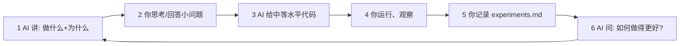
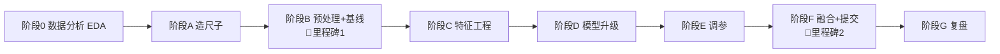

# House Prices 项目 · 完整路线图（初学者版）

> **用途**：把"从零到完成"的每一步摊开，让使用者（ML 初学者）知道**现在在哪、下一步做什么、为什么**。
> **配套**：详细知识点见 `docs/study_notes.md`；**代码/语法/库看不懂**见 `docs/python_syntax_notes.zh.md`；实验记录见 `docs/experiments.md`；协作规范见 `.github/copilot-instructions.md`。
> **最后更新**：2026-09-27

---

## 学习闭环（每一步都这么跑）⭐

**核心原则**：先讲清楚"做什么 + 为什么"，再给代码；**一次只推进一小步**，给完代码就停下等用户理解。

---

## 总览：8 个阶段 + 2 个里程碑

| 里程碑 | 达成标志 | 意义 |
|--------|---------|------|
| 🏁 里程碑 1 | 阶段 B 结束：跑出能提交的基线 | 闭环打通，之后优化都有"尺子"可比 |
| 🏁 里程碑 2 | 阶段 F 结束：最终提交 + 证据链 | 项目完成，可写进简历 |

---

## 阶段 0：数据分析（EDA）—— 当前起点 👈

> **为什么要重做**：之前那份 EDA 是 AI 直接生成的，用户看不懂。（元规则：看不懂 = 没做。）
> **原则**：一步一步来，每步先讲"做什么 + 为什么"，再给代码，然后停下观察。

| 步骤 | 做什么 | 为什么 |
|------|--------|--------|
| E1 | 加载数据 + 全局概览（形状 / 类型） | 先知道"盘子多大"、哪些是数字哪些是文字 |
| E2 | 目标变量分析（分布 / 偏态） | 决定要不要 `log` 变换 —— 直接影响最终分数 |
| E3 | 缺失值分析 | 分清"真缺失" vs "无该设施"，否则填错方向 |
| E4 | 单变量分析（数值偏态 / 类别基数） | 找出该变换的列、该合并的高基数列 |
| E5 | 与目标的关系（相关性 / 散点 / 离群点） | 找强特征、找异常样本 |
| E6 | train/test 一致性检查 | 防止本地 CV 很好、提交却崩 |

**产出**：`notebooks/01_data_overview.ipynb`（手写、可讲解）+ EDA 结论清单

---

## 阶段 A：造尺子（笔记 Step 3）

| 步骤 | 做什么 | 为什么 | 学到什么 |
|------|--------|--------|---------|
| A1 | 统一 CV 打分函数：`KFold(5, shuffle, seed=42)` + `RMSE on log1p(SalePrice)` | 🧒 没有统一尺子，"我改进了"全是错觉 | 交叉验证在估什么、为什么 RMSE-log、种子为何要固定 |

**产出**：`src/house_prices/data.py`（加载数据）、`src/house_prices/evaluate.py`（打分函数）

---

## 阶段 B：预处理 + 基线，打通闭环（笔记 Step 4 + 6）

| 步骤 | 做什么 | 为什么 |
|------|--------|--------|
| B1 | 缺失值按三类语义处理 | 🧒 先把"空格子"的含义搞对 |
| B2 | 类别编码：名义 One-Hot / 有序 Ordinal | 🧒 无序类别编号会造出假顺序 |
| B3 | 组装 `Pipeline`（预处理+模型打包） | 🧒 关进一个盒子，防止偷看答案（泄漏） |
| B4 | 基线模型（中位数 / Ridge）拿第一个 CV 分数 | 🧒 先有"地板"当参照 |
| B5 | 首次提交：`expm1` 还原 + 按 sample_submission 对齐 Id | ⚠️ 忘 `expm1` 分数爆炸；格式错直接失败 |

**里程碑 1** ✅
**产出**：`src/house_prices/pipeline.py`、`src/house_prices/train.py`、`submissions/submission_v1.csv`

---

## 阶段 C：特征工程（笔记 Step 5）

| 步骤 | 做什么 |
|------|--------|
| C1 | 10 个有序评级列（`Ex>Gd>TA>Fa>Po`）转 0~4 |
| C2 | 派生特征：总面积、房龄、卫浴总数、地下室面积… |
| C3 | 高基数类别：`Neighborhood` 等（目标编码 / 保留 One-Hot） |
| C4 | 离群点：先记录 Id 524/1299，CV 验证后再决定 |

**纪律**：一次只改一个变量，每改一次用阶段 A 的尺子量一次 → 记 `experiments.md`。

---

## 阶段 D：模型升级（笔记 Step 7）

由浅入深，每步建立在前一步直觉上：

1. 决策树 —— "树怎么切空间"
2. 随机森林 —— Bagging：平均为什么更稳
3. GBDT —— Boosting：一棵棵纠错为什么更强
4. XGBoost / LightGBM / CatBoost —— 工业级实现

**注意**：此阶段才需要 `pip install xgboost lightgbm catboost`。

---

## 阶段 E：调参（笔记 Step 8）

1. 手动调 → 搞懂每个参数在干嘛
2. GridSearch / RandomSearch
3. Optuna 贝叶斯优化（代理模型 + 采集函数）

---

## 阶段 F：融合 + 最终提交（笔记 Step 9 + 10）

1. 加权平均（性价比之王）
2. Stacking（⚠️ 元特征必须 K 折 OOF）
3. 最终提交：`expm1` → 提交 → 记录 CV vs LB

**里程碑 2** ✅

---

## 阶段 G：复盘

- 更新 `study_notes.md`、`README.md`「我学到了什么」
- 整理 `experiments.md` 成证据链
- 总结：哪步涨分最多？哪些是负结果？

---

## 简历证据链（全程积累）

| 证据 | 在哪里 |
|------|--------|
| 完整流程代码 | `src/house_prices/` |
| 实验对比记录 | `docs/experiments.md` |
| 学习笔记 | `docs/study_notes.md` |
| LB 成绩 | Kaggle 提交记录 |
