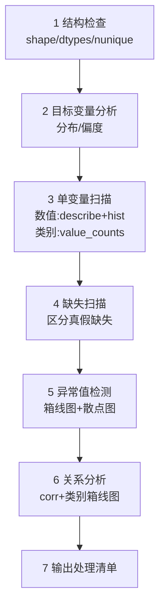
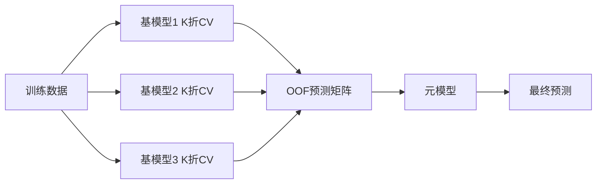

# House Prices 项目 · 学习笔记

> **用途**：Kaggle 房价预测项目的知识点笔记（面向"转 AI 工程师"的系统学习）。
> **写法约定**：术语后面都跟一句 🧒 "人话解释"，公式用 LaTeX，坑点用 ⚠️ 单独标出。
> **目标读者**：数学背景、ML 零基础。
> **配套**：本笔记讲"为什么这么做"；**代码/语法/库看不懂**时看 [python_syntax_notes.zh.md](./python_syntax_notes.zh.md)（读代码速查）。

---

## 如何阅读这份笔记

**第一遍（建立全局）**
1. 先读 **「模型章 · 总览」** —— 用"模型演化史"讲清每个模型为了解决什么问题而生
2. 再按 **Step 1 → Step 10** 顺序精读

**第二遍（补深度）**
3. 读 **「难点拓展」** —— 展开那些"重要但难理解"的地方（含推导）

**随时查阅**
4. 术语不懂 → **附录 C 术语速查**
5. 动手前 → 扫一遍 **附录 D 常见坑总表**
6. 遇到泄漏问题 → **附录 A 数据泄漏专题**
7. 准备面试 → **附录 E 面试高频问题速查**
8. **代码/语法/库看不懂** → [python_syntax_notes.zh.md](./python_syntax_notes.zh.md)（Python 与常用库「读代码」速查）

## 目录

| 章节 | 内容 |
|------|------|
| Step 1 | 环境与工程规范 |
| Step 2 | 数据理解 / EDA |
| Step 3 | 评估方案（造尺子） |
| Step 4 | 数据预处理 |
| Step 5 | 特征工程 |
| **模型章 · 总览** | 每个模型到底是"干嘛的" |
| **模型章 · 详解** | SVR 与 Boosting 三兄弟 |
| Step 6 | 建立基线模型 |
| Step 7 | 模型升级（树/集成） |
| Step 8 | 超参数调优 |
| Step 9 | 模型融合 |
| Step 10 | 提交与复盘 |
| 十步回顾 | 全流程总结 |
| **难点拓展** | 深入理解 16 个关键问题（含推导） |
| 附录 A | 数据泄漏专题 |
| 附录 B | 数学背景 → ML 对照 |
| 附录 C | 术语速查（人话版） |
| 附录 D | 常见坑总表 |
| 附录 E | 面试高频问题速查 |

---

## 学习进度

| Step | 主题 | 状态 |
|------|------|------|
| 1 | 环境与工程规范 | ✅ 已完成（基础） |
| 2 | 数据理解 / EDA | ✅ 已整理 |
| 3 | 评估方案 | ✅ 已整理 |
| 4 | 数据预处理 | ✅ 已整理 |
| 5 | 特征工程 | ✅ 已整理 |
| 6 | 建立基线模型 | ✅ 已整理 |
| 7 | 模型升级（树/集成） | ✅ 已整理 |
| 8 | 超参数调优 | ✅ 已整理 |
| 9 | 模型融合 | ✅ 已整理 |
| 10 | 提交与复盘 | ✅ 已整理 |
| 拓展 | 难点深入理解 | ✅ 已整理 |

---

## 全局流程地图


**心法**：
- 1→2→3 是**打地基**（尤其 Step 3 的"尺子"）
- 4→5 决定**分数上限**
- 6→9 是**在既定特征上榨分**
- 分数上不去，问题多半出在 4 和 5

---

# Step 1 · 环境与工程规范（简述）

**要做什么**：配环境、定目录、保证可复现。

**核心知识点**
- **虚拟环境**：隔离依赖，保证别人能复现
- **依赖锁定**：`requirements.txt` / `pyproject.toml`
- **项目结构**：`data/`（raw 与 processed 分离）、`src/`（可复用逻辑）、`notebooks/`（探索）、`configs/`（参数）、`submissions/`（输出）
- **可复现三要素**：固定随机种子、记录版本、配置与代码分离

**常见坑**：不固定随机种子 → 每次结果不同 → 无法判断改动是否有效。

---

# Step 2 · 数据理解 / EDA

## 定位

> EDA 的本质：**不是"看数据"，而是"盘问数据"**。
> 你是侦探，数据是证人。你要按顺序问它一组问题，每个问题都有对应工具。

## 要盘问的 6 组问题

| # | 问题 | 一句话含义 |
|---|------|-----------|
| 1 | 有多少、什么类型？ | 骨架：行列数、数值还是文字 |
| 2 | 每列长什么样？ | 分布：集中、散度、偏斜 |
| 3 | 缺东西吗？ | 缺失值 |
| 4 | 有怪东西吗？ | 异常值 |
| 5 | 列与列有关系吗？ | 相关性、共线性 |
| 6 | 哪些列跟目标有关？ | 特征 vs 目标 ⭐最重要 |

## 2.1 数据类型与规模

**变量类型**

| 类型 | 人话 | 例子 | 后续处理 |
|------|------|------|---------|
| 连续数值 | 可取任意小数 | 面积、价格 | 缩放、变换 |
| 离散数值 | 只能取整数 | 卧室数、车位数 | 可数值可类别 |
| 名义类别 | 无顺序的文字 | 社区名、外墙材料 | One-Hot |
| 有序类别 | 有高低顺序 | `Ex>Gd>TA>Fa>Po` | Ordinal 编码 |
| 时间 | 日期/年份 | 建造年份 | 转成年龄/间隔 |

**工具**：`shape` / `dtypes` / `nunique()`

> ⚠️ **数字形式 ≠ 数值变量**。判断法：看 `nunique()`。
> 只有 15 个不同值的数字列（如 `MSSubClass`）→ **其实是类别**。

## 2.2 分布

**四个关键统计量**

| 统计量 | 人话 |
|--------|------|
| 均值 mean | 加总除以个数 |
| 中位数 median | 排队站中间那个（抗极端值） |
| 标准差 std | 平均偏离中心多远 |
| 四分位 IQR | 中间 50% 的跨度 |

> 🧒 **超好用的判断技巧**：**均值和中位数差得远 → 数据是偏的。**
> - 均值 ≈ 中位数 → 对称
> - 均值 > 中位数 → 右偏
> - 本项目：均值 18.1 万，中位数 16.3 万 → **右偏** ✅

**偏度判断标准**

| \|偏度\| | 含义 | 处理 |
|---------|------|------|
| < 0.5 | 基本对称 | 不管 |
| 0.5 ~ 1 | 中等偏斜 | 看情况 |
| **> 1** | 严重偏斜 | **考虑 log 变换** |

**看分布三件套**

| 工具 | 人话 | 擅长 |
|------|------|------|
| 直方图 | 分桶数个数 | 整体形状、几个峰 |
| KDE 曲线 | 直方图平滑版 | 形状更直观 |
| **箱线图** | 一个箱子 + 两条须 | **异常值**、中位数、分散度 |

**箱线图怎么读**

```
        ┌──────────┐
  ├─────┤          ├─────┤        ○  ○
  │     │  中位数  │     │      (异常点)
  └─────┴──────────┴─────┘
  Q1               Q3
  ←──── IQR ────→
```
- 箱子下边 = Q1，上边 = Q3，中间线 = 中位数
- 箱子高度 = IQR（中间 50% 数据跨度）
- 须延伸到正常范围边界
- **须外的小圆点 = 可疑异常值**

## 2.3 缺失值

**第一步：分清两种缺失（关键）**

| 类型 | 人话 | 判断依据 | 处理 |
|------|------|---------|------|
| **假缺失** | 不是没记录，是"没这个东西" | 数据字典里列了 `NA` 取值 | 填 `"None"` |
| **真缺失** | 本来有值但没记 | 数据字典没列 `NA` | 统计量/模型填补 |

> ⚠️ 不区分就无脑填均值 → 把"有/无泳池"的信息抹掉了。

**第二步：缺失机制**

| 机制 | 人话 |
|------|------|
| MCAR（完全随机缺失） | 缺失跟谁都没关系 |
| MAR（随机缺失） | 缺失**跟别的变量**有关 |
| MNAR（非随机缺失） | 缺失**跟它自己的值**有关 |

判断技巧：算一算"缺失样本"和"非缺失样本"的目标均值差多少。差很多 → **缺失本身含信息** → 加"是否缺失"特征。

**工具**：`isna().sum()`、`isna().mean()`、缺失热图、`groupby(isna)` 交叉分析

## 2.4 异常值

> ⚠️ **异常值 ≠ 错误值！** 三种可能：
> 1. 数据错误 → 修/删
> 2. 真实极端值（真有大豪宅）→ 保留
> 3. 稀有特殊事件 → 小心处理

**三种检测法**

| 方法 | 人话 | 公式/准则 |
|------|------|----------|
| Z-score | 离均值几个标准差 | $z=\frac{x-\mu}{\sigma}$，$\|z\|>3$ 可疑（不稳健） |
| **IQR 法则** ⭐ | 用中间 50% 划正常范围 | 超出 $[Q1-1.5IQR,\ Q3+1.5IQR]$ |
| 可视化 | 箱线图、散点图 | 一眼看散落点 |
| Isolation Forest | 模型自动找孤立点 | 进阶 |

**处理方式（不只"删"）**：保留 / 删除 / 截断 winsorize / 变换(log) / 换对异常不敏感的模型

> ⚠️ **先记录，别急着删**。有 baseline 后用 CV 验证"删了是否真的更好"。

## 2.5 相关性

> **多重共线性的危害与 VIF 公式见「难点拓展 3」。**

**两种用途**：① 特征 vs 目标（筛选）② 特征 vs 特征（共线性）

**三种系数**

| 系数 | 人话 | 适用 |
|------|------|------|
| Pearson | 衡量**线性**关系 | 数值 vs 数值 |
| Spearman | 衡量**单调**关系（看排名） | 抗异常值、非线性单调 |
| ANOVA F / 点双列 | 类别 vs 数值 | 类别 vs 数值目标 |

**读法**：\|r\|<0.3 弱；0.3~0.7 中；>0.7 强

> ⚠️ **三个认知**：
> 1. **相关 ≠ 因果**
> 2. 相关系数只看线性/单调 → 不能只靠它筛特征
> 3. **多重共线性**：特征间高度相关 → 线性模型系数不稳。用 **VIF** 检测，VIF>5~10 算严重

**工具**：`corr()`、`heatmap`、`pairplot`、`scatterplot`

## 2.6 特征与目标的关系 ⭐

| 特征类型 | 用什么看 | 看什么 |
|---------|---------|--------|
| 数值 vs 房价 | 散点图 + 相关系数 | 趋势线性还是曲线？有异常点？ |
| 类别 vs 房价 | **箱线图**（每类别一箱）+ 组均值 | 不同类别差别大吗？ |
| 有序类别 vs 房价 | 按顺序排的箱线图 | 是否**单调**？ |

实用技巧：`df.groupby('Neighborhood')['SalePrice'].agg(['mean','median','count'])`

## 2.7 EDA 标准动作序列



> 🧒 **核心心法**：**先看统计量缩小范围，再画图看细节。**
> 绝不"一上来画 79 张图"。

## 2.8 EDA 的坑

1. ❌ 把 `NA` 全当真缺失
2. ❌ 只看均值不看中位数
3. ❌ 看到异常值就删
4. ❌ 以为相关=因果
5. ❌ 只做单变量分析（忽略与目标的关系）

## 2.9 本项目 EDA 实测结论

| 检查项 | 发现 | 下一步 |
|--------|------|--------|
| 规模 | 1460×81（79 个特征 = 36 数值 + 43 类别），3.43 MB | 特征编码是主要工作量 |
| 目标分布 | 右偏，skew = **1.88**；log1p 后 **0.12** | 对目标做 log1p |
| 缺失 | 19 列，共 7829 个格子；多数是"无设施" | 假缺失填 None，真缺失用中位数 |
| 偏度最高 | MiscVal 24.5、PoolArea 14.8、LotArea 12.2 | 考虑变换或转"有无" |
| 基数最高 | Neighborhood 25、Exterior2nd 16 | One-Hot 可接受 |
| 强相关 | OverallQual 0.79、GrLivArea 0.71、GarageCars 0.64 | 优先保留 |
| 共线性 | GarageCars ↔ GarageArea | 考虑只留一个 |
| 无用列 | Utilities 近乎常数 | 考虑丢弃 |
| 异常值 | Id 524、1299（面积超大、价格很低） | 记录，待 CV 验证 |

---

# Step 3 · 评估方案（给模型造一把"尺子"）

## 定位

> Step 3 不是训练模型，而是**先想清楚"我怎么判断模型好坏"**。
> 没有可靠的尺子，后面所有"我改进了"都是错觉。

## 3.1 泛化（Generalization）

**人话**：模型在**没见过的新数据**上的表现。

> 🧒 两个学生：A 背了所有例题，换数字就懵（泛化差）；B 理解原理，新题也会做（泛化好）。
> **我们永远要 B。** 所以考试数据必须是模型**没见过的**。

## 3.2 三个数据集

| 名称 | 作用 | 类比 |
|------|------|------|
| 训练集 Train | 模型学习 | 课本/作业 |
| 验证集 Validation | **调模型**、选方案 | 模拟考（可多次） |
| 测试集 Test | **一次性**验收 | 高考（只有一次） |

**为什么要三份**：如果只有"训练+测试"，你会忍不住反复用测试集挑方法 → **对测试集过拟合** → 真高考露馅。

**本项目**：从 `train.csv`（1460）切"训练+验证"；`test.csv`（1459）是"高考卷"，答案在 Kaggle 后台。

## 3.3 交叉验证（K-Fold）

> **折数怎么选、留一法的悖论、为什么需要"重复 CV"，见「难点拓展 9」。**

**人话**：把数据分 K 份，**轮流**拿 1 份当验证集，其余当训练集，取 K 次分数的平均。

K=5 示意：


> 🧒 像**5 个老师轮流出题考你**，最后取平均分——运气被平均掉了。

**好处**：① 结果更稳 ② 用满数据 ③ 能看稳定性
**代价**：训练 K 次（本题很小，K=5/10 没问题）

**变体**：Stratified K-Fold（分层）、Group K-Fold（按组划分，**何时需要见拓展 13.2**）

## 3.4 偏差与方差

> **完整推导见「难点拓展 2」**。

**人话（射箭比喻）**
- **偏差 Bias**：瞄得准不准（系统性偏移）
- **方差 Variance**：手稳不稳（落点散不散）

$$\text{预测误差} \approx \text{偏差}^2 + \text{方差} + \text{噪声}$$

> 🧒 误差来自三部分：方法本身偏（偏差）、方法太敏感（方差）、数据自身随机性（噪声，认命）。

**为什么重要**——所有技巧本质都在调这个平衡：

| 技巧 | 在干什么 |
|------|---------|
| 加特征、换复杂模型 | 降偏差，可能升方差 |
| 正则化 | **降方差**（牺牲一点偏差） |
| 集成（随机森林、融合） | 主要**降方差** |
| Boosting | 主要**降偏差** |
| 更多数据 | 同时有益，尤其降方差 |

## 3.5 过拟合 / 欠拟合

| | 欠拟合 | 过拟合 |
|---|--------|--------|
| 人话 | 学得太差 | 学得太死（背下来了） |
| 训练集 | 差 | 极好 |
| 验证集 | 差 | **差** |
| 原因 | 模型太简单/特征少 | 模型太复杂/特征多/数据少 |
| 对应 | 高偏差 | 高方差 |
| 怎么救 | 加特征、换复杂模型 | 正则化、简化、加数据、集成 |

> 🧒 **关键信号 = 训练集与验证集分数的差距**。

## 3.6 数据泄漏（Leakage）⚠️

**人话**：训练时不小心用了"不该知道"或"将来才知道"的信息 → 分数虚高，真实场景崩。

> 🧒 **就是"练习时偷看了答案"。**

**本项目的典型泄漏**
1. **标准化/编码用了全量数据** → 应用训练集算统计量
2. **Target Encoding 用了全量数据** → 必须用 OOF
3. **用了实际预测时拿不到的特征**
4. **训练集和验证集有重复样本**

> ⚠️ 一句话：**只要你在验证/测试数据上提前看到了任何结论性信息，都是泄漏。**（面试高频考点）

## 3.7 评估指标

> **"为什么用平方误差"的统计解释见「难点拓展 1」；分类问题的指标见「难点拓展 15」。**

| 指标 | 人话 | 公式 |
|------|------|------|
| MAE | 绝对误差的平均，单位同价格 | $\frac{1}{n}\sum\|y_i-\hat{y}_i\|$ |
| MSE | 误差平方的平均，**放大大错** | $\frac{1}{n}\sum(y_i-\hat{y}_i)^2$ |
| **RMSE** | MSE 开根号，单位变回价格 | $\sqrt{\frac{1}{n}\sum(y_i-\hat{y}_i)^2}$ |
| **RMSLE** ⭐本比赛 | 先取对数再算 RMSE | $\sqrt{\frac{1}{n}\sum(\log(1+\hat{y}_i)-\log(1+y_i))^2}$ |

## 3.8 为什么这题一定要取对数 ⭐（重点）

**例子**：两个房子都猜错 1 万

| 房子 | 真实价 | 预测 | 绝对误差 | 相对误差 |
|------|--------|------|---------|---------|
| 便宜房 | 10 万 | 11 万 | 1 万 | **10%** |
| 豪宅 | 50 万 | 51 万 | 1 万 | **2%** |

绝对误差一样，**严重程度完全不同**。RMSE 只看绝对误差 → 不公平。

**对数怎么解决**：$\log(a)-\log(b)=\log(a/b)$ → **对数空间的差 ≈ 相对误差**。

**附带好处**：让右偏数据变正态（实测 skew 1.88 → 0.12）。

**实操**：
1. 训练前：`log1p(SalePrice)`
2. 模型学 log 空间
3. 预测后：`expm1` 变回来
4. 在 log 空间算 RMSE（官方口径）

### ⚠️ 取 log 的副作用（进阶，重要）

**① 改变了"关注点"**：不取 log 时，豪宅的大误差会**绑架**总损失（贡献是便宜房的几十倍）→ 模型优先照顾豪宅。
取 log 后按相对误差算 → **便宜房被"重视"了，贵房的绝对误差变大**。

> ✅ 这是**故意的、正确的**——因为比赛评的就是相对误差。

**② Jensen 不等式导致系统性低估**：

$$\exp(\mathbb{E}[\log y]) \le \mathbb{E}[y]$$

模型在对数空间学到的是 $\mathbb{E}[\log y]$，变回来后是**几何平均**（≤ 算术平均）→ 预测偏低。

修正（smearing）：$\hat{y} = \exp(\hat{\mu}) \times e^{\sigma^2/2}$

- **比赛中不用管**（Kaggle 就在对数空间评分）
- **做业务必须管**（否则系统性低估房价）

**什么时候不取 log**：当你真正关心"美元绝对误差"时（如预算、贷款评估）。

## 3.9 本项目的评估方案

| 要素 | 选择 | 原因 |
|------|------|------|
| 验证方式 | **5 折交叉验证** | 数据仅 1460 行，单次切分靠运气 |
| 指标 | **RMSE on log 目标** | 官方口径 |
| 目标处理 | 训练 `log1p`，预测 `expm1` | 纠偏 + 对齐指标 |
| 防泄漏 | **预处理只在训练折 fit** | 否则一提交就崩 |
| 随机种子 | **固定** | 可复现、可比 |
| 记录 | 每次实验记"改了啥→CV 分数" | 否则不知道有没有用 |

## 3.10 自检

1. 为什么不能只切一次验证集？→ 数据少，运气成分大，CV 取平均更稳
2. 训练 RMSE 低、验证 RMSE 高说明？→ 过拟合（高方差）
3. "全量数据标准化再 CV"错在哪？→ 泄漏
4. 为什么取 log？→ 把绝对误差变相对误差 + 纠正右偏

---

# Step 4 · 数据预处理

## 定位

> Step 2 搞清"数据有什么毛病"，Step 4 **动手治**。
> 原始表格 → 模型能直接吃的**数字矩阵**。

## 〇、四件大事 + 铁律

| # | 毛病 | 方法 |
|---|------|------|
| 1 | 有缺失 | 缺失值填补 |
| 2 | 是文字 | 类别编码 |
| 3 | 量纲不一致 | 数值缩放 |
| 4 | 分布太偏 | 分布修正 |

> ⚠️ **铁律**：所有"学规则"的动作（算均值、学编码表、算缩放参数）**只能用训练集**！

## 4.1 缺失值填补

**先分真假**

| 类型 | 判断 | 填 |
|------|------|-----|
| 假缺失（无该设施） | 字典列了 `NA` | `"None"` |
| 真缺失 | 字典没列 `NA` | 统计量/模型 |

**六种策略**

| 策略 | 人话 | 何时用 |
|------|------|--------|
| ① 删行/列 | 缺太多就扔掉 | 缺 80%+ 且无意义；⚠️ 会减样本 |
| ② 填常量 | 0 / `"None"` / `"Unknown"` | 假缺失 |
| ③ 填统计量 | 均值/中位数/众数 | **中位数**最常用（抗偏斜） |
| ④ **分组填补** | 按组填，如按社区的中位数填 `LotFrontage` | 缺失与某类别相关 |
| ⑤ 模型填补 | `KNNImputer` / `IterativeImputer` | 想利用变量关系 |
| ⑥ 加缺失标记 | 额外加"原本是否缺失"列 | 缺失本身含信息 |

**决策表**

| 情况 | 建议 |
|------|------|
| 假缺失 | 填 `"None"` |
| 缺 > 80% 且无意义 | 删列或转"有无" |
| 真缺失 + 偏态 | **中位数** |
| 真缺失 + 类别 | **众数** |
| 缺失与其他变量相关 | **分组填补** |
| 缺失可能含信息 | **加标记** |

**坑**：全量数据算中位数（泄漏）；无脑填均值；忘了假缺失。

## 4.2 类别编码

> 🧒 模型只会算数，不会读文字。

**① One-Hot（独热）** ⭐
把 k 个取值拆成 k 列（或 k-1 列），每列填 0/1。
- ✅ 不引入虚假大小关系
- ❌ 维度爆炸
- 用于：**名义类别**且取值不多（<15~20）

**② Ordinal（有序编码）** ⭐
按**有意义的顺序**映射：`Ex→5, Gd→4, TA→3, Fa→2, Po→1, None→0`
- 顺序必须**你手动定**且符合现实
- 用于：`ExterQual`、`KitchenQual`、`BsmtQual`、`LotShape` 等

**③ Label Encoding** ⚠️
机械分配整数，**不管语义** → 会硬塞一个假顺序。
- ✅ 有序类别 / 树模型
- ❌ 线性模型 + 名义类别

> ⚠️ **② 与 ③ 的关系（常见混淆）**：**机械地看，Label 和 Ordinal 是同一个操作**（都把类别映射成整数）。区别在**意图 + API**：
>
> | | Label Encoding | Ordinal Encoding |
> |---|---|---|
> | sklearn 类 | `LabelEncoder`（输入 **1D**，设计用于**目标 `y`**） | `OrdinalEncoder`（输入 **2D**，用于**特征 `X`**） |
> | 隐含语义 | 编号**无顺序**（只是占位） | 整数**代表真实顺序** |
> | 危险 | 无序类别 + 线性模型 → **假顺序** | 顺序必须你手动定对 |
>
> 🧒 **无序类别别用整数编码**（线性模型会以为 `NAmes=1` 比 `CollgCr=2` 便宜）→ 用 One-Hot 或 Target Encoding。

**④ Target / Mean Encoding** ⭐强但危险
用**该类别的平均房价**代表该类别。
- ✅ 不增维度、信息量大
- ❌ **极易泄漏**！必须只用训练折 + OOF + 平滑
- 用于：**高基数**类别

> **平滑公式与防泄漏的具体做法见「难点拓展 7」。**

**⑤ 其他**：Frequency/Count Encoding、Binary Encoding

**决策表**

| 类别类型 | 取值少 | 取值多 |
|---------|--------|--------|
| 有序 | Ordinal | Ordinal |
| 名义 | **One-Hot** | Target（谨慎） |

## 4.3 数值缩放

**谁需要**

| 模型 | 需要？ | 为什么 |
|------|--------|--------|
| 线性 / Ridge / Lasso | ✅ | 正则化对所有系数一视同仁 |
| KNN / SVR | ✅ | 靠距离，量纲会主导 |
| PCA | ✅ | 找方差最大方向 |
| 树 / 随机森林 / XGBoost | ❌ | 只看"在哪切" |

**三种方法**

| 方法 | 公式 | 特点 |
|------|------|------|
| 标准化 Z-score ⭐ | $z=\frac{x-\mu}{\sigma}$ | 均值 0、标准差 1；**对异常值敏感** |
| 归一化 Min-Max | $x'=\frac{x-\min}{\max-\min}$ | 压到 [0,1]；**对异常值极敏感** |
| 稳健缩放 RobustScaler ⭐ | $x'=\frac{x-\text{median}}{\text{IQR}}$ | **不怕异常值** |

**选哪个**：一般用标准化；有异常值用 Robust；需要固定范围用 Min-Max；树模型不缩放。

## 4.4 分布修正

> **Box-Cox / Yeo-Johnson 的完整公式与选择标准见「难点拓展 8」。**

| 方法 | 公式 | 约束 | 适合 |
|------|------|------|------|
| log / log1p | $\log(1+x)$ | $x\ge0$ | 右偏正数 ⭐ |
| Box-Cox | 带参数 $\lambda$ 的变换族 | 必须严格正 | 自动找最优 λ |
| Yeo-Johnson | Box-Cox 推广 | 任意实数 | 有 0/负数时 |

**何时用**：偏度 > 1 的特征。⚠️ 稀疏右偏（多数为 0）→ 更好是拆成"有无 + 数值"。

## 4.5 Pipeline 与 ColumnTransformer（防泄漏的关键工具）

**三个核心动作**

| 动作 | 人话 |
|------|------|
| `fit` | **学规则**（只看训练集）：算均值、学类别表、算缩放参数 |
| `transform` | **用规则**：减均值、换数字 |
| `fit_transform` | 学 + 用（只在训练集用） |

> 🧒 **防泄漏机制**：训练集 `fit_transform`；验证/测试集只 `transform`。
> 这样验证集信息**永远没机会**污染规则。

**ColumnTransformer**：数值列走"填补+缩放"，类别列走"填补+One-Hot"，最后拼起来。

**Pipeline**：把"预处理 + 模型"打包成一个整体 → 丢进 CV 时自动防泄漏。


## 4.6 处理顺序

```
1 区分真假缺失 → 2 填补 → 3（可选）加缺失标记
→ 4 分布修正(log) → 5 类别编码 → 6 数值缩放
```
缩放放最后（因为 log 会改变尺度）。

## 4.7 坑清单

| 坑 | 正确做法 |
|----|---------|
| 用全量数据算均值/编码 | 只在训练集 fit |
| 无脑填均值 | 偏态用中位数 |
| 把假缺失当真缺失 | 查数据字典 |
| LabelEncoder 编名义类别 | 用 One-Hot |
| 给树模型缩放 | 不必要 |
| Target Encoding 用全量 | OOF + 平滑 |
| 手动一步步预处理 | 用 Pipeline |

## 4.8 自检

1. `Alley` 缺 1369 行填什么？→ `"None"`（假缺失）
2. 为什么 KNN 要缩放、森林不用？→ KNN 靠距离；森林靠阈值切分
3. Target Encoding 最危险在哪？→ 用了目标值，易泄漏
4. 为什么不能全量算标准化参数？→ 泄漏
5. `ExterQual` 用什么编码？→ Ordinal

---

# Step 5 · 特征工程（分数线所在）

## 定位

> - **Step 4 是"修毛病"** → 让数据**能用**
> - **Step 5 是"造新东西"** → 让数据**更强**

**核心事实**：

> **模型能自己学到的有限，你给它的特征质量决定了分数上限。**

| 做法 | 大致 CV 分数 |
|------|-------------|
| 原始特征直接喂 | ~0.15 |
| **认真做特征工程** | **~0.11~0.12** |

## 五个方向

| # | 方向 | 一句话 | 本题重要性 |
|---|------|--------|-----------|
| 1 | 领域特征构造 | 用人类理解造新列 | ⭐⭐⭐⭐⭐ |
| 2 | 交互特征 | 两个特征的组合效应 | ⭐⭐⭐ |
| 3 | 多项式特征 | 自动做乘法 | ⭐⭐ |
| 4 | 聚合特征 | 按组算统计量 | ⭐⭐ |
| 5 | 特征选择 | 做减法 | ⭐⭐⭐⭐ |

## 5.1 领域特征构造 ⭐

> 🧒 **问自己："如果我是买房的，我会怎么判断这套房值多少钱？"**

**① 面积类**

```python
TotalSF      = TotalBsmtSF + 1stFlrSF + 2ndFlrSF          # 总面积
TotalPorchSF = OpenPorchSF + EnclosedPorch + 3SsnPorch + ScreenPorch
TotalBath    = FullBath + 0.5*HalfBath + BsmtFullBath + 0.5*BsmtHalfBath
```

> 半卫（HalfBath）乘 0.5 —— 这个 0.5 就是**领域判断**。
>
> ⚠️ **重要**：**0.5 是"约定"，不是"定理"**。它假设"半卫对房价的贡献 ≈ 全卫的一半"，**没有严格依据**，换成 0.3/0.7 同样合法。
> - **更严谨的做法**：`FullBath`、`HalfBath` **分开作为独立特征，让模型自己学权重**（树模型尤其推荐）
> - **验证 0.5 是否合理**：看两列各自与房价的相关性/回归系数；若半卫系数 ≈ 全卫一半，0.5 就站得住
> - 用**线性模型**时"合并 + 固定权重"的降维好处更明显
>
> 🧒 **规律**：**单位一致就直接加（面积）；单位不等价就加权或分开（卫生间、门廊）**。

**② 时间类**

```python
HouseAge    = YrSold - YearBuilt
RemodAge    = YrSold - YearRemodAdd
GarageAge   = YrSold - GarageYrBlt
IsRemodeled = (YearRemodAdd != YearBuilt)
```

**③ 有无指示（把稀疏数值变开关）**

```python
HasPool      = (PoolArea > 0)
HasGarage    = (GarageArea > 0)
HasBasement  = (TotalBsmtSF > 0)
Has2ndFloor  = (2ndFlrSF > 0)
HasFireplace = (Fireplaces > 0)
```

> 因为"有泳池"本身值钱（约 +5 万），但"300 还是 350 平米"差别不大 → 降级成"有无"反而降噪。

**④ 其他**

| 新特征 | 构造 | 直觉 |
|--------|------|------|
| `TotalQual` | `OverallQual + OverallCond` | 综合质量 |
| `QualArea` | `OverallQual × GrLivArea` | 质量 × 面积 |
| `AvgRoomSF` | `GrLivArea / TotRmsAbvGrd` | 宽敞度 |
| `BathPerRoom` | `TotalBath / TotRmsAbvGrd` | 卫浴密度 |

> ⚠️ **每个新特征都要问："它带来新信息了吗？"** 能被现有特征**精确**线性组合出来的 → 对**线性模型**冗余；但**对树模型不算冗余**（树自己算不出加法，见「拓展 3 补充」）。

## 5.2 交互特征

**人话**：**"1+1>2"** 的效应。

> 房子大 → 贵；质量好 → 贵；**又大又好质量 → 贵得多得多** ⬆️

```python
QualArea = OverallQual * GrLivArea
```

**为什么线性模型特别需要**：线性模型只会**加法**（$\hat{y}=w_1x_1+w_2x_2+b$），**表达不了乘积** → 必须手动造。

**什么时候造**：① 领域直觉 ② 看残差 ③ 自动搜索

> ⚠️ 数量爆炸：n 个特征 → ~n²/2 个交互。**先造候选 → 用特征选择筛 → 只留有效的。**

## 5.3 多项式特征

**人话**：把特征平方、两两相乘，自动生成组合。

```python
PolynomialFeatures(degree=2)
```
`[a,b]` → `[a, b, a², ab, b²]`

> 🧒 **关键洞察**：多项式回归**本质还是线性模型**（对参数线性），只是对原始特征非线性 → 照样能用最小二乘，但现在能画**抛物线**。

⚠️ **两个大问题**：维度爆炸 + 严重共线性 → **必须配正则化**。

## 5.4 聚合特征（分组统计）

```python
# 安全（不涉及目标）
df['Neighborhood_count']    = df.groupby('Neighborhood')['Id'].transform('count')
df['Neighborhood_avg_area'] = df.groupby('Neighborhood')['GrLivArea'].transform('mean')
```

> ⚠️⚠️ **危险**：`groupby(...)['SalePrice'].transform('mean')` —— 碰了目标 → **必然泄漏**，必须用 OOF。

> 🧒 **原则**：只要特征构造里碰了"目标变量"，就必须格外小心泄漏。

## 5.5 特征选择

**为什么要减法**：特征太多 → 过拟合、慢、噪音稀释信号、共线性。
> 找凶手时给 1000 条线索，990 条无关 → 更难破案。**少而精 > 多而杂。**

**三大类**

| 类别 | 人话 | 方法 | 优缺点 |
|------|------|------|--------|
| **过滤法 Filter** | 用统计指标单独打分 | 相关系数、方差阈值、卡方、互信息、ANOVA F | 快，但忽略特征间配合 |
| **包裹法 Wrapper** | 真训模型看分数变化 | RFE、前向/后向选择 | 准但慢 |
| **嵌入法 Embedded** ⭐ | 训练中顺便选 | Lasso(L1)、树重要性、Permutation Importance | 快 + 考虑配合 |

**Lasso 为什么能选特征**：L1 正则会把不重要特征的系数**压到正好 0**。

**决策表**

| 情况 | 推荐 |
|------|------|
| 快速初筛 | 过滤法（相关 + 方差阈值） |
| 特征多、要靠谱 | Lasso / 树重要性 |
| 追最优、不差时间 | RFE |
| 已有不错模型 | Permutation Importance |

> ⚠️ **特征选择也必须在 CV 内部做**，否则泄漏。

## 5.6 四条心法

1. **领域优先**：人的理解 > 机器盲搜
2. **加完必须验证**：跑 CV，涨了才留
3. **问"有没有新信息"**：能被线性组合出来的 → 对**线性模型**冗余；对**树模型**仍是新能力（加法树自己算不出来）
4. **记录实验**：改了啥、分数变多少（简历"证据链"素材）

## 5.7 坑清单

| 坑 | 后果 | 正确做法 |
|----|------|---------|
| 用目标构造特征 | 泄漏 | 用 OOF |
| 无脑堆特征 | 过拟合、变慢 | 特征选择 |
| 加了特征不验证 | 不知道有没有用 | CV 对比 |
| 保留冗余共线特征 | 系数不稳 | 合并/删 |
| 先选特征再 CV | 泄漏 | 选择放 CV 内 |

## 5.8 自检

1. `TotalSF` 为什么有用？→ 把分散的面积信号合成直接信号
2. 为什么线性模型要手动造交互？→ 它只会加法，表达不了乘积
3. 算"社区平均房价"风险？→ 用目标，易泄漏，须 OOF
4. `PoolArea` 多为 0 怎么处理？→ 转 `HasPool` + 面积
5. 特征选择为什么放 CV 内？→ 否则"看到"验证集，泄漏

---

# 模型章 · 总览：每个模型到底是"干嘛的"

> **先读这一章，再去看 Step 6 / Step 7 的细节。**
> 学模型不是背参数，而是搞懂 **"人为什么要发明它"**。

## 总纲：所有回归模型都在回答同一个问题

> **"房价和这些特征，到底是什么关系？"**
> **不同模型 = 对"关系"做了不同的假设。**

| 模型 | 它的假设 |
|------|---------|
| 线性回归 | 房价 = 各特征乘系数再加起来（加法、直线） |
| 决策树 | 房价 = 一串"如果…就…"的规则（分段、阶梯） |
| KNN | 长得像的房子，价格也像 |
| SVR | 大部分房子应落在一条误差通道里 |

**学一个模型，就问两件事**：① 它假设了什么？② 我的数据符合吗？

## 演化史（每一步都是为解决上一步的毛病）

| 步骤 | 遇到的问题 | 于是有了 | 它干嘛的 |
|------|-----------|---------|---------|
| 1 | 完全不懂房价，最朴素的猜测 | **线性回归** | 给每个特征算一个"单价"（权重），加起来预测 |
| 2 | 特征重叠 → 权重乱跳、不稳定 | **Ridge** | 给权重加"别太大"的罚款 → 权重变小变稳 |
| 3 | 想自动删掉没用的特征 | **Lasso** | 换种罚款，**把没用的权重压成 0** → 自动筛特征 |
| 4 | 既想删特征又想稳 | **ElasticNet** | L1 + L2 混合 |
| 5 | 关系不是直线、还有组合条件 | **决策树** | 自动找"如果…就…"规则，能表达任意形状 + 自动发现交互 |
| 6 | 单棵树太不稳（换个数据就变） | **随机森林** | 种几百棵树投票；每棵看随机数据 + 随机特征 → 错误互相抵消 |
| 7 | 平等投票精度不够 | **GBDT** | **接力纠错**：后一棵专门学前一棵做错的部分 |
| 8 | GBDT 不够快不够准 | **XGBoost** | 用二阶信息 + 显式正则化 + 工程优化 |
| 9 | 数据大时太慢 | **LightGBM** | 连续值分桶 + 只长最有价值的叶子 → 快省 |
| 10 | 类别特征多，手动编码又烦又险 | **CatBoost** | 自动抗泄漏地处理类别特征 + 对称树 |

**两条不一样的路**

| 模型 | 假设 | 人话 |
|------|------|------|
| KNN | 相似的房子价格相似 | 不学公式，直接找最像的 K 个房子取平均；慢、对量纲敏感 |
| SVR | 大部分点落在误差通道里 | 不追求每点都准，只要大部分点在一条"管子"里 |

## 怎么选

1. **关系大致线性？** → 线性回归族
2. **关系复杂/有拐点？** → 树模型
3. **怀疑很多特征没用？** → Lasso 帮你删
4. **类别特征多？** → CatBoost 省事

> 🧒 没有"哪个更高级"，只有**"哪个更匹配你的数据关系"**。
> 实际做法：**多试几个，用交叉验证分数说话**（Step 8）。

---

# 模型章 · 详解：SVR 与 Boosting 三兄弟

> 讲法固定为：**它为了解决什么 → 它怎么操作 → 它怎么处理你的数据**。

## SVR（支持向量回归）

### 从哪来

SVM 本来是**做分类**的（找一条线把两类分开）。1996 年左右 Vapnik 把它推广到回归。

**推广的难点**：回归不像分类那样"分开就行"，怎么定义"预测得好"？
**SVR 的回答（灵魂）**：**不要求每个点都准，允许一条"宽容带"（管道）；落在带内就不算误差。**

### 核心想法：ε-不敏感管道

```
          ○                    ← 管道外的点：要罚
      ─────────────  ε 上界
    ●  ●   ●   ●  ●           ← 管道内的点：完全不管
    ═════════════  f(x) 回归函数
      ─────────────  ε 下界
          ○                    ← 管道外的点：要罚
```

| 效果 | 说明 |
|------|------|
| 只关心"难的点" | 容易的点不再拉扯模型 |
| **稀疏性** | 模型**只由管道外的支持向量决定** |
| 抗噪音 | 小波动落在管道内，自动忽略 |

### 数学形式

$$\min_{\mathbf{w},b}\ \frac{1}{2}\|\mathbf{w}\|^2 + C\sum_i\max\big(0,\ |y_i-f(x_i)|-\varepsilon\big)$$

| 项 | 干嘛的 |
|----|--------|
| $\frac{1}{2}\|\mathbf{w}\|^2$ | 让函数尽量**平**（等价于最大化间隔） |
| $C\sum\max(0,\|\cdot\|-\varepsilon)$ | **只有管道外的点才算账** |

**两个关键超参数**
- $\varepsilon$：管道宽度（越宽 → 支持向量越少 → 模型越简单）
- $C$：多在意拟合（大 → 拟合更狠、易过拟合；小 → 更平、易欠拟合）

**正式形式（引入松弛变量）**

$$\min \tfrac{1}{2}\|\mathbf{w}\|^2 + C\sum(\xi_i+\xi_i^*),\quad \text{s.t.}\ y_i-f(x_i)\le\varepsilon+\xi_i,\ f(x_i)-y_i\le\varepsilon+\xi_i^*,\ \xi\ge0$$

**解出的预测形式**

$$f(x)=\sum_i(\alpha_i-\alpha_i^*)K(x_i,x)+b$$

> 🧒 **绝大多数 $\alpha_i=0$**，只有少数**支持向量**非零 → 名字的由来。

**核技巧（处理非线性）**

$$K(x,x')=\exp(-\gamma\|x-x'\|^2)\quad(\text{RBF})$$

> 🧒 不用真算高维坐标，只算两点相似度 $K$ 即可。$\gamma$ 大 → 影响范围小 → 易过拟合。

### ⭐ SVR 怎么处理数据（最苛刻）

| 数据处理 | 要求 | 为什么 |
|---------|------|--------|
| **必须缩放** ⚠️ | StandardScaler / RobustScaler | 基于**距离和内积**；不缩放则 `LotArea` 会压制 `OverallQual` |
| 必须编码类别 | One-Hot / Ordinal | 只吃数字矩阵 |
| 必须填补缺失 | 中位数/模型 | 算不了带空值的距离 |
| 对异常值敏感 ⚠️ | 谨慎 | $C$ 会放大异常值的惩罚 |
| 样本量不能大 | 1460 可以，10 万不行 | 复杂度约 $O(n^2)\sim O(n^3)$ |
| 无特征重要性 | — | 核方法说不清"哪个特征重要" |

> 🧒 **SVR = "娇气但精巧"**：先伺候好数据（缩放/编码/填补），适合**小样本 + 非线性**。

## XGBoost

### 为了解决什么

GBDT（1999）已强，但：数学推导不够精细（只有一阶）、无明确防过拟合机制、工程实现慢。
2014 年陈天奇一次解决这三个问题。

### 核心操作：加法地建树

$$\hat{y}_i^{(t)}=\hat{y}_i^{(t-1)}+f_t(x_i)$$

> 第 $t$ 步加一棵新树，任务是让当前总损失尽量小（补前面的差）。

### 创新 1：二阶泰勒展开

$$\mathcal{L}^{(t)}\approx\sum_i\Big[g_if_t(x_i)+\tfrac{1}{2}h_if_t^2(x_i)\Big]+\Omega(f_t)$$

- $g_i$ 一阶梯度（误差方向）；$h_i$ 二阶梯度（弯曲程度）

> 🧒 **为什么是大创新**：用了二阶后，**任何二阶可导的损失函数都能套同一套公式** → 这就是它能自定义损失的原因。

### 创新 2：正则化 + 最优叶子权重

$$\Omega(f)=\gamma T+\tfrac{1}{2}\lambda\sum_{j=1}^{T}w_j^2$$

**最优叶子权重（心脏公式）**

$$w_j^*=-\frac{G_j}{H_j+\lambda},\qquad G_j=\sum_{i\in I_j}g_i,\ H_j=\sum_{i\in I_j}h_i$$

**分裂增益（选切分点用）**

$$\text{Gain}=\frac{1}{2}\left[\frac{G_L^2}{H_L+\lambda}+\frac{G_R^2}{H_R+\lambda}-\frac{(G_L+G_R)^2}{H_L+H_R+\lambda}\right]-\gamma$$

> 🧒 所有候选切分点都算一遍这个公式，**选增益最大的一刀**。$G,H$ 可累加 → 很快。

### 创新 3：工程优化
精确贪心、近似算法（分位点）、稀疏感知、列采样、特征级并行、缓存优化。

### ⭐ 怎么处理数据

| 数据处理 | 要求 |
|---------|------|
| **不需要缩放** | ✅ |
| **自动处理缺失值** ⭐ | 每个分裂点学一个"**默认方向**"；把缺失样本分别试放左右，选增益大的 |
| 类别特征 | 早期需手动编码；新版 `enable_categorical=True` 原生支持 |
| 输入格式 | `DMatrix` |
| 对异常值较稳健 | 树的性质 |
| **有特征重要性** | gain / weight / cover |

### 主要超参数
`n_estimators`、`learning_rate`、`max_depth`、`min_child_weight`、`subsample`、`colsample_bytree`、`gamma`、`lambda`、`alpha`

## LightGBM

### 为了解决什么

微软 2017。**目标只有一个：让 GBDT 在"大数据"上快起来。**

### 创新 1：直方图算法

把每个连续特征**离散化成 k 个桶**（默认 255）。

```
原始值：1834, 1915, 1872, 1993, 2007, 1939 ...
   ↓ 按分位点分桶
桶编号： 1     2     1     3     4     2  ...
```

切分时只在**桶边界**上找。

| 好处 | 说明 |
|------|------|
| **省内存** | float64(8B) → uint8(1B)，省 8 倍 |
| **快** | 切分查找 $O(\#data)\to O(\#bins)$ |

> ⚠️ 代价：分桶损失精度（实践中影响很小）。

### 创新 2：Leaf-wise 生长

```
   Level-wise                 Leaf-wise
      ●                          ●
    /   \                      /   \
   ●     ●                    ●     ●
  / \   / \                        /   \
 ●   ● ●   ●                      ●     ●
                                 / \
                                ●   ●   ← 一直往最有价值方向深挖
```

| | 方式 | 特点 |
|---|---|---|
| 传统/XGBoost | Level-wise 按层长 | 整齐但浪费 |
| **LightGBM** | **Leaf-wise 按收益长** | 同叶子数下更准，**但易过拟合**（限 `num_leaves`） |

> 🧒 **实现机制**：维护一个"待分裂叶子"集合，**每轮挑增益最大的叶子**裂开，再把新叶子放回集合 → 本质是**优先队列**。配合**直方图 + 兄弟相减**（只对样本少的一侧建直方图，另一侧 = 父节点 − 它）→ 再省一半计算。
> ⚠️ Leaf-wise 里 **`num_leaves` 才是主角**（不是 `max_depth`）；因为树不平衡，经验上 `num_leaves ≤ 2^max_depth`。

### 创新 3 & 4

| 技术 | 人话 |
|------|------|
| **GOSS** | 保留梯度大的样本，随机丢部分梯度小的 → 减计算量 |
| **EFB** | 把很少同时非零的稀疏特征捆成一列 → 降维加速 |

### ⭐ 怎么处理数据

| 数据处理 | 要求 |
|---------|------|
| 不需要缩放 | ✅ |
| **自动处理缺失值** | ✅ 同 XGBoost，学默认方向 |
| **原生支持类别特征** ⭐ | `categorical_feature` 指定，内部做防过拟合的编码，不用手写 One-Hot |
| 输入格式 | `Dataset` |

> ⚠️ **本项目注意**：1460 行太小，LightGBM 的"快"体现不出来，反而 Leaf-wise 更易过拟合 → 用的话把 `num_leaves` 调小（15~31）+ 设 `min_data_in_leaf`。

## CatBoost

### 为了解决什么

Yandex 2017。核心动机：**类别特征到底怎么处理？**

| 传统方法 | 毛病 |
|---------|------|
| One-Hot | **维度爆炸**（高基数类别） |
| Label Encoding | 给**无序**类别强加顺序 → 噪音 |
| **Target Encoding** | **会泄漏** ⚠️（用样本自己的目标值构造自己的特征） |

### 创新 1：有序目标统计 ⭐ 核心

1. 把**样本（行）**随机打乱顺序
2. 对第 $i$ 个样本，**只用排在它前面的样本**算该类别的平均目标值

```
打乱顺序：样本3, 样本7, 样本1, 样本9 ...
给「样本1」编码 → 只看 样本3、样本7（在它前面的）
给「样本9」编码 → 只看 样本3、样本7、样本1
```

> 🧒 **永远不用"自己"算"自己"的特征** → 堵住泄漏。训练时用多个随机排列增加鲁棒性。

**⭐⭐ 最容易懵的点：这里"有序"指什么？**

- ❌ **不是**"房子按年份排"，也**不是**"打乱质量等级 `Ex/Gd/TA`"
- ✅ 是**人为造一条"时间线"**：排前面 = "过去"，排后面 = "未来"；**未来不能偷看过去**
- ⚠️ **打乱的是"样本（行）"，不是类别语义** → 某房是 `Ex` 就永远是 `Ex`，**"类别 ↔ 价格"的联系不会被破坏**

**同一个类别，编码长什么样？**（对比序数编码）

| | 同一类别（如 `KitchenQual=Ex`）编码后 | 用目标 `y`？ |
|---|---|---|
| **序数编码** | **全是同一个数字**（`Ex → 5`） | ❌ |
| **有序目标统计** | **一族不同数字**，都聚在"Ex 组均价"附近（排越后越准） | ✅ |

> 🧒 同一类别的每套房，看到的"前面同类样本"不同 → 编码略有差异，但**都朝该类别的真实价格水平收敛**；`Ex` 的编码整体仍**高于** `TA` 的编码。

### 创新 2：对称树（oblivious tree）

同一层所有节点用**同一个分裂条件**（深度 $d$ 的树只有 $d$ 个条件，却有 $2^d$ 个叶子）。

```
        总面积 > 150 ?
        /            \
   质量 > 7        质量 > 7      ← 同层同条件（普通树可不同）
```

**这"一个条件"怎么定？** —— **整层总增益最大**：

第 $d$ 层有若干叶子 $I_1,\dots,I_K$，对候选 $(特征\,j,阈值\,t)$ 把**每个叶子**切分后的增益求和，选最大者：

$$(j^*,t^*)=\arg\max_{j,\,t}\sum_{k}\tfrac12\Big[\tfrac{G_L^2}{H_L+\lambda}+\tfrac{G_R^2}{H_R+\lambda}-\tfrac{G_k^2}{H_k+\lambda}\Big]-\gamma$$

→ 用同一个 $(j^*,t^*)$ 切**这一层的所有叶子**。

**⚠️ 澄清一个常见误解**："同层同条件，叶子不就重复了？半边树没用？"

> ❌ **不会**。因为**数据在上一层已被切开**：用同一条件切**两份不同的数据**，得到的是**不同结果**。
> 例：第 0 层按 `OverallQual>7.5` 分开，第 1 层两边都用 `GrLivArea>1500` → 得到 4 个**互不相同**的叶子（低质小 / 低质大 / 高质小 / 高质大）。
> 每个叶子 = 路径上所有条件的 **AND**，$d$ 个条件 → $2^d$ 个不同格子（像一张**轴对齐网格**），**一个都不浪费**。
> （而且算法不会重复选"完全相同的条件"——那样增益为 0。）

**好处从哪来**

| 好处 | 原因 |
|------|------|
| **不易过拟合** ⭐ | 自由度从 $2^d-1$ 个条件降到 $d$ 个 → 约束强、方差小 |
| **预测极快** ⭐ | 叶子 = **二进制编码**（每层记 0/1）→ 算 $d$ 个判断拼成下标**直接查表** |
| 高效/规整 | 整层同条件 → 直方图整层算一次；GPU 友好 |

⚠️ **代价**：单棵表达力弱（只能"网格切"，不能局部自定义）→ 靠**更多/更深的树**补。

### 创新 3：Ordered Boosting

用不同数据子集分别算梯度、建树，缓解"预测偏移"。

### ⭐ 怎么处理数据

| 数据处理 | 要求 |
|---------|------|
| 不需要缩放 | ✅ |
| **原生自动处理类别特征** ⭐ | 把列名/索引传给 `cat_features`，它自己用有序目标统计编码，**不用手写 One-Hot，也不怕泄漏** |
| 缺失值 | 内置处理 |
| 文本特征（新版） | 支持 |
| 输入格式 | `Pool` |
| **对调参不敏感** | 默认参数常常就很好 → **新手友好** |

> 🧒 **本项目特别适合**：43 个类别列 → 直接丢给 CatBoost，省掉 Step 4 一大半编码工作。

## ⭐ 一张表看懂"它们怎么处理数据"

| 模型 | 要缩放吗 | 类别特征 | 缺失值 | 输入格式 | 特征重要性 |
|------|---------|---------|--------|---------|-----------|
| 线性 / Ridge / Lasso | ✅ **要** | 必须编码 | 必须填补 | numpy 数组 | ✅ 系数 |
| **SVR** | ✅ **必须** | 必须编码 | 必须填补 | numpy 数组 | ❌ |
| KNN | ✅ **必须** | 必须编码 | 必须填补 | numpy 数组 | ❌ |
| 决策树 | ❌ | 需编码 | sklearn 需填补 | numpy 数组 | ✅ |
| 随机森林 | ❌ | 需编码 | sklearn 需填补 | numpy 数组 | ✅ |
| **XGBoost** | ❌ | 需编码（新版原生） | **自动** ⭐ | DMatrix | ✅ |
| **LightGBM** | ❌ | **原生支持** ⭐ | **自动** ⭐ | Dataset | ✅ |
| **CatBoost** | ❌ | **原生自动** ⭐⭐ | 自动 | Pool | ✅ |

## 三兄弟分工

| 模型 | 独门绝技 | 何时选 |
|------|---------|--------|
| **XGBoost** | 数学最严谨（二阶）、生态成熟、可自定义损失 | 想稳妥 / 自定义指标 |
| **LightGBM** | **最快最省内存** | **大数据** |
| **CatBoost** | **类别特征最省心、最不易过拟合、调参最省事** | **类别特征多** / 新手 |

**本项目建议**（1460 行、43 类别列）：**CatBoost 和 XGBoost 都是好选择**；LightGBM 因数据小优势不显，且要防过拟合。

---

# Step 6 · 建立基线模型

## 定位

> **基线（Baseline）= 你的"标尺"。**
> 它不追求高分，作用是：**让后面所有改进都有东西可以对比。**

## 6.1 为什么必须先跑最傻的模型（4 个作用）

| # | 作用 | 人话 |
|---|------|------|
| 1 | 当标尺 | 后面任何改动，跟它比才知道有没有进步 |
| 2 | 打通流水线 | 验证"数据→特征→模型→预测→提交"整条路是通的 |
| 3 | **检测泄漏** ⭐ | 基线分数**好得离谱** → 几乎肯定泄漏了 |
| 4 | 防止无效努力 | 复杂模型打不过基线说明白忙了 |

> 🧒 第 3 条特别重要：本项目顶尖 CV 约 0.11，如果线性模型就拿到 0.05，**一定泄漏了**。

## 6.2 基线用什么模型（逐级加码）

| 层级 | 模型 | 人话 | 用途 |
|------|------|------|------|
| L0 | `DummyRegressor` | 不管谁都猜平均房价 | **及格线**：必须打败它 |
| L1 | 线性回归 | 超平面拟合 | 经典基线 |
| L2 | **Ridge / Lasso** | 线性 + 约束 | ⭐ 推荐实用基线 |

## 6.3 线性回归原理

**模型形式**

$$\hat{y}=w_1x_1+\cdots+w_nx_n+b \quad\Longleftrightarrow\quad \hat{\mathbf{y}}=X\mathbf{w}+b$$

> 每个特征配一个权重，权重越大越重要。

**最小二乘目标**

$$\min_{\mathbf{w}}\ \|X\mathbf{w}-\mathbf{y}\|_2^2=\sum_i(y_i-\hat{y}_i)^2$$

> 为什么用平方：① 正负不抵消 ② 可微好求导 ③ 惩罚大错

**闭式解（正规方程）**

$$\mathbf{w}=(X^TX)^{-1}X^T\mathbf{y}$$

推导：$L=\mathbf{w}^TX^TX\mathbf{w}-2\mathbf{y}^TX\mathbf{w}+\mathbf{y}^T\mathbf{y}$ → $\nabla L=2X^TX\mathbf{w}-2X^T\mathbf{y}=0$ → $X^TX\mathbf{w}=X^T\mathbf{y}$

**几何直觉（最有价值）**

> 最小二乘 = 把 $\mathbf{y}$ **正交投影**到 $X$ 的**列空间**上。
> 残差 $\mathbf{y}-X\mathbf{w}$ 垂直于整个列空间。
> ——这就是线代里"投影"的直接应用。

**什么时候出问题 → 引出正则化**

| 问题 | 原因 | 后果 |
|------|------|------|
| $X^TX$ 不可逆 | 共线性 / 特征数 > 样本数 | 解不唯一 |
| 解不稳定 | 特征多、样本少 | 高方差 → 过拟合 |

## 6.4 正则化：Ridge / Lasso / ElasticNet

**核心思想**

> 从"只最小化误差"改成"最小化 **误差 + 权重惩罚**"。
> $\lambda$ = 惩罚力度，越大权重被压得越狠。

### Ridge（L2）

$$\min_{\mathbf{w}}\ \|X\mathbf{w}-\mathbf{y}\|_2^2+\lambda\|\mathbf{w}\|_2^2,\qquad \|\mathbf{w}\|_2^2=\sum w_j^2$$

闭式解（把 $\lambda I$ 加进正规方程）：

$$\mathbf{w}_{\text{ridge}}=(X^TX+\lambda I)^{-1}X^T\mathbf{y}$$

- Hessian $2(X^TX+\lambda I)$ 正定 → **严格凸、唯一解**
- ✅ 解决共线性、稳定系数；有闭式解
- ⚠️ **不会把系数压到 0** → **不做特征选择**

### Lasso（L1）

$$\min_{\mathbf{w}}\ \|X\mathbf{w}-\mathbf{y}\|_2^2+\lambda\|\mathbf{w}\|_1,\qquad \|\mathbf{w}\|_1=\sum|w_j|$$

- ✅ **会把不重要系数压到正好 0** → **自动特征选择**
- ❌ 无闭式解；强共线性下不稳定

**为什么 L1 稀疏、L2 不稀疏（几何）**

```
   Ridge（L2）              Lasso（L1）
   约束区是「圆」            约束区是「菱形」
        ╱‾‾╲                    ╱╲
      ╱      ╲                 ╱  ╲
     │   ●    │               │  ● │  ← 尖角在坐标轴上
      ╲      ╱                 ╲  ╱
        ╲__╱                    ╲╱
```

> 🧒 损失等值线（椭圆）最先碰到约束边界的地方就是最优解。
> - Ridge 边界**光滑**（圆）→ 切点在斜边 → 坐标不为 0
> - Lasso 边界有**尖角，且尖角在坐标轴上** → 容易切到角 → **某坐标 = 0，特征被删**

### ElasticNet

$$\min\ \|X\mathbf{w}-\mathbf{y}\|_2^2+\lambda_1\|\mathbf{w}\|_1+\lambda_2\|\mathbf{w}\|_2^2$$

既想要 Lasso 的选择能力，又想要 Ridge 的稳定性。

### 三者对比

| | Ridge (L2) | Lasso (L1) | ElasticNet |
|---|---|---|---|
| 惩罚项 | $\sum w_j^2$ | $\sum\|w_j\|$ | 混合 |
| 系数变 0 | ❌ | ✅ | ✅ |
| 特征选择 | ❌ | ✅ | ✅ |
| 共线性下 | 稳定 | 不稳定 | 较稳定 |
| 闭式解 | ✅ | ❌ | ❌ |
| 何时用 | 特征都重要 | 很多特征没用 | 两者都要 |

### $\lambda$ 怎么定

| $\lambda$ | 效果 |
|-----------|------|
| 0 | 退化成普通线性回归 |
| 小 | 弱约束 |
| 合适 | 偏差方差平衡最佳 |
| 很大 | 权重趋近 0 → 欠拟合 |

**用交叉验证选**：`RidgeCV` / `LassoCV` 会自动搜最优 $\lambda$。

> ⚠️ **参数 vs 超参数**：$w$ 是**参数**（模型学）；$\lambda$ 是**超参数**（你定）。别搞混。

## 6.5 怎么判断基线好不好

| 对比 | 说明 |
|------|------|
| vs `DummyRegressor` | 必须明显更好 |
| 训练集 vs 验证集 | 差距小才好；训练远好 → 过拟合 |
| 改进前后 | 每次改动跟上一版比 |

**本项目经验值**：好预处理 + Ridge 基线 ≈ **0.13~0.16**；认真特征工程后 ≈ **0.11~0.12**。

## 6.6 实操要点

| 要点 | 说明 |
|------|------|
| 一定用 **Pipeline** | 自动防泄漏 |
| 目标 **log1p** | 对齐指标口径 |
| 放进 **5 折 CV** | 别用单次切分 |
| **固定随机种子** | 可复现可比 |
| **保存 submission** | 打通完整闭环 |
| **线性模型要缩放** | 否则惩罚不公平 |

## 6.7 坑清单

| 坑 | 后果 |
|----|------|
| 跳过基线直接上 XGBoost | 不知道分数来源 |
| 忘了 log | 指标口径错 |
| CV 外做预处理 | **泄漏** |
| 线性模型不缩放 | 惩罚不公平 |
| 不记录结果 | 无法比较/复现 |
| 基线分数异常好 | 🚨 查泄漏 |

## 6.8 自检

1. 为什么不能跳过基线？→ 没标尺，无法判断改进是否有效
2. 基线分数异常好，第一反应？→ 查泄漏
3. Ridge vs Lasso 本质区别？→ L2 不稀疏、L1 把系数压到 0
4. 为什么 L1 稀疏？→ 菱形尖角在坐标轴上，最优解易落角上
5. Ridge 为何要 $+\lambda I$？→ 保证矩阵可逆
6. $\lambda$ 怎么定？→ CV（RidgeCV/LassoCV）
7. 线性模型为何必须缩放？→ 惩罚项对所有系数一视同仁

---

# Step 7 · 模型升级（树模型与集成）

## 定位

> Step 6 的线性模型只会画"直线"（超平面）；**树模型能画"台阶"**——自动处理非线性、特征交互，且不需要缩放。
> **集成学习 = 把一堆树组合起来，比单棵树强得多。**

## 7.1 决策树

**人话**：一串"是/否"问题，走到叶子就给出预测值。

```
        [总样本]           ← 根节点
        /      \
   面积>150?    面积≤150?   ← 内部节点（判断）
    /    \       /    \
 [35万] [22万] [18万] [12万]  ← 叶节点（预测值）
```

**本质**：把特征空间切成方块，每个方块放该区域样本的**平均值**。

**分裂准则（回归树）= 方差/MSE 减少**

$$\text{增益}=\text{分裂前方差}-\Big(\frac{n_L}{n}\text{Var}_L+\frac{n_R}{n}\text{Var}_R\Big)$$

> 🧒 如果切一刀后两边各自很"整齐"（方差小），就是好刀。

**⭐ 只按"单个特征"切，怎么学到"组合/交互"？**

每次分裂确实只看**一个**特征，但**一条"根 → 叶子"的路径 = 多个条件的 AND**：

```
OverallQual > 7.5 ?
├─ GrLivArea > 1500 ?     ← 只有在"质量高"这一支才这么切
└─ GrLivArea > 1200 ?     ← "质量低"这一支的阈值不同
```

走到某叶子 = `(质量>7.5) ∧ (面积>1500)` → **这已经是"质量 × 面积"的交互**。

> 🧒 **不是"一次发现组合"，而是"分而治之"的副产品**：先按 A 分组，再在每组里按 B 分组。关键点是**各支阈值可以不同**——同一特征 `GrLivArea` 在"质量高"支的阈值可不同于"质量低"支 → "面积的作用取决于质量"就被自动学到了。

⚠️ **限制**：
> - 表达 $k$ 阶交互要**至少 $k$ 层深度**（浅树表达不了高阶交互）
> - "斜的/光滑的"边界要靠**大量阶梯**逼近
> - 依然**算不出加法**（`x1+x2`）→ 所以手造 `TotalSF` 对树仍有价值

**⚠️ 为什么单棵树一定过拟合**：不加限制会长到**每个叶子只剩 1 个样本** → 训练误差 0，新数据全不准。
树的天性：**高方差（不稳定）+ 低偏差**。

**控制复杂度的超参数**

| 超参数 | 人话 |
|--------|------|
| `max_depth` | 最多几层，越小越简单 |
| `min_samples_split` | 节点至少几个样本才允许继续分 |
| `min_samples_leaf` | 叶子至少几个样本 |
| `max_leaf_nodes` | 最多几片叶子 |
| `ccp_alpha` | 后剪枝强度 |

**优缺点**

| ✅ | ❌ |
|----|----|
| 自动非线性 | 容易过拟合 |
| 自动发现交互 | 不稳定（高方差） |
| **不需要缩放** | 单棵精度一般 |
| 对异常值不敏感 | |
| 可解释（能画出来） | |

> 🧒 "不需要缩放"的原因：树只看"大于/小于"，量纲变化不改变切分逻辑。

## 7.2 集成学习总览

| | **Bagging**（并行） | **Boosting**（串行） |
|---|---|---|
| 训练方式 | 多模型同时独立训练 | 一个接一个，后面修正前面 |
| 主要作用 | **降方差** | **降偏差** |
| 代表 | 随机森林 | AdaBoost、GBDT、XGBoost、LightGBM |
| 基模型 | 深树（强） | 浅树（弱） |
| 过拟合风险 | 较低 | 较高（要调参） |

> 🧒 Bagging = 一群专家各看一部分数据后**投票**；Boosting = 一群学生轮流**订正前人的错题**。

## 7.3 Bagging 与随机森林

**Bagging 两步**
1. **Bootstrap 采样**：有放回随机抽 n 个样本，重复很多份（每份约 37% 样本被漏掉）
2. **聚合**：回归取平均，分类投票

**为什么能降方差（数学）**

$$\text{Var}\Big(\frac{1}{K}\sum_k \hat{f}_k\Big)=\frac{\sigma^2}{K}$$

> 🧒 平均 K 个**独立**模型，方差降到 $1/K$。→ **多样性越强，降得越多。**

**随机森林 = Bagging + 特征随机**

每次分裂**只在随机的一部分特征里**选最优切分。

> 🧒 为什么加这招：若有个超强特征（如 `OverallQual`），每棵树都会先选它 → 树之间太像 → 不够独立 → 降方差打折。强制"每棵树只看部分特征" → 多样性↑ → 方差↓。

| ✅ 优点 | ❌ 缺点 |
|---------|---------|
| 稳、不易过拟合 | 比单棵树慢 |
| 几乎不用调参 | 高维稀疏不如 Boosting |
| 能给出特征重要性 | 内存占用大 |

## 7.4 Boosting

**核心思想**：先训一个弱模型，盯着它做错的样本，再训下一个专门补错，累加起来。

**最直观的理解：拟合残差**

$$\text{残差} = y - \text{当前预测}$$

1. 第一棵树 $f_1$ → 残差 $r_1=y-f_1(x)$
2. 第二棵树 $f_2$ **专门拟合** $r_1$ → $r_2=r_1-f_2(x)$
3. …
4. 最终 $\hat{y}=f_1+f_2+\cdots+f_M$

**数学视角：函数空间的梯度下降** ⭐

> 普通梯度下降在**参数空间**走；Boosting 在**函数空间**走——每棵新树就是**当前的负梯度方向**。
> - 平方损失下，负梯度**正好是残差** → 与直觉一致
> - 换其他损失（绝对、Huber）时负梯度不是残差 → 这就是"梯度提升"能推广的原因

### GBDT

关键超参数

| 参数 | 人话 | 影响 |
|------|------|------|
| `n_estimators` | 树的数量 | 太多 → 过拟合 |
| `learning_rate` | 每棵树的"步长" | 小 → 需更多树但更稳 |
| `max_depth` | 树深 | 通常用浅树（3~6） |
| `subsample` | 每棵树的样本比例 | <1 增加随机性 |

> ⚠️ **`learning_rate` 与 `n_estimators` 是一对**：学习率小就配更多树。经典权衡。

### XGBoost（三大升级）

**① 二阶泰勒展开**（GBDT 只用一阶）

$$L\approx\sum_i\Big[g_if(x_i)+\tfrac{1}{2}h_if^2(x_i)\Big]+\Omega(f)$$

**② 显式正则化项**

$$\Omega(f)=\gamma T+\tfrac{1}{2}\lambda\sum_{j=1}^{T}w_j^2$$

（$T$ 叶子数，$w_j$ 叶子权重）→ 自带防过拟合

**③ 工程优化**：列采样、并行、近似分位点、缓存、内置缺失值处理

### LightGBM（快、省）

| 技术 | 人话 | 好处 |
|------|------|------|
| **直方图算法** | 连续特征分桶（255 桶），只在桶边界找切分 | 快、省内存 |
| **Leaf-wise** | 每次分裂"收益最大"的叶子，而非逐层 | 更准，但易过拟合（限 `num_leaves`） |
| GOSS | 保留大梯度样本，随机丢小梯度 | 加速 |
| EFB | 合并互斥稀疏特征 | 降维 |

> 🧒 Level-wise（整层长，整齐但浪费） vs Leaf-wise（挑有价值的长，高效但要注意过拟合）。

### CatBoost（擅长类别特征）

| 特色 | 人话 |
|------|------|
| **自动处理类别特征** | 内置有序目标编码（Ordered TS），**抗泄漏**，不用手动 One-Hot |
| **对称树** | 每层同一分裂条件 → 结构规整、预测快、不易过拟合 |

> 本项目有 43 个类别列 → **CatBoost 很合适**。

### 三大 Boosting 对比

| | XGBoost | LightGBM | CatBoost |
|---|---|---|---|
| 速度 | 中 | **快** | 中 |
| 内存 | 中 | **省** | 中 |
| 类别特征 | 需手动编码 | 需手动编码 | **自动处理** ⭐ |
| 过拟合风险 | 中 | 中高 | **低** |
| 调参难度 | 中 | 中 | **低** |

**本项目建议**：数据小 + 类别多 → **CatBoost / XGBoost 都合适**；想快就 LightGBM。

## 7.5 树模型 vs 线性模型

| 维度 | 线性模型 | 树模型 |
|------|---------|--------|
| 关系形态 | 线性才行 | **非线性也行** |
| 特征交互 | 手动造 | **自动发现** |
| 缩放 | **需要** | 不需要 |
| 类别特征 | 必须编码 | 部分原生处理 |
| 异常值 | 敏感 | 较稳健 |
| 小数据 | **稳** | 易过拟合 |
| 可解释性 | **强（系数）** | 一般 |

> 🧒 表格 + 非线性 + 交互多 → 树；数据少 + 关系简单 → 线性正则化也很能打。
> **本项目策略**：两个都留，最后融合（Step 9）。

## 7.6 其他模型（了解）

| 模型 | 人话 | 特点 |
|------|------|------|
| **KNN** | 找最相似的 K 个房子取平均 | 简单；但预测慢、**对缩放极敏感**、维度灾难 |
| **SVR** | 找一条"管状通道"包住尽可能多的点 | 有 kernel 技巧；小样本好；**对缩放和超参极敏感** |

## 7.7 为什么树在表格数据上强（面试常问）

| 原因 | 人话 |
|------|------|
| 1 自动非线性 | 阶梯切分天然拟合各种形状 |
| 2 自动交互 | 一条根到叶的路径 = 一组条件的组合 |
| 3 不敏感量纲 | 不用缩放 |
| 4 稳健 | 只看大小关系，极端值影响有限 |

> 🧒 这也是**深度学习在表格数据上常打不过 GBDT** 的原因。

## 7.8 坑清单

| 坑 | 后果 | 正确做法 |
|----|------|---------|
| 给树模型缩放 | 白费功夫 | 不做 |
| Boosting 不调学习率/树数 | 严重过拟合 | 小 `learning_rate` + 配套 `n_estimators` |
| LightGBM 默认 `num_leaves` | 小数据过拟合 | 调小 |
| 单棵树直接用 | 过拟合/不稳 | 用集成 |
| 类别列硬 One-Hot 喂 CatBoost | 浪费优势 | 直接传类别列 |

## 7.9 自检

1. 为什么单棵树易过拟合？→ 不加限制会长到每叶一样本
2. Bagging 为什么降方差？→ 平均 K 个独立模型，方差 → 1/K
3. 随机森林比 Bagging 多了什么？→ 分裂时只看随机特征子集
4. Bagging vs Boosting 本质？→ 并行降方差 vs 串行降偏差
5. Boosting 的数学本质？→ 函数空间梯度下降
6. XGBoost 三大升级？→ 二阶泰勒、显式正则化、工程优化
7. LightGBM 为什么快？→ 直方图 + Leaf-wise
8. CatBoost 特色？→ 自动有序目标编码 + 对称树
9. 树要缩放吗？→ 不要
10. `learning_rate` 与 `n_estimators`？→ 此消彼长

---

# Step 8 · 超参数调优

## 定位

> **超参数 = 你能拧的旋钮；参数 = 模型自己学的答案。**
> 调优要解决的问题：旋钮组合太多（每个 5 个候选 × 3 个参数 = 125 种，再乘 5 折 CV = 625 次训练），**手动试不可能** → 需要系统、聪明的方法。

## 8.1 参数 vs 超参数

| | 参数 | 超参数 |
|---|------|--------|
| 谁定 | **模型自己学** | **你，训练前设定** |
| 例子 | 权重 $w$、树的分裂点、叶子预测值 | `max_depth`、学习率、$\lambda$、KNN 的 K |
| 类比 | 学生自己学到的知识 | 老师设定的教学方式 |

> 🧒 记住：**超参数 = 你能拧的旋钮；参数 = 模型自己学的答案。**

## 8.2 调参的本质：在偏差-方差间找平衡

| 旋钮拧过头 | 后果 |
|-----------|------|
| 树太深 / 树太多 | 方差↑ → 过拟合 |
| 树太浅 / 树太少 | 偏差↑ → 欠拟合 |
| 学习率太大 | 学得快但糙 |
| $\lambda$ 太大 | 压太死 → 欠拟合 |

**目标**：找到让**验证集分数最好**的组合（不是训练集）。

## 8.3 网格搜索（Grid Search）—— 穷举

给每个参数列候选值，所有组合都试一遍。

```
max_depth:     [3, 5, 7]
learning_rate: [0.01, 0.1]
→ 3×2 = 6 种组合，每种跑 5 折 CV，选最好的
```

- ✅ 简单直观、网格内不漏
- ❌ ⚠️ **组合爆炸**：5 参数 × 各 5 候选 = 3125 种

## 8.4 随机搜索（Random Search）⭐

给每个参数一个**范围**，**随机采样 N 个组合**。

### ⭐ 为什么随机搜索常常击败网格搜索

**关键事实：不是所有超参数都同等重要。**

```
      网格搜索（3×3=9次）             随机搜索（9次）
   y                                y
   ↑  ○    ○    ○                   ↑     ○
   |                                |  ○       ○
   |  ○    ○    ○                   |       ○
   |                                | ○    ○
   |  ○    ○    ○                   |          ○
   +--------------→ x               +--------------→ x

   横轴（重要维度）只试 3 个值        横轴（重要维度）试了 9 个不同值
   纵轴（不重要）白试 3 行            纵轴：随机，反正不重要
```

> 🧒 网格在**没用的维度上浪费**；随机撒点让**重要维度被更充分探索**。
> 结论来自 Bergstra & Bengio 2012，是实践默认经验。

- ✅ 效率更高、范围更大、易并行
- ❌ 不保证最优（网格也不保证）

## 8.5 贝叶斯优化（详解）

### 用一个场景理解

> **想象你在浓雾中的山上找最高点。**
> - 迈一步就能测出海拔，但**每测一次都很贵**（= 训练一次模型）
> - 雾很大，**看不到远处地形**（= 函数关系未知）
> - 只能测有限次（比如 100 次）
>
> **贝叶斯优化要解决的就是：在"看不见的函数"上，用最少的尝试找到最优点。**

### 三个部件

```
1. 代理模型 (Surrogate)     —— 用便宜替身"猜出地形"
2. 采集函数 (Acquisition)   —— 根据猜测决定下一步测哪里
3. 循环                     —— 测完 → 更新猜测 → 再决定 → 重复
```

### 部件 1：代理模型

**为什么要它**：真实函数看不见、测试贵。→ 用数学手段**近似整条曲线**（几乎不花钱），就能在草图上随便试，挑出最值得"实地测"的点。

**最经典：高斯过程（GP）**

> **GP 是一种"函数的概率分布"——不只给预测值，还给你"有多不确定"。**

| 普通回归 | 高斯过程 |
|---------|---------|
| 给一个预测值 $\hat{y}$ | 给一个**正态分布** $\mathcal{N}(\mu,\sigma^2)$ |
| 只有"我猜多少" | **"我猜多少" + "我有多不确定"** |

**由两部分决定**
- $\mu(x)$：均值函数（整体趋势）
- $k(x,x')$：核函数（两点有多相似，决定曲线多平滑）
  常用 RBF：$k(x,x')=\exp\big(-\frac{\|x-x'\|^2}{2\ell^2}\big)$

**预测给出**：$\mu(x^*)$（猜的值）+ $\sigma^2(x^*)$（不确定性）

**核心规律**

| 新点位置 | 不确定性 $\sigma$ |
|---------|-----------------|
| 离已测点**近** | **小**（知道过这附近） |
| 离已测点**远** | **大**（没去过） |

**图示**

未测点（先验）：
```
f(x)
 ↑  ┄┄┄┄┄┄┄┄┄┄┄┄┄┄┄┄┄┄┄┄┄   ← 不确定带很宽
 |  ────────────────        ← 均值线（平）
 +----------------------→ x
```

测了几个点后（后验）：
```
f(x)
 ↑           ╱╲
 |          ╱  ╲
 |         ╱    ╲
 |  ╱╲    ╱      ╲
 | ╱  ╲  ●        ╲  ●
 |●     ╲          ╲
 +-------╲----------╲----→ x
       ↑带子窄      ↑带子宽
      （去过这里）
```

**公式（了解）**

$$\mu(x^*)=k_*^TK^{-1}\mathbf{y},\qquad \sigma^2(x^*)=k(x^*,x^*)-k_*^TK^{-1}k_*$$

**另一个常用：TPE（Optuna 默认）**

不学整条曲线，而是学**两个分布**：
```
1. 已试点按分数分两堆：好的(前25%) → 分布 l(x)；差的 → 分布 g(x)
2. 找 l(x)/g(x) 最大的位置 → "最像好点、最不像坏点"
```
- ✅ 能处理类别/条件超参数，通常更快
- ❌ 理论没那么优雅

### 部件 2：采集函数

**要解决的问题**：有了地形草图，**下一个去哪测？**
**采集函数 = 给每个候选点算"值得去的分数"，选最高的去测。**

**核心矛盾：利用 vs 探索**

| 策略 | 人话 | 风险 |
|------|------|------|
| **利用 Exploit** | 去目前看起来最高的地方 | 可能只是小山包 |
| **探索 Explore** | 去完全没去过的地方 | 可能白跑一趟 |

> 🧒 类比：吃**已验证的好餐厅**（安全） vs 试**没去过的新餐厅**（可能惊喜也可能踩雷）。

**三种常见采集函数**

| 名称 | 公式 | 人话 |
|------|------|------|
| **UCB**（最直观） | $\mu(x)+\kappa\sigma(x)$ | "我猜的值" + "不确定性的奖励"，乐观估上限 |
| **PI** | $P(f(x)>f_{\text{best}})$ | "能打破最好成绩的概率多大"（只看概率不看幅度） |
| **EI** ⭐最常用 | $\mathbb{E}[\max(0,f(x)-f_{\text{best}})]$ | "平均能提升多少"，**同时考虑幅度与可能性** |

EI 的闭式解：

$$\text{EI}(x)=(\mu-f_{\text{best}}-\xi)\Phi(Z)+\sigma\phi(Z),\quad Z=\frac{\mu-f_{\text{best}}-\xi}{\sigma}$$

> 🧒 不用背，但要看出：**EI 里同时有 $\mu$ 和 $\sigma$** → 天然平衡利用与探索。

### 部件 3：完整流程

```
1. 随机初始化：试 5~10 个点，记录 (超参数, 分数)
2. 循环 N 次：
     a. 用已测点拟合代理模型（GP 或 TPE）
     b. 用采集函数找"最值得测"的点
     c. 实际训练模型，得到该点分数
     d. 把新点加入历史
3. 返回历史中最好的那组超参数
```

**具体例子（调 `max_depth` 1~12，目标最小化 CV 误差）**

| 步骤 | 内容 |
|------|------|
| 初试 | depth=3→0.150；depth=8→0.130（最好）；depth=12→0.170 |
| 拟合 GP | 8 附近预测好且确定；**5~6 之间预测可能更好 + 不确定大** |
| 算 EI | `depth=6` 的 EI 最高 |
| 实测 | depth=6 → **0.125**，更好！ |
| 更新 | 把 (6, 0.125) 加入，重新拟合，重复 |

### 为什么叫"贝叶斯"

| 阶段 | 术语 | 人话 |
|------|------|------|
| 开始前 | 先验 Prior | 对地形一无所知（带很宽） |
| 测一个点 | 似然 Likelihood | 观测到海拔 X |
| 更新后 | 后验 Posterior | 修正对地形的判断 |

每测一点就用**贝叶斯公式更新一次信念** → 所以叫贝叶斯优化。

### 相比随机搜索

| | 随机搜索 | 贝叶斯优化 |
|---|---------|-----------|
| 下一步 | 随机 | **根据历史智能挑** |
| 需要的尝试次数 | 多 | **少** |
| 并行 | ✅ 容易 | ❌ 较难 |
| 实现复杂度 | 简单 | 复杂 |

> 🧒 **判断**：每次训练很快 → 随机搜索更简单省事；每次训练很慢 → 贝叶斯值得上。

### 工具：Optuna

```python
import optuna

def objective(trial):
    max_depth = trial.suggest_int("max_depth", 3, 12)
    lr        = trial.suggest_float("learning_rate", 1e-3, 0.3, log=True)
    return train_and_cv(max_depth=max_depth, learning_rate=lr)

study = optuna.create_study(direction="minimize")
study.optimize(objective, n_trials=100)
print(study.best_params)
```

> **注意 `log=True`**：学习率这种参数应**在对数尺度上采样**（0.001 vs 0.01 的差别远大于 0.1 vs 0.2）。
> Optuna 默认代理模型是 **TPE**。

### 局限

| 局限 | 说明 |
|------|------|
| 难并行 | 边试边学，天然串行 |
| 有额外开销 | 拟合代理模型要时间 |
| 高维效果下降 | 超参数 >20 维时代理模型难学好 |
| 不保证最优 | 只是"有限次数内尽量好" |
| 有随机性 | 建议固定种子 / 多跑几次 |

### 自检

1. 为什么需要代理模型？→ 真实函数看不见且测试贵
2. GP 比普通回归多了什么？→ **不确定性** $\sigma$
3. GP 的不确定带在哪宽？→ 离已测点远的地方
4. 采集函数要平衡哪两件事？→ 利用 vs 探索
5. UCB 公式含义？→ 预测值 + 不确定性奖励
6. EI 为什么最常用？→ 同时考虑提升幅度与可能性
7. 何时用贝叶斯而非随机搜索？→ 每次训练慢、尝试次数有限
8. 为什么叫"贝叶斯"？→ 每测一点用贝叶斯公式更新信念

## 8.6 三种策略怎么选

| 情况 | 推荐 |
|------|------|
| 参数少（≤3）、候选少 | 网格搜索 |
| 参数多、不知道哪个重要 | **随机搜索** ⭐ |
| 训练慢、想省时间 | **贝叶斯（Optuna）** |

> 🧒 **实用做法**：先随机搜索**粗调**（大范围），再网格/贝叶斯**精调**（好区域）。

## 8.7 ⚠️ 陷阱：验证集过拟合

**问题**：用**同一份 CV** 反复挑参数 → 挑到"恰好在这份验证集上最好"的组合 → CV 分数乐观 → 提交后比 CV 差。

> 🧒 类比：反复用**同一套模拟题**复习考 90 分，真高考换题只有 70 分。**不是变强，是记住了模拟题。**

**应对**

| 做法 | 说明 |
|------|------|
| 控制调参次数 | 调越多 CV 越乐观 |
| 别追 CV 极限最优 | 差 0.001 的选**更简单稳健**的 |
| 保留"干净"验证 | 最后用没参与调参的方式估一次 |
| **嵌套交叉验证** | 见下 |
| 用 Kaggle LB 交叉验证判断 | |

**嵌套 CV**

```
外层 CV：用来"评估性能"
   └── 每折内部再做一次"内层 CV"用来"调参"
```

> 🧒 调参和评估用**不同数据划分** → 评估不被污染。代价：计算量 ×K。

## 8.8 该优先调哪些参数

**Boosting 类优先级**

| 优先级 | 参数 | 说明 |
|--------|------|------|
| 🥇 最高 | `learning_rate` + `n_estimators` | 一对，此消彼长；**小学习率 + 多树**通常更稳 |
| 🥈 高 | `max_depth` / `num_leaves` | 直接决定复杂度 |
| 🥉 中 | `min_child_weight`、`lambda`、`alpha`、`gamma` | 正则化，防过拟合 |
| 低 | `subsample`、`colsample_bytree` | 0.7~0.9 通常就够 |

> 🧒 先调好 `learning_rate` + `n_estimators`（可用**早停**定树数），再动其他。

> **早停的完整做法与"学习率-树数"权衡见「难点拓展 4」；诊断模型的「学习曲线 / 验证曲线」见「难点拓展 5」。**

## 8.9 实操要点

| 要点 | 说明 |
|------|------|
| 一定套 **Pipeline** | 否则调参中会泄漏 |
| 固定随机种子 | 保证组合间可比 |
| `n_jobs=-1` | 并行加速 |
| 记录实验 | 组合→分数，别靠脑子 |
| 先粗后细 | 大范围随机 → 小范围精调 |
| 设时间上限 | 调参可能比建模还慢 |

## 8.10 坑清单

| 坑 | 后果 |
|----|------|
| 全量数据上调参 | **泄漏** |
| 无休止调参 | CV 虚高、浪费时间 |
| 网格铺太密 | 慢且收益小 |
| 不看重要性、均匀铺网格 | 在没用的维度浪费 |
| 把 CV 最优当真实性能 | 提交后失望 |

## 8.11 自检

1. 参数 vs 超参数？→ 模型学的 vs 你拧的
2. 为什么随机搜索常优于网格？→ 不是所有参数都重要，随机撒点使重要维度采样更密
3. 网格何时合适？→ 参数少、候选少
4. 什么是验证集过拟合？→ 反复用同一份 CV 挑参数 → 分数乐观
5. 怎么缓解？→ 控制次数、别追极限、留干净验证、嵌套 CV
6. Boosting 先调哪两个？→ `learning_rate` + `n_estimators`
7. 调参为何要套 Pipeline？→ 否则泄漏

---

# Step 9 · 模型融合

## 定位

> **问题：每个模型都有自己的"偏好"和"盲区"。**
> 线性模型抓不住拐点；树模型外推很差；KNN 在稀疏区没辙。**单模型再强也有系统性犯错的区域。**

> 🧒 类比**医院会诊**：一个医生可能误判；内科+影像科+外科**三个不同科室**一起看，结论更可靠。
> 但**如果三个医生同科室、思路一样 → 会诊毫无意义**。

## 9.1 为什么融合有效（数学）

**两个必要条件**：① 每个模型都还不错 ② 模型之间**犯错不一样**（多样性）

设两模型误差方差都是 $\sigma^2$，相关系数 $\rho$，取平均后：

$$\text{Var}\left(\frac{f_1+f_2}{2}\right)=\frac{\sigma^2(1+\rho)}{2}$$

| $\rho$ | 平均后方差 | 含义 |
|--------|-----------|------|
| 1（完全一样） | $\sigma^2$ | **一点没降，白融合** |
| 0（独立） | $\sigma^2/2$ | **方差减半** ⭐ |
| −1 | 0 | 完美抵消（现实中不可能） |

> 🧒 **核心结论**：**模型越不相关（$\rho$ 越小），融合越有效。**
> **关键是"造出不一样的模型"，不是"找更多模型"。**

## 9.2 多样性从哪来

| 来源 | 操作 |
|------|------|
| **不同算法** ⭐ | Ridge + 随机森林 + XGBoost + CatBoost |
| 不同特征子集 | 一个只用数值列，一个只用类别列 |
| 不同超参数 | 深树 + 浅树 |
| 不同随机种子 | 10 个不同种子的 XGBoost |
| 不同目标变换 | 学 log 价格 vs 学原始价格 |

> 🧒 最有效的是**不同算法**——假设完全不同，错的区域自然不一样。

## 9.3 四种融合方式

### ① 简单平均

```
最终预测 = (模型1 + 模型2 + 模型3) / 3
```
- ✅ 极简单、几乎不会过拟合
- ❌ 不考虑模型强弱
- 适合：模型水平差不多时

### ② 加权平均

```
最终预测 = 0.5×模型1 + 0.3×模型2 + 0.2×模型3
```

**权重怎么定**：手动（看 CV） / 网格搜索 / 数学优化（`scipy.optimize`）

- ✅ 能体现强弱
- ❌ **权重容易在验证集上过拟合** → 建议用**粗权重**或 CV 定权重

### ③ Blending（留出法）

```
1. 训练集切两块：A(80%) 训基模型，B(20%) 留出
2. 在 A 上训练多个基模型
3. 让基模型预测 B
4. 用「B 的真实值」训练混合器，学"怎么组合这些预测"
5. 测试时：基模型预测 → 混合器组合
```

- ✅ 简单、天然防泄漏
- ❌ **浪费数据**（A 只训练，B 只学组合）

> ⚠️ 本项目仅 1460 行，再切 20% → 基模型只有 1168 行可训，**太亏**。

### ④ Stacking ⭐（主流）

**就是为了解决 Blending 浪费数据**——用 **K 折 CV** 代替留出集，**所有数据既参与训练又参与生成元特征**。

**先理解 OOF（Out-of-Fold）**

> 🧒 **核心思想**：**让每个样本的预测，都来自一个"没见过这个样本"的模型。**

以 5 折、单个基模型为例：

```
第1折：用 2,3,4,5 折训练 → 预测第1折
第2折：用 1,3,4,5 折训练 → 预测第2折
第3折：用 1,2,4,5 折训练 → 预测第3折
第4折：用 1,2,3,5 折训练 → 预测第4折
第5折：用 1,2,3,4 折训练 → 预测第5折

拼起来 → 完整 OOF 预测向量（每个值都来自没见过它的模型）
```

**完整流程**

```
第1步：对每个基模型做 K 折 CV，生成 OOF 预测
        ┌──────── OOF 预测矩阵 ────────┐
        样本1  样本2  样本3 ... 样本n
模型1    0.13   0.15   0.12      0.14
模型2    0.14   0.14   0.13      0.13
模型3    0.12   0.16   0.11      0.15
        └──────────────────────────────┘
第2步：对测试集，每个基模型用全部训练数据训练后预测
第3步：用「OOF 矩阵」当输入特征、真实房价当目标，训练「元模型」
第4步：用元模型在「测试集的基模型预测」上做出最终预测
```



> 🧒 **一句话**：第一层几个不同模型各自预测；第二层再训一个小模型，学会"什么情况该信谁"。

## 9.4 ⭐ 为什么 OOF 是 Stacking 的生死线

**如果不用 OOF**（直接让基模型在训练集上预测当元特征）：
1. 基模型对训练数据**"背下来了"** → 预测几乎完美
2. 元模型看到**过于乐观**的输入 → 错误地给这个模型极高权重
3. 测试时新数据上该模型没那么神 → **整个 Stacking 崩掉**

> 🧒 类比：想评估学生真实水平，却拿"他做过的原题"考他 → 100 分是假的。
> **OOF = 用他没做过的题考他。**

## 9.5 多层 Stacking

可以叠多层，但：
- **收益递减**（第二层通常有用，第三层常常没用）
- 过拟合风险增加、复杂度暴涨

> 🧒 **两层足够了，别贪心。**

## 9.6 实操要点

| 要点 | 说明 |
|------|------|
| **元模型用简单的** ⭐ | 线性回归 / Ridge；输入已是好预测，复杂模型易过拟合 |
| 基模型要多样 | 优先不同算法 |
| **折划分必须一致** | 所有基模型用同一套折，否则泄漏 |
| **必须用 OOF** | 否则严重泄漏 |
| 融合是锦上添花 | 特征烂时救不了 |
| 收益通常有限 | 一般 0.002~0.005 |
| 工具 | `StackingRegressor` |

## 9.7 坑清单

| 坑 | 后果 |
|----|------|
| **不用 OOF** | 🚨 严重泄漏，Stacking 崩溃 |
| 基模型太相似 | 没收益（$\rho\approx1$） |
| 元模型太复杂 | 过拟合 |
| 各模型折划分不一致 | 泄漏 |
| 小数据叠 3 层 | 过拟合、白忙 |
| 期待融合大幅提升 | 失望 |

## 9.6 元模型到底在训练什么？（把 Stacking 看穿）

**答：一个普通的回归问题。** 把各基模型的 OOF 预测当**特征**、真实目标当**目标**，做拟合：

$$Z=\big[\hat y^{(1)},\hat y^{(2)},\dots\big],\qquad
\min_{w,\,w_0}\sum_i\Big(y_i-w_0-\textstyle\sum_j w_jZ_{ij}\Big)^2
\;\Longrightarrow\;
w=(Z^\top Z)^{-\dagger}Z^\top y$$

**元模型是线性时，它学的「就是那些权重 + 一个截距」**；
但当它非线性（GBDT / 神经网络做元模型）时，参数变成「分裂点 + 叶值」，
**根本不存在「每个基模型一个权重」** —— 它学的是
「**在特征空间的不同区域，用不同的组合方式**」（= 条件权重）。

### ⚠️ 它和「网格搜权重」是两种不同的动作

| | 网格搜权重 | 元模型 |
|---|---|---|
| 在**哪份数据**上定 | OOF/验证集上**打分** | OOF 上**拟合 $y$** |
| 优化对象 | **评价指标**（RMSE） | **平方误差**（拟合目标） |
| 解空间 | **离散格点** | **连续** |
| 约束 | 人给（非负 / 和为 1） | 无约束（可正可负） |
| 能力上限 | 一套**全局固定**权重 | 可非线性 → **条件权重** |

> 注意：两者都是「线性 + MSE」时，**目标函数相同** → 结果几乎重合。
> 本项目实测（实验 #25）：元模型学出的权重**和 $\approx 1.02$**、表现 $\approx$ 加权平均
> → **数据在说「别整花活儿」。**
>
> 🧒 小细节：元模型**带截距**时权重**不被约束为和为 1**；那个 1.02 是学出来刚好在 1 附近。

## 9.7 可以用决策树当元模型吗？

**可以，但实践中默认不用** —— 这是「能用」和「该用」分得很开的一件事。

| 为什么容易翻车 | 说明 |
|---|---|
| **元特征太少** | 只有 $K$ 维（$K$ = 基模型个数），通常 3~10 维；树最擅长「多特征挑有用的」，特征一少就没优势 |
| **元特征高度相关** | 本项目 0.94~0.98 → 树在强相关特征上会**随机挑一个**分裂 → 方差大 |
| **第二层数据小** | 样本数 = 训练集大小；树会**记住训练样本**（对照实验 #8：单棵长满的树 0.20270，比线性还差） |
| **树不能外推** | 预测被压回训练范围（见拓展 10）→ 极端样本被「抹平」，是你**控制不了的副作用** |

**什么时候才值得试**（满足越多越值得）：

| 条件 | 为什么 |
|---|---|
| ⭐ **元特征 × 目标存在「交互」** | 即「**该信谁**」随样本变化（有的模型擅长豪宅、有的擅长小户型）——这是树唯一能赢线性的地方 |
| 基模型多（10+）且误差模式差异大 | 树有东西可分区段 |
| 第二层数据大（几万行以上） | 不至于过拟合 |
| 基模型来自不同模态 / 信息源 | 互补性强 |

**怎么先问数据**（很便宜）：把基模型**误差**按某个变量分组（如房价高低分 3 组），
看「谁更准」的**排序是否会变**：

- 排序基本不变 → 无交互 → 树学不到东西 → 用线性元模型 ✅
- 排序明显翻转 → 有交互 → 树 / **手工交互项**值得一试 ⭐

> ⚠️ **诚实说明**：本项目**没做**这个测试。从「误差相关 0.94~0.98」**推测**交互很弱，
> 但那是推测，不是验证过的事实。

**实践配方**：

| 层级 | 用什么 |
|---|---|
| **默认** | 线性 + 正则：`Ridge` / `Lasso` / **非负最小二乘**（非负、和为 1，可解释） |
| 想上树 | **浅 + 强正则**：`max_depth=2~3`、小学习率、大 `reg_lambda` —— 绝不用单棵长满的树 |
| 更稳的替代 ⭐ | **手工造交互**：在元特征里加「基模型预测 × 某原始特征」，比让树去猜更可控 |

## 9.8 自检

1. 为什么融合有效？→ 模型盲区不同，互相补短
2. 生效的两个条件？→ 每个模型都不错 + 多样性
3. $\rho=1$ 时有收益吗？→ 没有
4. Blending vs Stacking？→ 留出集（浪费数据） vs K 折 OOF（不浪费）
5. 什么是 OOF？→ 每个样本的预测都来自没见过它的模型
6. 为什么必须用 OOF？→ 否则基模型"背答案"，元模型学错权重，严重泄漏
7. 元模型为何用简单的？→ 输入已是好预测，复杂易过拟合
8. 融合收益多大？→ 很小（0.002~0.005）
9. 元模型是线性时，它到底在学什么？→ 就是「权重 + 截距」，靠**最小二乘拟合目标**得来，不是「在验证集上搜分」
10. 什么情况下才该用树当元模型？→ 存在**条件权重**（该信谁随样本变，即「元特征 × 目标」有交互），且第二层数据足够大

---

# Step 10 · 提交与复盘

## 定位

> 前 9 步都在"做"，这一步是**交卷 + 回头看**。

## 10.1 提交格式（错了前面全白干）

```csv
Id,SalePrice
1461,154000.0
1462,183000.0
```

| 要求 | 说明 |
|------|------|
| **列名** | `Id,SalePrice`，**大小写完全一致** |
| **行数** | = `test.csv` 行数（**1459 + 表头**） |
| **Id 对齐** | 最安全：按 `sample_submission.csv` 的 Id 顺序 |
| **不要多余列** | `to_csv(index=False)` |

### ⚠️ 最致命的坑：忘了把 log 变回来

```python
# 训练时：y = log1p(SalePrice)
# 提交前：SalePrice = expm1(prediction)   ← 别忘了！
```

> 🧒 忘了 `expm1` → 提交的是"对数值"（如 12.5），而房价是几十万 → **分数爆炸性难看**。

**提交前自检**：① 行数 1459？② 列名拼写？③ Id 对得上？

## 10.2 Public / Private LB

| 部分 | 占比 | 何时可见 |
|------|------|---------|
| **Public LB** | 约一半 | **每次提交后立刻** |
| **Private LB** | 另一半 | **比赛结束后，决定最终排名** |

> 🧒 为什么分两半：防止大家**对着 Public 刷榜**（反复提交微调 → 只是把 Public 那部分背下来了）。

> ⚠️ **Public LB ≠ 最终成绩。别为刷 Public 分反复提交** → 过拟合 LB，Private 翻车。

## 10.3 ⭐ CV 与 LB 的差距

**为什么"本地好、榜上未必好"**

| # | 原因 |
|---|------|
| 1 | **CV 被调参污染**（验证集过拟合，见 Step 8） |
| 2 | 训练集/测试集**分布不完全一样**（详见「难点拓展 14」） |
| 3 | 你的 CV 划分也**不巧** |
| 4 | **小数据波动大**（1460 行） |

**应对**

| 做法 | 说明 |
|------|------|
| 建立 **CV-LB 对照表** | 看差距是否稳定 |
| **看相对、不看绝对** | 相信"A 比 B 好"，别在意 CV 具体数值 |
| CV 好但 LB 差很多 | 🚨 查**泄漏** |
| 别反复提交微调 | 过拟合 LB |

> 🧒 **CV 是模拟考，LB 是真实考试**：模拟考的相对排名可信，绝对分数会有偏差。

## 10.4 复盘之一：残差分析 ⭐（统计强项）

**残差 = 真实值 − 预测值**

**四个要看的模式**

| # | 看什么 | 健康 | 不健康意味着 |
|---|--------|------|-------------|
| ① | 残差**分布** | 均值≈0、接近正态 | 系统偏高/偏低；遗漏重要特征 |
| ② | **残差 vs 预测值** | 均匀散布无模式 | 某价格区间系统性出错 |
| ③ | **残差 vs 某特征** | 无模式 | 对该特征的信息学得不够 |
| ④ | **异方差** | 残差大小稳定 | 高价房预测更不稳 |

```
健康：                     不健康：
residual                   residual
  ↑    ·  ·  ·              ↑          · · ·
  |  ·  ·  ·  ·             |  · · ·
  |----·----·----·--→ ŷ      |____________·___·__→ ŷ
  |  ·  ·  ·  ·                  高估区   低估区
  （均匀散布）                （有系统性趋势）
```

> 🧒 残差分析 = **用统计眼光找模型的结构性问题**。最适合你（假设检验、分布诊断、模式识别）。

## 10.5 复盘之二：模型解释

**为什么要解释**：① 验证符合常识 ② 能给面试官讲清楚 ③ 指导特征工程

### 特征重要性（树模型自带）

| 口径 | 含义 |
|------|------|
| `gain` | 分裂带来的总增益（最常用） |
| `weight` | 被用作分裂特征的次数 |
| `cover` | 影响的样本数 |

⚠️ **局限**：**不反映方向**；**相关特征会分摊**（两个相似特征各自看起来都不高）。

### Permutation Importance（打乱法）

把某特征的值**随机打乱**，看分数掉多少 → 掉得多 = 重要。

- ✅ **模型无关**、直观
- ❌ 有**相关特征**时会**低估**（信息可从相关特征恢复）

### SHAP ⭐（最强大）

> **Shapley 值的公式、四条公理、以及"为什么算不动/怎么近似"见「难点拓展 12」。**

基于**博弈论的 Shapley 值**：把"预测结果"看成合作博弈的总收益，**公平分配给每个特征**。

> 🧒 一套房预测 30 万 → SHAP 告诉你："面积 +8万、质量 +5万、房龄老 −3万…"，**加起来正好 30 万**，且**每个样本都能算**。

| 能力 | 特征重要性 | Permutation | **SHAP** |
|------|-----------|-------------|---------|
| 全局重要性 | ✅ | ✅ | ✅ |
| **单样本解释** | ❌ | ❌ | ✅ |
| **正负方向** | ❌ | ❌ | ✅ |
| 理论基础 | 启发式 | 启发式 | **博弈论（可加性、一致性）** |

⚠️ 局限：计算慢。**数学背景优势**：Shapley 值的公理化定义很漂亮，值得一读。

> 🧒 **实用价值**：验证模型是否符合常识。若 SHAP 说"厨房质量越差价格越高" → 代码/数据有问题。

## 10.6 复盘之三：项目层面

| 问自己 | 用途 |
|--------|------|
| 哪个改动带来**最大提升**？ | 找到真正有效的方法 |
| **哪些尝试失败了**？ | 负结果也是知识 |
| 调了多少次参？CV 被污染了吗？ | 评估分数可信度 |
| 如果重做会怎么做？ | 提炼方法论 |

> 🧒 **一定要有"实验记录表"**：改了什么 → CV 分数 → 结论。这是最重要的学习资产 + 简历证据链。

## 10.7 成果沉淀（求职导向）⭐

**README 应包含**：问题陈述 / 方法（讲**为什么**）/ 实验结果（CV 演进表）/ 关键洞察 / 如何运行 / 可复现性

**简历怎么写（体现"决策"而非"工具"）**

| ❌ 弱 | ✅ 强 |
|------|------|
| "使用了 XGBoost 和 LightGBM" | "针对 43 个类别特征，对比 One-Hot 与 CatBoost 原生编码，后者 CV 提升 0.004 且避免目标编码泄漏" |
| "做了特征工程" | "构造 TotalSF/房龄/有无指示等 18 个特征，CV 从 0.15 降至 0.12；面积聚合特征贡献最大" |
| "做了模型融合" | "用 5 折 OOF 构建 Ridge+RF+XGBoost+CatBoost 的 Stacking，CV 再降 0.003" |

> 🧒 简历写**"为什么这么决策 + 结果如何"**，不是"用了什么工具"。

## 10.8 坑清单

| 坑 | 后果 |
|----|------|
| 忘了 `expm1` | 🚨 提交对数值，分数爆炸 |
| 列名大小写错 | 提交失败 |
| 行数不对 | 提交失败 |
| 带 pandas 索引列 | 提交失败 |
| Id 没对齐 | 分数错乱 |
| 反复提交微调 | 过拟合 Public LB |
| 只看 LB 不看 CV | 被榜单误导 |
| 不复盘不记录 | 学不到东西、简历没素材 |

## 10.9 自检

1. 提交前必须做什么？→ `expm1` 变回原尺度
2. Public vs Private LB？→ 实时可见 vs 决定最终排名
3. 为什么要分 Public/Private？→ 防刷榜
4. 为什么 CV 好 LB 可能差？→ 调参污染/分布差异/划分随机/小数据波动
5. 残差图"喇叭形"？→ 异方差，高价房更不稳
6. 特征重要性最大局限？→ 不反映方向、相关特征分摊
7. SHAP 强在哪？→ 单样本解释 + 正负方向 + 博弈论基础
8. 简历怎么写？→ 决策 + 结果，不是工具清单

---

# 十步全流程回顾 🎉


| Step | 一句话总结 |
|------|-----------|
| 1 | 配环境、定结构、保可复现 |
| 2 | 盘问数据：类型/分布/缺失/异常/相关 |
| 3 | 造一把可靠的尺子（CV + 指标 + 防泄漏） |
| 4 | 治毛病：填补/编码/缩放/纠偏 |
| 5 | 造新特征（**分数上限所在**） |
| 6 | 先跑最傻的模型，拿标尺和首个提交 |
| 7 | 上树和集成（提分主力） |
| 8 | 系统调参（注意验证集过拟合） |
| 9 | 融合多模型（注意 OOF 防泄漏） |
| 10 | 提交 + 复盘 + 沉淀（**别忘了 expm1**） |

**然后回到 Step 5，迭代。**

---

# 难点拓展 · 深入理解关键问题

> 这一章专门展开笔记里**"重要但难理解"**的地方，**带推导**。建议第二遍复习时重点读。
> 收录 15 个专题，全部是"面试常问 + 容易一知半解"的点。

## 拓展 1 · 为什么偏偏用"平方误差"？—— 连上你的统计知识

**问题**：为什么回归最常用 MSE，而不是"绝对误差"或别的？

**答案藏在概率里。** 假设真实关系是"真值 + 高斯噪声"：

$$y = f(x) + \varepsilon,\qquad \varepsilon \sim \mathcal{N}(0,\sigma^2)$$

那么给定 $x$，观测到 $y$ 的概率密度是高斯分布：

$$p(y\mid x) = \frac{1}{\sqrt{2\pi}\sigma}\exp\!\left(-\frac{(y-f(x))^2}{2\sigma^2}\right)$$

**最大似然估计（MLE）** = 找让所有观测"最可能发生"的那个 $f$。取对数（把连乘变连加）：

$$\log L = \underbrace{-\frac{n}{2}\log(2\pi\sigma^2)}_{\text{常数}} - \frac{1}{2\sigma^2}\sum_{i=1}^{n}\big(y_i-f(x_i)\big)^2$$

前两项与 $f$ 无关 → **最大化 $\log L$ 等价于最小化 $\sum(y_i-f(x_i))^2$**。

> 🧒 **结论**：**最小二乘 = "假设误差服从高斯分布"时的最大似然估计。**

**这个结论还能推出更多东西**：

| 假设误差服从 | 最大似然就变成最小化 | 对应指标 |
|---|---|---|
| **高斯分布** | 平方误差 | **MSE / RMSE** |
| **拉普拉斯分布** | 绝对误差 | **MAE** |
| **对数正态分布** | 对数空间的平方误差 | **RMSLE** |

> 🧒 **所以"选 MSE 还是 MAE"本质是在回答："我认为误差服从什么分布？"**
> MAE 更稳健，是因为它背后的拉普拉斯分布"尖峰厚尾"，不把大错看得那么重。

**副产品**：MSE 能有闭式解，正是因为高斯分布取对数后是二次的。

## 拓展 2 · 偏差-方差分解的完整推导

笔记给了公式，这里补**怎么来的**。

设 $y=f(x)+\varepsilon$，$\varepsilon\sim\mathcal N(0,\sigma^2)$；$\hat f$ 是**随训练集变化的随机变量**。

**第一步：展开**

$$\mathbb{E}\big[(y-\hat f)^2\big]=\mathbb{E}\big[(f+\varepsilon-\hat f)^2\big]$$

**第二步：展开平方**

$$=\mathbb{E}\big[(f-\hat f)^2\big]+2\,\mathbb{E}\big[(f-\hat f)\varepsilon\big]+\mathbb{E}[\varepsilon^2]$$

**第三步：中间项为 0**（$\varepsilon$ 独立于训练过程，$\mathbb{E}[\varepsilon]=0$）

$$\mathbb{E}\big[(f-\hat f)\varepsilon\big]=\mathbb{E}[f-\hat f]\cdot\mathbb{E}[\varepsilon]=0$$

**第四步：拆第一项**（记 $\bar f=\mathbb{E}[\hat f]$，加一项减一项）

$$\mathbb{E}\big[(f-\hat f)^2\big]=\underbrace{(f-\bar f)^2}_{\text{偏差}^2}+\underbrace{\mathbb{E}\big[(\hat f-\bar f)^2\big]}_{\text{方差}}$$

**第五步：合并**

$$\boxed{\ \mathbb{E}\big[(y-\hat f)^2\big]=\underbrace{(f-\bar f)^2}_{\text{偏差}^2}+\underbrace{\mathbb{E}\big[(\hat f-\bar f)^2\big]}_{\text{方差}}+\underbrace{\sigma^2}_{\text{噪声}}\ }$$

> 🧒 **三项的含义**：
> - **偏差²**：平均预测离真值多远（准不准）
> - **方差**：预测在不同训练集之间波动多大（稳不稳）
> - **噪声 σ²**：数据本身的随机性，**换任何模型都降不掉** → 这就是分数的天花板

**为什么重要**：它解释了**所有技巧为什么有效**（Bagging 降方差、Boosting 降偏差、Ridge 用偏差换方差），也告诉你**别追不可能达到的分数**。

## 拓展 3 · 多重共线性：危害到底在哪？（含 VIF）

**问题**：特征高度相关，为什么会让线性模型"不稳"？

**从公式看**——线性回归系数的方差是：

$$\text{Var}(\hat\beta_j)=\frac{\sigma^2}{1-R_j^2}\cdot\frac{1}{\sum_i(x_{ij}-\bar x_j)^2}$$

其中 $R_j^2$ 是"**用其他所有特征去回归第 $j$ 个特征**"得到的 $R^2$（也就是"第 $j$ 个特征能被其他特征解释多少"）。

定义**方差膨胀因子**：

$$\text{VIF}_j=\frac{1}{1-R_j^2}$$

> 🧒 **人话**：VIF 是"系数方差被放大了多少倍"。
> - 特征**完全无关**（$R_j^2=0$）→ VIF = 1 → 不放大
> - 特征**高度相关**（$R_j^2\to1$）→ VIF → ∞ → **方差爆炸**

**判断标准**

| VIF | 含义 |
|---|---|
| 1 | 无共线性 |
| 1~5 | 轻度 |
| **5~10** | **中度，要留意** |
| **> 10** | **严重，建议处理** |

**这解释了两个现象**：
1. 数据微变、系数大幅跳动 → 方差大
2. "本该为正的特征却算出负系数" → 系数之间互相"抢夺"解释权

**处理方式（四条路）**

| 方法 | 说明 |
|---|---|
| **删掉一个** | 最简单，但丢信息 |
| **合并** | 如 `GarageCars` + `GarageArea` 合成一个 |
| **用 Ridge** ⭐ | $\lambda I$ 让矩阵可逆，**天然解决共线性**（这是 Ridge 的主要价值） |
| **PCA** | 用正交主成分代替（但失去可解释性） |

> 🧒 **注意**：**树模型不怕共线性**（它只挑一个来分裂）→ 这个问题**只对线性模型和"需要解释系数"的场景重要**。

### 拓展 3 补充 · "线性组合 = 冗余" 是**相对模型**的 ⭐

**一个容易钻牛角尖的问题**：`TotalSF = TotalBsmtSF + 1stFlrSF + 2ndFlrSF` 明明就是现有特征的线性组合，为什么还说它有用、不算冗余？

**答案：冗余不是特征的绝对属性，取决于"模型自己会不会算这个组合"。**

| 模型 | 能自己表示线性组合吗 | `TotalSF` 对它算冗余吗 |
|---|---|---|
| **线性模型**（含截距） | ✅ 天生就会（$\hat y=w_1x_1+w_2x_2+\cdots$） | ✅ **是**，同一张成空间，无新信息 |
| **树模型**（RF/GBDT/XGB/LGBM） | ❌ 只会**轴对齐切分**（一次看一个特征） | ❌ **不是**，是新能力 |

**为什么树模型不会算加法**：

树只能做 `1stFlrSF > 2000?` 这种"拿尺子量**单个**维度"的切分，**无法**直接表达"三个面积之**和** > 5000"。要用三列逼近出一个"和"，需要**大量**阶梯式切分，又慢又不准。给它现成的 `TotalSF`，等于**直接送它一把量总和的尺子**。

> 🧒 **人话**：给**自带计算器的线性模型**递一个"1+2+3 的和"是多余的；给**只会量单一维度的树**递这个和，是雪中送炭。

**精确 vs 近似：对线性模型的严重程度不同**

| 类型 | 例子 | 对线性模型 |
|---|---|---|
| **精确**线性组合 | `TotalSF = 三部分之和` | **完全共线**（秩亏，$X^\top X$ 不可逆）⚠️ |
| **近似**线性组合 | ≈ 各部分之和的 0.95 倍 | **高共线**（系数不稳，但不秩亏） |
| **人为加权** | `FullBath + 0.5*HalfBath` | 通常**不是**精确共线（0.5 是猜的） |

**实践结论**

- 用**树模型** → 加 `TotalSF`、`TotalBath` 等加和特征**放心加**，不算冗余。
- 用**线性模型** → 加了 `TotalSF` 就**必须删掉它的组成部分**（或反过来），**别四个都放**（秩亏）。
- **加权特征**里的权重（如 `0.5*HalfBath`）是**猜的**；若要严谨，可把各部分**分开喂、让模型自己学**。

## 拓展 4 · 早停（Early Stopping）：Boosting 最实用的技巧

**问题**：Boosting 是"树越多越好"吗？**不是**——太多会过拟合。那怎么知道该多少棵？

**答案：早停。**

```
把训练数据留一份"监控集"（或用 CV 的一折）
每加一棵新树，就在监控集上算分数
如果连续 N 轮分数都没改善 → 停，用最好的那一步
```

参数：`early_stopping_rounds=100`

> 🧒 **人话**：**一边建树一边看"验证集有没有变好"，一旦开始原地踏步就停手。**

**它和 `learning_rate` 的关系（很重要）**

| `learning_rate` | 每棵树的步子 | 需要的树数 |
|---|---|---|
| 大（0.3） | 大步快走 | 少（容易走过头） |
| **小（0.01~0.05）** | **小步慢走** | **多（更精细、更稳）** |

**标准写法**

```
learning_rate        = 0.05     ← 设小
n_estimators         = 5000     ← 设大（只是上限）
early_stopping_rounds = 100     ← 让程序自己停
```

程序可能发现第 837 棵最好，就自动用 837 棵。

> 🧒 **好处**：把 `n_estimators` 从"需要你调的"变成"程序自己找的" → **少调一个参数**。

⚠️ **注意**：早停要用**验证集**，所以必须和 CV 配合（每个折内部各自早停），否则会泄漏。

## 拓展 5 · 学习曲线与验证曲线：一眼看出"该往哪改"

前面说"过拟合的信号是训练好、验证差"，但**具体该加数据、加特征，还是加正则化？** 这两条曲线告诉你答案。

### 学习曲线（Learning Curve）

**横轴**：训练样本数｜**纵轴**：分数｜**两条线**：训练集、验证集

```
分数                    分数                    分数
 ↑                       ↑                       ↑
 |─────── 训练           |─────── 训练           |─────── 训练
 |                        |   ╱╲                  |   ╱╲
 |─────── 验证           |  ╱  ╲──── 验证         |  ╱  ╲──── 验证
 |________→ 样本数        |_/______→ 样本数        |_/______→ 样本数
   ①好：都高且接近        ②过拟合：训练高、验证低    ③欠拟合：都低，
                          差距大                   验证线还在涨
```

| 形态 | 诊断 | 怎么办 |
|---|---|---|
| 两条都高且接近 | ✅ 好 | 可以收工 |
| 训练高、验证低、**差距大** | **过拟合** | 加数据 / 加正则化 / 简化模型 |
| 两条都低、**验证还在涨** | **欠拟合** | 加特征 / 换更复杂模型 |
| 两条都低、**验证已平** | 能力到顶 | 换模型 / 加特征 |

> 🧒 **最有用的一招**：**看验证曲线是否还在上升**。
> - 还在升 → **加数据有用**（但现在数据不够）
> - 已经平了 → **加数据没用，得改模型或加特征**

### 验证曲线（Validation Curve）

**横轴**：某个超参数的值｜**纵轴**：分数｜两条线

```
分数
 ↑  训练  ────────────────────────────  （一直变好）
 |              验证 ╱‾‾╲
 |                 ╱     ╲
 |_______________╱________╲______→ 超参数
                   ↑ 最优点（验证最高）
```

> 🧒 **人话**：它直接告诉你**"这个参数调到多少最好"**，以及**"从哪开始过拟合"**。
> 例：`max_depth` 从 3→6 验证分上升，7 之后下降 → **选 6**。

## 拓展 6 · 降维：PCA 人话详解

**它要解决什么问题**：特征太多、且互相相关 → 模型慢、易过拟合、看不清。

**人话**：**把很多相关的特征，压成少数几个"综合指标"。**

> 🧒 **比喻**：你要描述一个人的体型，量了"身高、臂展、腿长、肩宽…"——但这些**高度相关**（高的人臂展也长）。
> 其实两三个综合指标（"整体大小"和"胖瘦"）就能概括大部分信息。**PCA 就是自动找出这几个综合指标。**

**三步做法**

```
1. 标准化数据（否则量纲大的特征会主导）    ← 必须做！
2. 算协方差矩阵，求它的特征向量
3. 按特征值从大到小排序，取前 k 个方向 → 把数据投影上去
```

**数学本质**

| 概念 | 含义 |
|---|---|
| 协方差矩阵的**特征向量** | **主成分方向**（数据变化最大的方向） |
| **特征值** | 该方向上的**方差**（信息量） |
| 第一主成分 | 方差最大的方向 |
| 第二主成分 | 与第一正交、方差次大 |
| 累计解释方差比 | 前 k 个主成分占了多少信息 |

> 🧒 **为什么"方差最大"= "信息最多"**？
> 方差大 = 数据在这个方向"分得开"、有区分度；方差小 = 点挤在一起、没区分度 → **信息少**。

| ✅ 优点 | ❌ 缺点 |
|---|---|
| 降维、去共线性、加速 | **新特征失去物理意义**（"主成分1"是啥？） |
| 可视化（压到 2 维画图） | 只捕捉**线性**结构 |
| 能去噪 | 可能丢掉"方差小但有用"的方向 |

**⚠️ 本项目一般不用**：树模型不需要它；且我们很在意**可解释性**。

## 拓展 7 · 目标编码：怎么做才不泄漏（含平滑公式）

笔记说"必须用 OOF + 平滑"，这里补**具体做法**。

**朴素做法（会泄漏）**：`encoded[c] = 类别 c 的所有目标值平均`
→ 算某样本编码时用到了**它自己的目标值** → 泄漏。

**正确做法 1：留一法（LOO）**

$$\text{encoded}_i = \frac{\sum_{j\in c}y_j - y_i}{n_c-1}$$

> 🧒 算编码时**把"自己"排除掉**。

**正确做法 2：K 折 OOF**（更稳，推荐）
```
把数据分 K 折
对第 k 折：用「其他 K-1 折」算各类别目标均值 → 编码第 k 折
```

**平滑（Smoothing）——解决小类别不稳**

某类别只有 2 个样本，均值波动巨大 → 向全局均值平滑：

$$\text{encoded}_c=\frac{n_c\cdot\bar y_c+m\cdot\bar y_{\text{global}}}{n_c+m}$$

| 符号 | 含义 |
|---|---|
| $n_c$ | 类别 $c$ 的样本数 |
| $\bar y_c$ | 类别 $c$ 的目标均值 |
| $\bar y_{\text{global}}$ | 全局目标均值 |
| $m$ | 平滑强度（常取 10~20） |

> 🧒 **人话**：**样本多的类别，信它自己；样本少的类别，往全局均值拉一拉。** $m$ 越大拉得越狠。

**再加一层保险**：编码上加一点**随机噪声**，防止死记硬背。

### 7.1 平滑的另一种写法（更能看出它在干什么）

$$\text{encoded}_c=\frac{n_c\bar y_c+m\bar y_{\text{global}}}{n_c+m}
\quad\Longleftrightarrow\quad
\text{encoded}_c=\bar y_{\text{global}}+\frac{n_c}{n_c+m}\big(\bar y_c-\bar y_{\text{global}}\big)$$

> 🧒 **从全局均值出发，按 $\dfrac{n_c}{n_c+m}$ 的比例，向「这个类别自己的均值」偏移。**
> 样本少 → 系数接近 0 → 几乎不动；样本多 → 系数接近 1 → 完全相信自己。

**$m$ 的直觉：它相当于「先验值多少条虚拟样本」**。以本项目 $m=10$、
`Neighborhood` 的真实分布（最少 2 条 / 中位数 49 条 / 最多 225 条）为例：

| 类别规模 | $n_c$ | 向自己偏移 $n_c/(n_c+m)$ | 含义 |
|---|---|---|---|
| 最少（`Blueste`） | 2 | **17%** | 83% 听全局 → 不被 2 套房「带跑」 |
| 中位 | 49 | 83% | 主要听自己 |
| 最多（`NAmes`） | 225 | 96% | 几乎完全听自己 |

两个极端：$m=0$ → 不收缩（原始类别均值，小类别极不稳）；$m\to\infty$ → 这列变成常数（**特征作废**）。

### 7.2 ⭐ 平滑也是「偏差-方差权衡」

| | 偏差 | 方差 |
|---|---|---|
| 不收缩（$m$ 小） | 低（类别均值无偏） | **高** |
| 收缩（$m$ 大） | 略高（被拉向全局） | **低** |

> 📌 同源概念：**经验贝叶斯**的「先验 + 观测 → 后验均值」、**岭回归 / James-Stein** 的收缩。
> 和我们反复见到的「树深 / 学习率」是同一个故事的两种外衣：
> **用一个小的偏差，换掉一大块方差。**

### 7.3 ⚠️ 最容易混的一点：**平滑 ≠ OOF，不能互相替代**

| | 解决什么 | 不做会怎样 |
|---|---|---|
| **OOF（交叉拟合）** | 编码里含**这一行自己的 $y$** | 折内过拟合：训练集虚好、验证集崩 |
| **平滑** | 小样本类别的**估计方差** | 罕见类别给出极端值 → 模型过拟合这些类别 |

**它俩都会栽在小类别上，但方向不同。** 设某类别只有 2 条：

- **只做 OOF、不做平滑**：做 OOF 时这 2 条各自被留出，训练部分只剩 1 条
  → 该行编码 = **另外那一套房的 $y$**（方差比不做 OOF 还大）
- **两个都做**：编码 $\approx 0.17\times$(另一条) $+0.83\times$ 全局 → 稳得多

> 🧒 **OOF 是防止「偷看答案」；平滑是防止「见过的人太少就乱下结论」。**

### 7.4 还有哪些同类手段

| 手段 | 思路 | 备注 |
|---|---|---|
| **加性平滑** | 向先验收缩 | 本节主角 |
| **加随机噪声** | 给编码值加抖动 | 等价于正则化，Kaggle 常用 |
| **留一法 LOO** | 排除「自己」再算均值 | ⚠️ 有已知伪泄漏风险，谨慎 |
| ⭐ **有序目标统计量** | 只用「排在当前样本之前」的数据 | CatBoost 的看家本事，天然防泄漏 |

> ⚠️ **诚实备注**：本项目用的 $m=10$ 是**默认值、没有调过**。
> 合理做法是扫 $m\in\{0,1,5,10,20,50\}$ 看 CV 曲线 —— 已记入「暂缓方向」清单。

## 拓展 8 · Box-Cox 与 Yeo-Johnson 的具体形式

**问题**：`log` 只能处理右偏的正数。数据有负数、或偏斜方向不同怎么办？

**Box-Cox**：一族带参数 $\lambda$ 的变换，程序**自动搜索最优 $\lambda$**。

$$x^{(\lambda)}=\begin{cases}\dfrac{x^{\lambda}-1}{\lambda} & \lambda\neq0\\[6pt]\ln x & \lambda=0\end{cases}\qquad(\text{要求 }x>0)$$

> 🧒 **看 $\lambda=0$ 那一行**：**log 变换其实是 Box-Cox 在 $\lambda=0$ 时的特例！**
> - $\lambda=1$ → 几乎不变换
> - $\lambda=0.5$ → 类似开根号
> - $\lambda=0$ → **log**
> - $\lambda=-1$ → $1-1/x$（处理左偏）
>
> **所以 Box-Cox 是"log 的推广"，能自动找最合适的"弯曲程度"。**

**Yeo-Johnson**：推广版，**允许任意实数**。

$$x^{(\lambda)}=\begin{cases}\dfrac{(x+1)^{\lambda}-1}{\lambda} & x\ge0,\ \lambda\neq0\\[4pt]\ln(x+1) & x\ge0,\ \lambda=0\\[4pt]-\dfrac{(-x+1)^{2-\lambda}-1}{2-\lambda} & x<0,\ \lambda\neq2\\[4pt]-\ln(-x+1) & x<0,\ \lambda=2\end{cases}$$

> 🧒 **本项目为什么需要它**：很多特征**大量取值为 0**（`PoolArea`、`MiscVal`、各门廊面积）。Box-Cox 要求严格正数用不了，**Yeo-Johnson 可以**。

**怎么选**

| 情况 | 用 |
|---|---|
| 全是正数、只是右偏 | `log1p` 就够（简单） |
| 全是正数、想找最优弯曲 | **Box-Cox** |
| 有 0 或负数 | **Yeo-Johnson** |

## 拓展 9 · 交叉验证：折数怎么选？为什么要"重复 CV"？

**折数 K 的影响**

| K | 每折训练数据 | 偏差 | 折间相关性 | 速度 |
|---|---|---|---|---|
| 小（3） | 少 | 大 | 低 | 快 |
| **5（常用）** | 80% | 中 | 中 | 中 |
| **10（常用）** | 90% | 小 | 高 | 慢 |
| =n（留一法 LOO） | 几乎全部 | **最小** | **最高** | **极慢** |

> 🧒 **为什么常用 5 或 10**：这是**偏差、方差、计算成本**三者的折中。
> K 越大训练数据越多（偏差小），但折间模型太像（相关性高）→ **评估的方差反而可能变大**。
> **所以不是 K 越大越好。**

**留一法（LOO）的悖论**：偏差最小，但评估方差最大，且要训练 n 次 → 慢到不可用。

**⭐ 重复 K 折（Repeated K-Fold）—— 小数据的救星**

**问题**：**K 折 CV 的结果本身也是随机变量**——换个随机划分，分数就变一点。数据越少，波动越大。

**解决**：把 K 折 CV **重复 R 次**（每次不同随机划分），取平均。

```
第一次划分：5 折 → 0.128
第二次划分：5 折 → 0.131   ← 换个随机种子
第三次划分：5 折 → 0.126
...
取平均 → 0.128（更稳定）
```

> 🧒 **人话**：一次 CV 像"考一次试"，**重复 CV 就是"考好几次取平均"** → 结果更可靠。
>
> **本项目只有 1460 行**，强烈建议用 **5 折 × 3~5 次** 的重复 CV —— 能显著降低评估的"抖动"，让你更准确判断"改动到底有没有用"。

### 9.1 ⭐ 多层 K-Fold（嵌套 CV）：当「评估流程」里本身含选择动作

#### 先用数字看懂"为什么"

假设有 **5 个候选配置**，它们的**真实能力其实差不多**（都 ≈ 0.120），
但 CV 分数里含**噪声**（本项目实测 $\sigma\approx0.003$）。用同一套折评估：

| 配置 | 真实能力 | 这套折带来的噪声 | 观察到的 CV |
|---|---|---|---|
| A | 0.120 | +0.002 | 0.122 |
| B | 0.120 | **−0.003** | **0.117** ← 你会挑它 |
| C | 0.120 | +0.001 | 0.121 |
| D | 0.120 | +0.002 | 0.122 |
| E | 0.120 | −0.001 | 0.119 |

你挑中 B、报告 **0.117**，以为"我做到了 0.117" —— **但 B 的真实能力是 0.120**。
那 0.003 是"**这套折恰好对它有利**"，不是它的本事。**换一套折，这份幸运不会跟来**（B 会显示 0.122）。

> 🧒 **一句话**："**挑最小值**"这个动作，会专门把"噪声恰好为负"的那个挑出来。
> 数学上：从 $N$ 个候选取最小，期望比均值低约 $\sigma\cdot E[Z_{\min}(N)]$（$N=10$ 时 ≈ $1.54\sigma$）。

#### ⭐ 更好的视角：你评估的**不是模型，而是流程**

| 你的"最终模型"是什么？ | 你真正在评估的对象 | 需要嵌套吗 |
|---|---|---|
| 一个**完全写死**的模型（超参数固定） | "**这个模型**的表现" | ❌ 普通 K 折够 |
| **"跑一遍调参、取最好的那个"** | "**挑 + 训练这套流程**的表现" | ✅ 必须嵌套 |

**嵌套 CV 就是用两套卷子分别承担这两件事**：

```
内层 K 折  → 用来【挑】（哪组参数最好？）—— 它带来的噪声在这里被消耗掉
外层 K 折  → 用来【评】（全程对外层验证行不可见）
```

因为**挑的过程完全看不到外层验证行** → 外层报出的分数**不含"挑选的幸运"** → 它是诚实的。

#### ⚠️ 偏差到底有多大？（别把话说满）

上面的 $1.54\sigma$ 假设各候选噪声**相互独立**。而我们用的是**同一套折** →
各候选分数里有一份**共享的**折噪声 → 比较时会抵消一部分。真实情况分档：

| 场景 | 选择偏差 | 该怎么办 |
|---|---|---|
| 同一套折、只挑几组超参数 | **不大**（~0.001 量级） | 换一套划分复核排名（够用） |
| **搜索空间很大**（挑 262 个特征用哪些 / 十几个超参数联合搜） | **可达 0.01 量级** | ✅ **必须嵌套**，否则分数不可信 |
| 流程里**又嵌了一层用 $y$ 的训练**（目标编码、Stacking） | 更大 | ✅ **必须嵌套 / OOF** |

> 🧒 **所以"为什么要嵌套"有两层答案**：
> ① **诚实** —— 让最终报告的数字不含"挑选的乐观偏差"；
> ② **必须** —— 搜索空间一大，就不是"偏乐观一点"，而是**分数直接不可信**。

#### 判据

| 流程里有这些动作吗？ | 需要嵌套吗 | 为什么 |
|---|---|---|
| 没有（模型 / 超参数完全固定） | ❌ 普通 K 折够 | 没有"选择"发生 |
| **调超参数**（少量候选，如本项目 13 组） | ⚠️ 想严谨就嵌套 | 用同一把折既挑参数又报分数 → 偏乐观 |
| **特征选择 / 大搜索空间调参** | ✅ **必须** | 偏差可达 0.01 量级 |
| **设定平滑系数**（如目标编码的 $m$） | ✅ | 同一个病 |
| **Stacking**（元特征 + 元模型） | ✅ **必须** | 元特征本身是"用数据训练"出来的 |

> 🧒 **判据一句话**：**流程里出现"挑一个"，就该嵌套；搜索空间越大越必须。**

**结构**：

```
外层 K 折 ── 只负责「评估」：每一折的验证集全程只当考卷
  │
  └─ 内层 K 折 ── 只在外层的「训练部分」内部再切一次，
                  用来做那些「依赖数据的选择 / 训练」动作
```

**两种最常见的嵌套**：

| | 外层做什么 | 内层做什么 | 训练次数 |
|---|---|---|---|
| ① 调参用 | 评估 | 挑超参数 | $K_外\times K_内$（5×5 = **25 倍**） |
| ② Stacking 用 | 评估 stacking | 在外层训练行内部生成**元特征** | $K_外\times(K_内\times M+M)$，$M$=基模型数；本项目 = **90 次** |

**三个容易混的点**：

| | 说明 |
|---|---|
| **嵌套 ≠ 更准** | 它是**更诚实**：分数通常**略低**，因为非嵌套那份「低」是乐观偏差，不是真本事 |
| **别和「重复 K 折」混** | 重复 CV 是「同一层切很多遍取平均」（降**方差**）；嵌套是「套两层」（消**乐观偏差**）。本项目 5×10 是重复，不是嵌套 |
| **多层 Stacking** | level-0 → level-1 → level-2… 每多一层元特征都要重新 OOF，**成本成倍涨、收益急剧衰减** |

> ⚠️ **诚实声明（本项目）**：`cv_rmse_log` 是**单层** K 折；`run_stacking.py` 用了**嵌套** ✔；
> 但 **E 阶段的调参没有用嵌套** —— 我们是「用同一套 5×10 折挑最优配置、再用这个分数报告」，
> 严格讲带选择偏差，靠**换一套划分复核排名**（实验 #20）来缓解。
> 📌 这能说明「结论稳健」，**但不等价于正式的嵌套 CV**。
> 这是个真实的取舍：嵌套成本高（25 倍），很多项目用「留一套划分做最终确认」替代 ——
> **但你必须知道自己做的是替代方案。**

## 拓展 10 · 为什么树模型"不会外推"？

笔记说"树模型外推很差"，这里解释**为什么**。

**因为树的预测值是"常数"**——每个叶子存一个固定值：

```
        面积 > 150 ?
        /          \
    是              否
   350000         180000     ← 叶子是常数
```

**问题**：假设训练数据里最大面积 4000 平方英尺。现在来一套 **10000 平方英尺**的房子——它会走到"面积 > 150"分支，**和 4000 平米的房子落进同一个叶子** → **预测出同一个价**。

> 🧒 **人话**：**树在训练数据范围之外，只会"平着延伸"。**
> 线性模型会沿斜率继续上升（可能不准，但至少"会动"）。

| | 线性模型 | 树模型 |
|---|---|---|
| 训练范围内 | 受限于线性假设 | **很强** |
| **范围外（外推）** | 沿趋势延伸（可能不准） | **直接平掉** ❌ |

> 🧒 这就是为什么**金融/时序预测要特别注意**（未来数据常超出历史范围）。

## 拓展 11 · 梯度提升的函数空间视角（完整推导）

笔记提过"Boosting 是函数空间的梯度下降"，这里推完整。

**普通梯度下降（参数空间）**：$\theta\leftarrow\theta-\eta\nabla_\theta L$

**Boosting（函数空间）**：把**整个预测函数 $F$** 当作"参数"：

$$\min_F\sum_{i=1}^n L\big(y_i,F(x_i)\big)$$

**三步循环**

```
① 算负梯度（第 i 个样本的下降方向）
   g_i = −[∂L(y_i,F(x_i))/∂F(x_i)]  在 F = F_{m-1} 处取值

② 训练一棵树去拟合这些负梯度
   h_m ≈ argmin_h Σ (g_i − h(x_i))²

③ 沿这个方向走一小步（学习率 ν）
   F_m = F_{m-1} + ν·h_m
```

**验证一下（用平方损失 $L=\frac12(y-F)^2$）**：

$$g_i=-\frac{\partial}{\partial F}\Big[\tfrac12(y_i-F)^2\Big]=y_i-F_{m-1}(x_i)$$

**这正是"残差"！**

> 🧒 **所以"拟合残差"不是拍脑袋想出来的，而是"平方损失下负梯度"的自然结果。**
> **换成其他损失（绝对误差、Huber、分位数），负梯度就不是残差了**——但框架一模一样。
> **这就是"梯度提升"能支持各种损失函数的原因，也是它比"残差拟合"更一般的地方。**

**XGBoost 在此基础上加了两件事**：
1. 用**二阶泰勒展开**（同时用 $g_i$ 和 $h_i$）→ 收敛更快
2. 加**显式正则化** $\Omega(f)=\gamma T+\frac12\lambda\sum w_j^2$ → 防过拟合

## 拓展 12 · Shapley 值：SHAP 的数学基础

**问题**：一套房预测 30 万，怎么**公平地**把功劳分给 79 个特征？

**这其实是博弈论问题**：几个玩家合作赚了一笔钱，**怎么公平分配**？

**Shapley 值的答案**：看每个玩家的**平均边际贡献**。

$$\phi_i=\sum_{S\subseteq N\setminus\{i\}}\frac{|S|!\,(n-|S|-1)!}{n!}\Big[v(S\cup\{i\})-v(S)\Big]$$

| 符号 | 含义 |
|---|---|
| $N$ | 所有特征（玩家） |
| $S$ | 一个特征子集（联盟） |
| $v(S)$ | 只用子集 $S$ 里的特征时的预测值 |
| $v(S\cup\{i\})-v(S)$ | **把特征 $i$ 加进去带来多少变化**（边际贡献） |
| 前面那串系数 | 所有"加入顺序"的**平均权重** |

> 🧒 **人话**：**把特征 $i$ "加入"所有可能的特征子集，看它每次带来多少提升，再按各种加入顺序加权平均。**

**它满足四条"公平"公理**

| 公理 | 人话 |
|---|---|
| **效率性** | 所有特征贡献之和 = 总预测 − 基线（**功劳分完，不剩不多**） |
| **对称性** | 贡献相同的特征得到相同的值 |
| **虚拟性** | 完全没影响的特征贡献 = 0 |
| **可加性** | 两个博弈合并时，贡献可直接相加 |

> 🧒 **这四条保证了唯一性**——Shapley 值是**唯一**满足这四条的分配方案。这就是它比"特征重要性"更可信的原因。

**致命问题：算不动**。$S$ 有 $2^n$ 种可能 → 79 个特征 = $3\times10^{23}$ 种。

**解决：采样近似**
- `KernelSHAP`：采样估计（慢但通用）
- **`TreeSHAP`**：树模型专用快速算法（本项目用这个）

> 🧒 所以实践中的 SHAP 值是**近似值**，但足够好用。

## 拓展 13 · 切分方式的陷阱：时间序列 与 分组

### 13.1 时间序列：不能随机切

如果数据的**时间维度**很重要，普通随机 K 折 CV 会**泄漏**——你会用"未来数据"训练、去预测"过去"。

**正确做法：TimeSeriesSplit**（按时间顺序切）

```
普通 K-Fold（对时序是错的）：        时序 CV（正确）：
折1: [2 3 4 5] → 测1               折1: [1 2 3]     → 测4
折2: [1 3 4 5] → 测2               折2: [1 2 3 4]   → 测5
      ↑ 用到了"未来"                折3: [1 2 3 4 5] → 测6
                                        ↑ 永远用过去预测未来
```

**本项目的情况**：数据是 **2006-2010 年的横截面房价**（不是时序预测）→ **普通 K 折是可以的**。
但如果你的特征涉及"同一套房的历史价格"，就要小心。

> 🧒 **判断标准**：**"训练时用到的信息，在实际预测时真的拿得到吗？"** 拿不到 → 泄漏。

### 13.2 分组切分（GroupKFold）：同一实体出现多次时不能随机切

**什么时候需要**：数据里**同一个实体有多条记录** —— 同一患者多次就诊、同一用户多条日志、
同一套房被卖了两次……

**为什么随机切会泄漏**：同一个实体的样本会被劈到训练集和验证集两边 →
模型在训练时"见过"这个实体 → 验证时等于开卷考试 → CV 分数虚高。

**正确做法：`GroupKFold`**，保证**同一组的样本永远只出现在同一折**。

**本项目**：已用代码验证（EDA · L5.1）—— `Id` 唯一、无特征完全重复的行、
train/test 的 `Id` 无交集 → **每行都是一套独立卖出的房子** → 普通 `KFold` 是对的，**不需要** `GroupKFold`。

> ⚠️ **别混淆两个"分组"**：
> - **分组聚合特征**（按 `Neighborhood` 算均价做 target encoding）→ **特征泄漏** → 用 OOF（见拓展 7）
> - **分组切分**（`GroupKFold`）→ **切分泄漏** → 只在"同一实体有多个样本"时才需要
>
> `Neighborhood`（小区）是**特征**，不是实体组：同小区不同房子是**各自独立**的交易。

> 🧒 判断口诀：**"同一条数据的'兄弟'，会不会跑到另一边的集合里？"** 会 → 用 `GroupKFold`。

### 13.3 随机 K 折**自己**的坑（本项目全踩过）⭐

> 13.1 讲"该不该用随机 K 折"，这一节讲**用随机 K 折时的坑**。
> 它们比时序/分组泄漏更隐蔽：**不报错，只是悄悄把分数变好看** —— 于是你会带着错觉往前走。

#### 坑 ① **考卷不能变**：在切分**之前**筛选/清洗数据（最贵的一个）

```python
# ❌ 错误：把离群点从数据集里整体删掉，再做 CV
X2, y2 = X.drop(outlier_idx), y.drop(outlier_idx)
cv_rmse_log(model, X2, y2)      # 分数好看了，但你换了考卷

# ✅ 正确：数据不动，只在【训练折】里剔除
for tr_idx, va_idx in kf.split(X):
    tr_idx = tr_idx[~dropped[tr_idx]]     # 训练折去掉；验证折保持全量
    model.fit(X.iloc[tr_idx], y[tr_idx])
    score = rmse(y[va_idx], model.predict(X.iloc[va_idx]))
```

**为什么错**：K 折里**验证集就是考卷**。你删掉的那几行，恰恰通常是"最难预测"的样本
（离群点、罕见类别、极端值）→ 删掉它们 = **把考卷里最难的题撕了** → 分数当然涨。
但这不是模型变好了，是**你在测量一个更简单的任务**。

**本项目实例（实验 #30，`tests/run_outlier_check.py`）**：

| 做法 | CV RMSE | 看起来的改善 |
|---|---|---|
| 参考（全量训练 + 全量验证） | 0.12083 | — |
| **只在训练折剔除**（严格可比） | **0.12034** | **−0.00049**（≈ 噪声，真实效应） |
| 连验证集一起剔除（❌） | 0.11255 | **−0.00828**（**假象**） |

**两者差 17 倍。** 真实结论是"剔除离群点没用"，但错误做法会告诉你"能涨 0.008"。

> 🧒 **一句话判据**：**凡是"删完数据/改完评估之后分数变好多"的实验，先问一句：
> 验证集是不是也变了？** 想比，就**固定考卷，只改训练**。

#### 坑 ② **折内过拟合**：同一折的数据既用来"造特征"又用来"训练"

典型代表是**目标编码**：如果"用这一折全部行算出类别均值，再拿它训练同一批行"，
那么每一行的编码里**包含了它自己的 y** → 模型会过度信任这个特征（训练集虚好、验证集崩）。

**正确做法**：`fit_transform` 内部**再做一层 K 折**（OOF，见拓展 7）。
⚠️ 注意：这条**不能**靠"把变换器放进 Pipeline"解决 —— Pipeline 只挡住了**跨折**泄漏，
**挡不住折内过拟合**。两者是不同的问题：

| | 跨折泄漏 | 折内过拟合 |
|---|---|---|
| 含义 | 编码里出现了**验证折**的 y | 编码里出现了**这一行自己**的 y |
| 挡住它 | 放进 `Pipeline`（`fit` 只见训练折） | **`fit_transform` 内部再做 K 折** |

**怎么判断 OOF 真的生效**（本项目 `tests/smoke_target_encoder.py` 的办法）：
找一条**数学上必然成立**的性质去检验 —— 例如"**只出现 1 次的类别，其 OOF 编码必然等于全局均值**"
（做 OOF 时这一行被留出 → 训练部分该类别 0 条 → 公式退化成 prior）。
📌 **泄漏的表现恰恰是"分数变好"，所以只盯分数永远发现不了它 —— 要用性质去卡。**

#### 坑 ③ **选择偏差**：用**同一把折**挑出"最优配置"

扫了 N 个配置、取 CV 最小的那个 → 这个动作**本身**就偏乐观（相当于同一份卷子考 13 次取最高分）。

**正确做法**：**换一套数据划分**（改 `seed`）重跑候选，比**排名**是否稳定（实验 #20）。
本项目实测：seed 42 与 2024 下**排名完全一致** → 结论才敢用。

> ⭐ 这只算**替代方案**。彻底的解法是 **嵌套 CV**（外层评估、内层挑参数）→ 见 **9.1**。

#### 坑 ④ 单次 K 折的均值**本身就有噪声**

换种子重跑，单次 5 折的均值会抖动 **std ≈ 0.0006**。
→ **差异小于噪声线的"改进"，一律不该当真**（先量化噪声线，再谈提升）。

#### 坑 ⑤ 聚合口径不同**不能混着比**

| 口径 | 怎么算 | 本项目例子 |
|---|---|---|
| 每折 RMSE 的**平均** | 先算 5 个折的 RMSE，再平均 | 0.12347 |
| 全部行**汇总**算 RMSE | 把 OOF 预测拼起来一次算 | 0.12476 |

同一个模型、同一套折，两个口径能差 0.001。**写实验报告时必须注明用的是哪个。**

#### 坑 ⑥ **参数结论是有前提的**

实验 #19 发现："`depth=6` 最优" —— 但那是在 `iterations=300` 固定时得出的。
把 `iterations` 放到 1200 后，结论要重新看（参数**耦合**）。
→ 记录结论时，把**前提**一起写下来。

#### 坑 ⑦ CV 与 LB 的差**不是常数**

差值会**变符号**（本项目 v1 是 LB 比 CV 低 0.004、v2/v3 是 LB 比 CV 高 0.005）。
原因见**拓展 14**：Public LB 只用约一半测试集，本身有 ±0.003 的采样噪声
→ **看大方向（排名、量级），别拿 CV 绝对值去比 LB 绝对值。**

---

#### 📋 K 折自检清单（做完实验前过一遍）

- [ ] 切分**之前**有没有对数据做过筛选/清洗？（有 → 考卷是否也变了？）
- [ ] 所有**用到 y** 的变换，是不是都在 Pipeline 里 + 内部 OOF？
- [ ] "最优配置"是否换过一套划分复核过排名？
- [ ] 这次改进的幅度，比噪声线（≈0.0006）大吗？
- [ ] 和别处比的分数，聚合口径一致吗？
- [ ] 结论的**前提**（其它参数固定在哪）写清楚了吗？
- [ ] 同一实体是否有多条记录 / 是否时序数据？（决定要不要 `GroupKFold` / `TimeSeriesSplit`）

## 拓展 14 · 分布漂移：为什么 CV 好、LB 可能差

Step 10 提过"训练集和测试集分布不完全一样"，这里展开。

**术语**：分布漂移（Distribution Shift）——训练数据分布 ≠ 实际应用时的分布。

**三种类型**

| 类型 | 人话 | 例子 |
|---|---|---|
| **协变量漂移** | 特征的分布变了 | 训练集是老城区，测试集是新城区 |
| **标签漂移** | 目标值的分布变了 | 训练时均价 18 万，测试时 25 万 |
| **概念漂移** | "特征→目标"的关系变了 | 政策变了，同样的房子估价比以前高 |

**为什么让 CV 失效**：CV 假设"验证集与训练集同分布"——一旦不成立，**CV 分数就不再能预测真实表现**。

**怎么应对**

| 做法 | 说明 |
|---|---|
| **检查分布** | 对比 train/test 的特征分布（画图、算统计量） |
| **对抗验证** ⭐ | 训练模型去区分"这是 train 还是 test" |
| **加权重** | 给"更像测试集"的训练样本更高权重 |
| **相信 CV 的相对比较** | 别信绝对数值 |

> 🧒 **对抗验证很巧妙**：构造新标签（train=0，test=1），训一个分类器。
> - AUC ≈ 0.5（分不出来）→ **同分布，放心**
> - AUC ≈ 1（轻松分开）→ **分布差异大，要警惕**

**本项目**：train 和 test 是同一时间窗内的随机切分，分布差异通常不大。但"检查分布"的习惯值得养成。

### 14.1 补充：能不能「过拟合 Private LB」？

**不能** —— 比赛结束前你**看不到** Private LB。你能过拟合的只有 **Public LB**（约一半测试集）。

设 Public LB 分数 = 真实能力 $\mu$ + 采样噪声 $\varepsilon$（$\mathrm{sd}\approx\pm0.003$，本项目量级）；
Private LB 用**另一半**数据 → 它的噪声 $\varepsilon'$ 与 $\varepsilon$ **基本独立**。

**提交 $N$ 次取最好**，看起来会「改善」：

| $N$ | 期望「看起来的改善」 |
|---|---|
| 5 | ≈ −0.0017 |
| 10 | ≈ −0.0046 |
| 20 | ≈ −0.0066 |

但这**全是挑出来的噪声**，**不会转移到 Private LB** → 终榜退回 $\mu$，甚至更差
（因为你可能已经丢掉了 CV 更稳的方案）。这就是 **shakeup（终榜翻车）** 的数学。

> ⭐ 这和我们踩过的**选择偏差**（实验 #20）是**同一个数学**，只是规模放大到「几十次提交」。

**还有两个现实约束**：① 每日提交**有额度**；② 多数比赛**禁止「探测 LB / 多账号刷提交」**，
会被 **DQ（取消资格）** —— 风险不对称（赢面小、输面大）。

**合法且真正有效的「用测试集信息」**：

| 做法 | 说明 |
|---|---|
| 只用 test 的**特征**（无标签） | 就是 EDA 阶段的 train/test 一致性检查（本项目就是这么发现「test 有 15 列缺失而 train 不缺」的） |
| **分布漂移诊断** | 知道 test 分布不同 → 该选**更稳健**的模型，而不是 CV 最高的 |
| **半监督 / 伪标签** | 用 test 特征 + 模型预测造训练数据（多数比赛允许） |
| **少量提交验证 CV-LB 映射** | 目的**不是刷分**，而是确认「我的 CV 可不可信」 |

> 🧒 **一句话**：**过拟合 Public LB = 把噪声当成能力，而 Private LB 会揭穿它。**
> 正确姿势：**让 CV 足够可信（尺子 + 噪声线 + 锚点校验），把 LB 当「抽检」而不是「靶子」。**

## 拓展 15 · 顺带补齐：分类问题的评估指标

本项目是**回归**，但 ML 面试**同样会问分类指标**——补齐这块知识盲区。

**分类任务**：预测"是/否"（如"这套房会不会在 30 天内卖出"）。

### 先看混淆矩阵（一切的源头）

|  | 预测为正 | 预测为负 |
|---|---|---|
| **实际为正** | TP（真阳性） | FN（漏报） |
| **实际为负** | FP（误报） | TN（真阴性） |

### 四个核心指标

| 指标 | 公式 | 人话 | 关注什么 |
|---|---|---|---|
| **Accuracy 准确率** | $\frac{TP+TN}{全部}$ | 分对了多少 | ⚠️ 样本不平衡时会骗人 |
| **Precision 精确率** | $\frac{TP}{TP+FP}$ | **"说正的有多少是真正的"** | 别误报（如垃圾邮件） |
| **Recall 召回率** | $\frac{TP}{TP+FN}$ | **"真正例找出来多少"** | 别漏报（如疾病筛查） |
| **F1** | $\frac{2PR}{P+R}$ | Precision 和 Recall 的调和平均 | 两者都要顾 |

> 🧒 **为什么 Accuracy 会骗人**：99% 的样本是负类时，模型全猜"负"也有 99% 准确率——但它一个正例都没找到。**这叫"类别不平衡"陷阱。**

### ROC-AUC

**人话**：模型把"正样本"排得比"负样本"更靠前的概率。**与阈值无关**，衡量排序能力。

| AUC | 含义 |
|---|---|
| 0.5 | 随机瞎猜 |
| 0.7~0.8 | 还行 |
| 0.9+ | 很好 |

**PR-AUC**：样本**极度不平衡**时比 ROC-AUC 更有参考价值。

### 回归 vs 分类：指标对照

| | 回归（本项目） | 分类 |
|---|---|---|
| 目标 | 连续数值 | 类别 |
| 常用损失 | MSE / MAE / Huber | 交叉熵 |
| 常用指标 | RMSE / MAE / $R^2$ | Accuracy / Precision / Recall / F1 / AUC |
| 特殊陷阱 | log 变换后的尺度 | **类别不平衡** |

### $R^2$（决定系数）—— 回归还有一个常用指标

$$R^2 = 1 - \frac{\sum(y_i-\hat y_i)^2}{\sum(y_i-\bar y)^2}$$

> 🧒 **人话**：**"模型解释了目标变量多少比例的波动"**。
> - $R^2=1$ → 完美
> - $R^2=0$ → 和"全猜平均值"一样差
> - $R^2<0$ → **比全猜平均值还差**（真的会发生！）

> ⚠️ **注意**：本项目**不用 $R^2$**——因为它对绝对误差敏感，而我们要的是相对误差（所以用 RMSLE）。

---

## 拓展 16 · 快问快答补充（评估细节 · 公式 · 编码辨析）

### 16.1 Stratified K-Fold（分层）到底解决什么

| | 划分单位 | 保证每折… | 解决 |
|---|---|---|---|
| K-Fold | 单条样本 | 折大小相近 | 通用基线 |
| **Stratified K-Fold** | 单条样本 | **各类别比例 ≈ 全集** | **类别不均衡** |
| Group K-Fold | **组（实体）** | 同组不跨折 | 切分泄漏 |

- **Stratified** 用于**分类**（按标签分层）；回归没有"类别"，若想分层可**先把目标分箱**再分层（可选技巧，非标配）。
- **Group** 用于**同一实体多样本**（见 13.2）。**本项目 `Id` 唯一 → 用普通 `KFold` 即可**。

### 16.2 三个描述数据的公式

**IQR（四分位距）**：$\text{IQR}=Q_3-Q_1$；离群判据 $x<Q_1-1.5\,\text{IQR}$ 或 $x>Q_3+1.5\,\text{IQR}$。
> ⚠️ 百分位**插值方式不唯一**（numpy/pandas 默认 linear）→ 统一用同一套。

**Pearson（线性相关）**：

$$r=\frac{\operatorname{Cov}(X,Y)}{\sigma_X\sigma_Y}=\frac{\sum_{i}(x_i-\bar x)(y_i-\bar y)}{\sqrt{\sum_i(x_i-\bar x)^2}\;\sqrt{\sum_i(y_i-\bar y)^2}}$$

- 对**离群敏感**、只测**线性**（`y=x²` 时 $r\approx0$ 但明显有关系）

**Spearman（单调相关，先取秩再套 Pearson）**：

$$\rho=\frac{\operatorname{Cov}(R_X,R_Y)}{\sigma_{R_X}\sigma_{R_Y}}\;\overset{\text{无并列}}{=}\;1-\frac{6\sum_i d_i^2}{n(n^2-1)},\qquad d_i=R_{x_i}-R_{y_i}$$

- 对**离群稳健**、能测**单调非线性**

> 🧒 Pearson 问"能不能用**直线**拟合"；Spearman 问"**A 涨、B 是否也涨**"（不管怎么弯）。

### 16.3 "改动是否真的更好"——和标准差比 ⭐

CV 提升要**明显大于折间标准差**才敢下结论（一般 > 1 倍，严格些 > 2 倍）。

| 改动 | 结论 |
|---|---|
| $0.125\to0.124$（std ±0.004） | ❌ 差异落在噪声内，**不能**说更好 |
| $0.125\to0.118$（std ±0.004） | ✅ 约 1.75×std，**较可信** |

> ⚠️ 试了很多值专挑 CV 最低的 = **在过拟合 CV**（多重比较）→ 用**重复 CV**（拓展 9）复核，别只信一次。

### 16.4 多项式特征怎么配正则化

```
PolynomialFeatures → StandardScaler → Ridge/Lasso
     (造组合)            (统一量纲)      (惩罚防过拟合)
```

- **必须先缩放**：正则罚的是**系数**，而系数量级由特征量纲决定 → 不缩放会"错误地重罚某些特征"
- **首选 Ridge**（L2，共线多时最稳）；列爆炸想稀疏化用 **Lasso/ElasticNet**
- `degree` 一般 **2**（$n$ 个特征 → ~$n^2/2$ 列；本项目 36 个 → ~700）
- `alpha` 用 **CV 选**（`RidgeCV` / `GridSearchCV`）
- ⚠️ 树模型**不需要**多项式（它能自己逼近非线性/交互）→ 多项式主要服务**线性模型**

### 16.5 XGBoost 并非"全方位优于" GBDT

XGBoost 是 **GBDT 家族**的一个**更强实现**（二阶导 + 显式正则 + 工程优化），但**不是全方位碾压**：

| 维度 | 说明 |
|---|---|
| 速度 | LightGBM 通常**更快**；sklearn `HistGradientBoosting` 也不慢 |
| 小数据 | 正则可能"用力过猛"，朴素 GBDT + 早停**常打平** |
| 调参 | 参数多 → 更贵、**更易过拟合验证集** |
| 理论 | **同一家族**，表达上限相同 |

> ⭐ **正确做法**：**别预设"新的更好"，用同一把 CV 尺子实测**（看差异是否 > 标准差，见 16.3）。

### 16.6 树模型代码怎么写（你**不**手写节点）

你**不**指定"在哪切"。你给**数据 + 约束（超参数）**，算法自己遍历所有 (特征, 阈值) 找最优切分。

```python
from sklearn.tree import DecisionTreeRegressor
from sklearn.ensemble import RandomForestRegressor
import numpy as np

tree = DecisionTreeRegressor(max_depth=5, min_samples_leaf=10, random_state=42)
tree.fit(X, np.log1p(y))          # ⚠️ sklearn 的树不能吃 NaN，须先填补

rf = RandomForestRegressor(n_estimators=500, max_features=1/3,
                           n_jobs=-1, random_state=42)
rf.fit(X, np.log1p(y))
```

- **"设置节点" = 超参数**，约束的是"**什么时候停**"（`max_depth`/`min_samples_leaf`…），不是具体节点
- **RF 的灵魂是 `max_features`**：每次只随机用部分特征 → 树**去相关** → 集成才有效
- 想看长啥样：`export_text(tree, feature_names=...)` / `plot_tree(...)`（这是**训练出的结果**，非手写）
- ⚠️ 有缺失 → 先 `SimpleImputer`，或换 `HistGradientBoostingRegressor`（原生支持 NaN）

---

# 附录 A · 数据泄漏专题汇总（高频面试点）

> **定义**：训练时用了"不该知道"或"将来才知道"的信息 → 分数虚高，真实场景崩。

| 泄漏场景 | 正确做法 |
|---------|---------|
| 全量数据算标准化参数 | 只在训练集 fit |
| 全量数据做 One-Hot / Ordinal | 只在训练集 fit 编码器 |
| Target Encoding 用全量目标 | OOF + 平滑 |
| 特征选择用全量数据 | 放进 CV 内 |
| 分组聚合用了目标 | OOF |
| 训练/验证集有重复样本 | 去重或按组划分 |
| 用了实际预测时拿不到的特征 | 去掉 |
| Stacking 不用 OOF 生成元特征 | 必须用 K 折 OOF |

**一句话**：**只要验证/测试数据的信息污染了"规则的学习过程"，就是泄漏。**

---

# 附录 B · 数学背景 → ML 知识对照

| 数学武器 | 对应 ML 知识 | 学习成本 |
|---------|-------------|---------|
| 最小二乘/投影 | 线性回归、正规方程 | ⭐ |
| 概率论/最大似然 | 损失函数、高斯假设 | ⭐⭐ |
| 优化理论 | 梯度下降、正则化、Boosting | ⭐⭐ |
| 偏差-方差分解 | 过拟合、正则化、集成 | ⭐⭐ |
| 线代/SVD | PCA、共线性 | ⭐ |
| 假设检验/残差分析 | 模型诊断 | ⭐ |
| Shapley 值（博弈论） | SHAP 模型解释 | ⭐⭐ |
| **要新建的** | 工具链 API、特征工程直觉、工程化 | ⭐⭐⭐⭐ |

---

# 附录 C · 术语速查（人话版）

| 术语 | 人话 |
|------|------|
| 泛化 | 在没见过的新数据上的表现 |
| 交叉验证 CV | 轮流当验证集，取平均分 |
| 偏差 | 方法本身准不准 |
| 方差 | 方法稳不稳 |
| 过拟合 | 背答案，新题就懵 |
| 欠拟合 | 连课本都没学会 |
| 数据泄漏 | 练习时偷看了答案 |
| 基线模型 | 最简单的参照物，用来当标尺 |
| 正则化 | 给模型加"约束"，防止它太放飞 |
| 独热编码 | 把类别拆成一串 0/1 开关 |
| 标准化 | 变成均值 0、标准差 1 |
| Pipeline | 把预处理+模型打包，防泄漏 |
| 特征工程 | 用人的理解把信息"翻译"给模型 |
| 交互特征 | 两个特征的组合效应（1+1>2） |
| 共线性 | 几个特征在说同一件事 |
| 冗余特征 | 能被其他特征（近似）表示的列；是否冗余**取决于模型**（线性模型冗余、树模型不冗余） |
| 代理模型 | 贝叶斯优化里"猜地形"的便宜替身 |
| 采集函数 | 贝叶斯优化里"下一步去哪"的决策器 |
| OOF | 每个样本的预测都来自没见过它的模型 |
| Stacking | 用 OOF 特征再训一个"元模型"来组合基模型 |
| 残差 | 真实值 − 预测值 |
| VIF | 衡量特征间共线性严重程度的指标，>10 算严重 |
| 早停 Early Stopping | 验证集不再改善就停止训练，省去调树数 |
| PCA / 主成分分析 | 把相关特征压成少数"综合指标"（正交方向） |
| 学习曲线 | 训练/验证分数随**样本量**的变化，诊断过/欠拟合 |
| 验证曲线 | 分数随**某个超参数**的变化，找最优值 |
| 重复 K 折 CV | 把 K 折 CV 重复多次取平均，评估更稳（小数据必备） |
| 目标编码 | 用类别的平均目标值代表该类别（高基数类别用） |
| 平滑 smoothing | 小类别编码时往全局均值拉，防止不稳 |
| Shapley 值 | 博弈论里"公平分配功劳"的唯一方案，SHAP 的基础 |
| 分布漂移 | 训练数据的分布 ≠ 实际应用时的分布 |
| 对抗验证 | 训练模型区分 train/test，用来检测分布差异 |
| 类别不平衡 | 某一类样本远多于另一类（Accuracy 会骗人） |
| 外推 | 预测超出训练数据范围的值（树模型做不好） |

---

# 附录 D · 常见坑总表

| 阶段 | 坑 | 后果 |
|------|----|------|
| EDA | 把 `NA` 全当真缺失 | 抹掉"无设施"信息 |
| EDA | 只看均值 | 被偏斜骗 |
| EDA | 见异常值就删 | 丢掉真实信息 |
| 评估 | 只切一次验证集 | 结果靠运气 |
| 评估 | 忘记取 log | 指标口径错 |
| 预处理 | 全量数据 fit | **泄漏** |
| 预处理 | Target Encoding 全量 | **泄漏** |
| 预处理 | 给树模型缩放 | 白费功夫 |
| 特征 | 用目标构造特征 | **泄漏** |
| 特征 | 无脑堆特征 | 过拟合 |
| 基线 | 跳过基线直接上 XGBoost | 不知道分数来源 |
| 调参 | 全量数据上调参 / 无休止调参 | **泄漏** / CV 虚高 |
| 融合 | Stacking 不用 OOF | **严重泄漏** |
| 融合 | 基模型太相似 | 无收益（$\rho\approx1$） |
| 提交 | 忘了 `expm1` | 🚨 分数爆炸 |
| 提交 | 反复提交刷 Public LB | 过拟合 LB |
| 流程 | 不固定随机种子 | 无法比较改动 |
| 流程 | 不记录实验 | 不知道什么有效 |
| 编码 | 目标编码不用 OOF / 不平滑 | **泄漏** / 小类别不稳 |
| 调参 | 不用早停硬调 `n_estimators` | 费时且易过拟合 |
| 评估 | 用单次 CV 判断改动 | 结果有随机抖动 → 误判 |
| 评估 | 不做分布检查 | CV 无法预测真实表现 |
| 分类 | 只看 Accuracy | 类别不平衡时被严重误导 |

---

# 附录 E · 面试高频问题速查

> 把全书的"自检题"汇总，按主题分组。**面试前扫一遍。**
> 每题答案都在对应 Step 里；**能不看笔记口头讲清 30 题以上**，说明这套体系已经掌握。

## 一、评估与泛化

1. 为什么不能只切一次验证集？
2. 训练集和验证集分数都低 → 什么病？训练高、验证低 → 什么病？
3. 交叉验证的折数 K 怎么选？为什么不是越大越好？
4. 什么是重复交叉验证？小数据为什么需要它？
5. 为什么要把房价取 log？取 log 有什么副作用？

## 二、数据泄漏（最高频）

6. 什么是数据泄漏？举 3 个具体例子。
7. 为什么标准化参数只能在训练集上算？
8. Target Encoding 怎么防泄漏？（LOO / OOF / 平滑）
9. Stacking 为什么必须用 OOF 生成元特征？
10. 特征选择放在 CV 外面做有什么问题？
11. 判断"是否泄漏"的一句话准则是什么？

## 三、数据预处理

12. 均值填补和中位数填补怎么选？为什么？
13. 什么情况下 `NA` 不是缺失？
14. One-Hot / Ordinal / Label / Target 编码各自适用什么场景？
15. 哪些模型必须缩放？哪些不用？为什么？
16. Box-Cox 和 Yeo-Johnson 的区别？和 log 什么关系？

## 四、模型原理

17. Ridge 和 Lasso 最本质的区别是什么？
18. 为什么 L1 正则能产生稀疏解？（几何解释）
19. 为什么树模型不需要缩放？
20. 为什么树模型"不会外推"？
21. Bagging 和 Boosting 的区别？（降方差 vs 降偏差）
22. 为什么 Bagging 能降方差？（含公式）
23. Boosting 的数学本质是什么？（函数空间梯度下降）
24. XGBoost 相比 GBDT 有哪些改进？（三点）
25. LightGBM 为什么快？（直方图 + Leaf-wise）
26. CatBoost 的独门绝技？为什么它抗泄漏？
27. SVR 的核心思想是什么？为什么它必须缩放？

## 五、调参与融合

28. 为什么随机搜索常常优于网格搜索？
29. 什么是验证集过拟合？怎么缓解？
30. 贝叶斯优化的"代理模型"和"采集函数"分别是什么？
31. 采集函数要平衡哪两件事？（利用 vs 探索）
32. 模型融合生效的两个必要条件？
33. Blending 和 Stacking 的区别？
34. 元模型为什么通常用简单的（Ridge/线性回归）？

## 六、统计与解释

35. 为什么回归常用平方误差？（提示：高斯分布的最大似然）
36. 写出偏差-方差分解的公式，并解释三项含义。
37. 相关性等于因果吗？举例。
38. VIF 是什么？怎么判断严重程度？共线性有什么危害？
39. 特征重要性有什么局限？SHAP 强在哪？
40. Shapley 值满足哪四条公理？

## 七、工程与提交

41. 提交 Kaggle 前必须做什么？（提示：`expm1`）
42. Public LB 和 Private LB 的区别？为什么这样设计？
43. 为什么"CV 好但 LB 可能差"？四个原因。
44. 什么是分布漂移？怎么用"对抗验证"检测？

---
